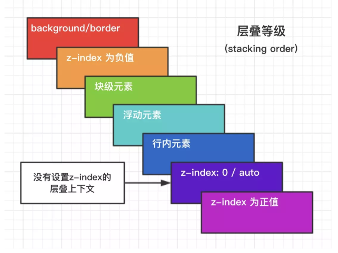

#### 1.盒模型 [Try It](./demo/boxSizing.html)
* content-box ==> W3C标准盒模型
> width和height不包含border和padding
* border-box ==> IE盒模型
> width和height包含border和padding

#### 2.BFC [Try It](./demo/BFC.html) [Detail](https://juejin.im/post/59b73d5bf265da064618731d)
块级格式化上下文 是一个独立的渲染区域 让处于BFC内部的元素与外部的元素互相隔离 使内外元素的定位不会相互影响
* 触发条件
    * 根元素
    * position: absolute/fixed
    * display: inline-block/table
    * float元素
    * overflow !== visible
* 规则
    * 属于同一个BFC的两个相邻Box垂直排列
    * 属于同一个BFC的两个相邻Box的margin会发生重叠
    * BFC中子元素的margin box的左边 与包含块（BFC）border box的左边相接触（子元素absolute除外）
    * BFC的区域不会与float的元素区域重叠
    * 计算BFC的高度时 浮动子元素也参与计算
    * 文字层不会被浮动层覆盖 环绕于周围
* 应用
    * 阻止margin重叠
    * 可以包含浮动元素----清除内部浮动（清除浮动的原理是两个div都位于同一个BFC区域之中）
    * 自适应两栏布局
    * 可以阻止元素被浮动元素覆盖

#### 3.层叠上下文 [Try It](./demo/stackingContext.html) [Detail](https://juejin.im/post/5b876f86518825431079ddd6)
元素提升为一个比较特殊的图层 在三维空间中（Z轴）高出普通元素一等
* 触发条件
    * 根层叠上下文（html）
    * position
    * css3属性
        * flex
        * transform
        * opacity
        * filter
        * will-change
        * -webkit-overflow-scrolling
* 层叠等级：层叠上下文在Z轴上的排序
    * 在同一层叠上下文中 层叠等级才有意义
    * z-index的优先级最高

> 1. 首先先看要比较的两个元素是否处于同一个层叠上下文中：
> * 如果是，谁的层叠等级大，谁在上面（怎么判断层叠等级大小呢？——看“层叠顺序”图）。
> * 如果两个元素不在统一层叠上下文中，请先比较他们所处的层叠上下文的层叠等级。
> 2. 当两个元素层叠等级相同、层叠顺序相同时，在DOM结构中后面的元素层叠等级在前面元素之上。
