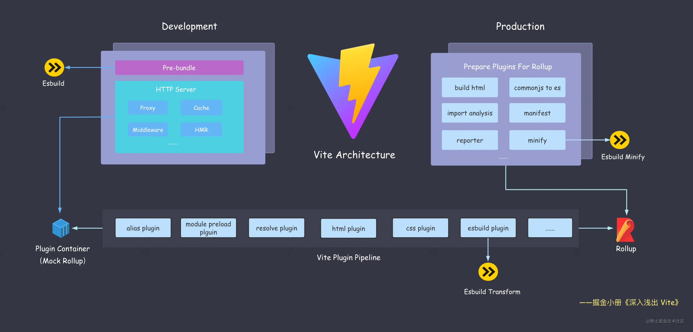

<!--
 * @Author: sbaoz xiaojz821@hotmail.com
 * @Date: 2022-07-15 12:05:57
 * @LastEditors: sbaoz xiaojz821@hotmail.com
 * @LastEditTime: 2022-07-15 17:39:17
 * @FilePath: \interview_knowledge\interview\Engineering_knowledge\学习笔记\深入浅出Vite\笔记\08.Vite的架构.md
 * @Description: 这是默认设置,请设置`customMade`, 打开koroFileHeader查看配置 进行设置: https://github.com/OBKoro1/koro1FileHeader/wiki/%E9%85%8D%E7%BD%AE
-->
#### Vite架构图

Vite 的双引擎架构 开发阶段使用 Esbuild，生产环境用 Rollup  

#### Esbuild在Vite中的作用
- 开发阶段的依赖预构建-Bundler
  Esbuild 作为打包工具也有一些缺点  
  - 不支持降级到 ES5 的代码。这意味着在低端浏览器代码会跑不起来。
  - 不支持 const enum 等语法。这意味着单独使用这些语法在 esbuild 中会直接抛错。
  - 不提供操作打包产物的接口，像 Rollup 中灵活处理打包产物的能力(如renderChunk钩子)在 Esbuild 当中完全没有。
  - 不支持自定义 Code Splitting 策略。传统的 Webpack 和 Rollup 都提供了自定义拆包策略的 API，而 Esbuild 并未提供，从而降级了拆包优化的灵活性。
- 作为TS和JSX的编译工具-Transformer  
  性能对比Babel、TSC提升巨大 但没有实现TS的类型系统 所以打包之前需要先执行tsc命令
- 作为压缩工具-Minifier  
  Esbuild共享AST以及原生语言编写的Minifier在性能上比其他工具提升巨大

#### Rollup在Vite中的作用
Vite基于Rollup本身成熟的打包能力进行扩展和优化  
- CSS代码分割  
  如果某个异步模块中引入了一些 CSS 代码，Vite 就会自动将这些 CSS 抽取出来生成单独的文件，提高线上产物的缓存复用率
- 自动预加载  
  Vite 会自动为入口 chunk 的依赖自动生成预加载标签
  ```
  <link rel="moduelpreload">
  ```
  这种适当预加载的做法会让浏览器提前下载好资源，优化页面性能
- 异步Chunk加载优化  
  在异步引入的 Chunk 中，通常会有一些公用的模块，如现有两个异步引入的 Chunk: A 和 B，而且两者有一个公共依赖 C  
  一般情况下，Rollup 打包之后，会先请求 A，然后浏览器在加载 A 的过程中才决定请求和加载 C，但 Vite 进行优化之后，请求 A 的同时会自动预加载 C，通过优化 Rollup 产物依赖加载方式节省了不必要的网络开销

Vite插件完全兼容Rollup 社区生态有先天优势
