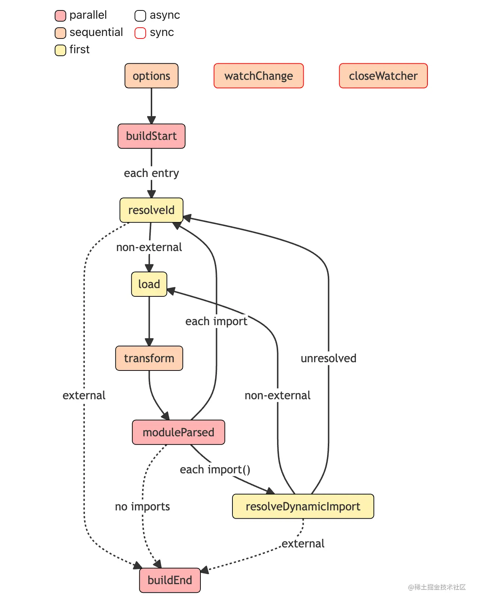

<!--
 * @Author: sbaoz xiaojz821@hotmail.com
 * @Date: 2023-02-23 11:11:21
 * @LastEditors: sbaoz xiaojz821@hotmail.com
 * @LastEditTime: 2023-02-23 14:52:32
 * @FilePath: \interview_knowledge\interview\Engineering_knowledge\学习笔记\深入浅出Vite\笔记\11.Rollup的插件机制.md
 * @Description: 这是默认设置,请设置`customMade`, 打开koroFileHeader查看配置 进行设置: https://github.com/OBKoro1/koro1FileHeader/wiki/%E9%85%8D%E7%BD%AE
-->
#### Rollup的插件机制  
将核心的打包逻辑与插件逻辑分离 按需引入插件 提高可扩展性  
打包过程中定义构建生命周期 在不同阶段自动执行对应的插件钩子函数  

#### Rollup整体构建阶段  
- Build阶段  
  创建模块依赖图，初始化各个模块的 AST 以及模块之间的依赖关系 同时暴露generate和write方法，以进入到后续的 Output 阶段
- Output阶段  
  真正进行打包的过程会在 Output 阶段进行 在bundle对象的 generate或者write方法中进行 （write和generate方法唯一的区别在于前者打包完产物会写入磁盘，而后者不会）

#### 拆解插件工作流  
- 插件Hook类型
  - Build Hook  
    这个阶段的 Hook 对于代码的操作粒度一般为模块级别，也就是单文件级别
  - Output Hook  
    操作粒度一般为 chunk级别(一个 chunk 通常指很多文件打包到一起的产物)
- Hook的执行方式  
  - Async & Sync  
    异步和同步的钩子函数，两者最大的区别在于同步钩子里面不能有异步逻辑，而异步钩子可以有  
  - Parallel  
    并行的钩子函数 插件之间的操作没有互相依赖 就可以并发执行 提升构建性能
  - Squential  
    串行的钩子函数 适用于插件间处理结果互相依赖 前一个插件的返回值作为后续插件的入参
  - First  
    如果有多个插件实现了这个 Hook，那么 Hook 将依次运行，直到返回第一个非 null 或非 undefined 的值为止  

#### Build阶段工作流  

