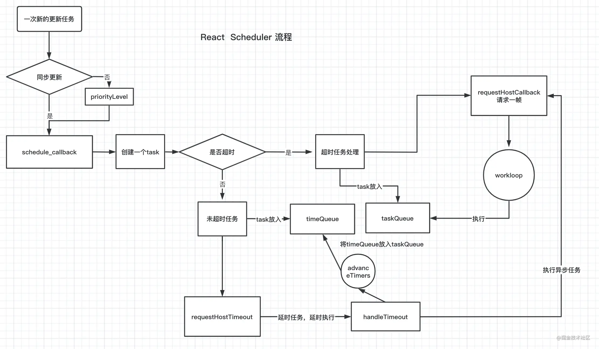
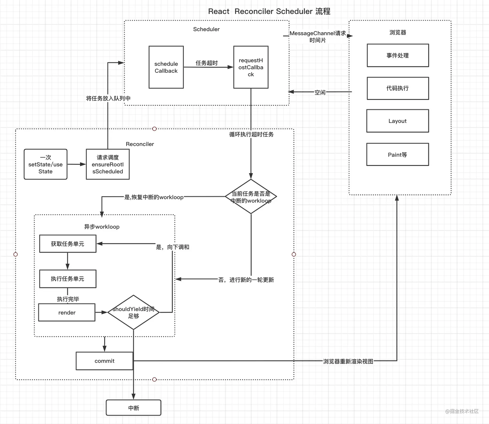

# 原理-调度和时间片

### 何为异步调度  
- 为什么采用异步调度  
  GUI渲染线程和JS引擎线程是互斥的 在执行js的时候 会阻塞浏览器的渲染绘制 给用户直观的感受就是卡顿 V15版本的React面临如上的问题 对于大型的React应用 会存在一次更新 递归遍历大量的虚拟DOM 造成占用js线程 使得浏览器没有时间去做一些渲染 伴随项目越来越大 就会越来越卡  
  Vue框架有template模板收集依赖的过程 构建响应式 使得一次更新中 Vue能迅速响应 找到需要更新的范围 然后以组件粒度更新 渲染视图 但是在React中 一次更新无法知道此次更新的范围 所有React需要从根节点开始diff 查找不同 更新这些不同  
  为了解决更新过程造成的浏览器绘制阻塞 React把更新任务的执行控制交给浏览器 在绘制任务空闲时 执行更新任务 解决卡顿问题 调度就是具体的实现方式  

- 时间分片  
  浏览器每次执行一次事件循环都会做如下事情  
  处理事件 执行js 调用requestAnimation 布局Layout 绘制Paint  
  在执行后 如果没有其他事件 浏览器就会进入休息时间 那么有一些不是特别紧急的React更新就可以执行了  

  如何知道浏览器有空闲时间？  
  requestIdleCallback是谷歌浏览器提供的一个api 在浏览器有空余时间时 浏览器就会调用requestIdleCallback的回调  
  ```javascript
  requestIdleCallback(callback,{ timeout })
  ```
  callback: 浏览器空余时间执行回调函数  
  timeout: 如果浏览器长时间没有空闲 那么回调就不会执行 为了解决这个问题 可以通过这个参数指定一个超时时间  
  
  React为了防止requestIdleCallback中的任务由于浏览器没有空闲时间而卡死 设置了5个优先级  
  - Immediate -1 需要立刻执行  
  - UserBlocking 250ms 超时时间250ms 一般指的是用户交互  
  - Normal 5000ms 超时时间5s 不需要直观立即变化的任务 比如网络请求  
  - Low 10000ms 超时时间10s 肯定要执行的任务 但是可以放在最后处理  
  - Idle 一些没有必要的任务 可能不会执行  
  
  React的异步更新任务就是通过类似requestIdleCallback去向浏览器做一帧一帧请求 等到浏览器有空余时间 去执行React的异步更新任务 保证页面的流畅  

- 模拟requestIdleCallback  
  requestIdleCallback目前只有谷歌浏览器支持 为了兼容每个浏览器 React需要自己实现一个requestIdleCallback要具备2个条件  
  1. 可以主动让出主线程 让浏览器去渲染视图  
  2. 一次事件循环只执行一次 因为执行一次以后 还会请求下一次的时间片  
  能够满足上述条件的只有宏任务 宏任务是在下次事件循环中执行 不会阻塞浏览器更新 而且浏览器一次只会执行一个宏任务  
  满足两种情况的宏任务  
  - setTimeout(fn, 0)  
    setTimeout(fn, 0)可以满足创建宏任务 让出主线程 但是递归执行setTimeout(fn, 0)时 间隔时间会变成4ms左右 而不是1ms 所以React没有选择setTimeout(fn, 0)  
  - MessageChannel  
    为了让视图流畅的运行 可以按照人类能感知到最低限度每秒60帧的频率划分时间片 这样每个时间片就是16ms 也就是16ms要完成如上js执行 浏览器绘制等操作 上述setTimeout带来的浪费就有4ms 所以React采用新的方式去实现 那就是MessageChannel  
    MessageChannel接口允许开发者创建一个新的消息通道 并通过它的两个MessagePort属性发送数据  
    - MessageChannel.port1只读返回channel的port1  
    - MessageChannel.port2只读返回channel的port2  
    ```javascript
      let scheduledHostCallback = null 
      /* 建立一个消息通道 */
      var channel = new MessageChannel();
      /* 建立一个port发送消息 */
      var port = channel.port2;

      channel.port1.onmessage = function(){
          /* 执行任务 */
          scheduledHostCallback() 
          /* 执行完毕，清空任务 */
          scheduledHostCallback = null
      };
      /* 向浏览器请求执行更新任务 */
      requestHostCallback = function (callback) {
        scheduledHostCallback = callback;
        if (!isMessageLoopRunning) {
          isMessageLoopRunning = true;
          port.postMessage(null);
        }
      };
    ```
    - 在一次更新中 React会调用requestHostCallback 把更新任务赋值给scheduleHostCallback 然后port2向port1发起postMessage消息通知  
    - port1会通过onmessage 接受来自post2消息 然后执行更新任务scheduleHostCallback 然后置空scheduleHostCallback 借此达到异步执行目的  

### 异步调度原理  
React发生一次更新 会统一走ensureRootIsScheduled（调度应用）  
- 对于正常更新会走performSyncWorkOnRoot逻辑 最后会走workLoopSync  
- 对于低优先级的异步更新会走performConcurrentWorkOnRoot逻辑 最后会走workLoopConcurrent  
> react-reconciler/src/ReactFiberWorkLoop.js
```javascript
function workLoopSync() {
  while (workInProgress !== null) {
    workInProgress = performUnitOfWork(workInProgress);
  }
}

function workLoopConcurrent() {
  while (workInProgress !== null && !shouldYield()) {
    workInProgress = performUnitOfWork(workInProgress);
  }
}
```
在一次更新调度过程中 workLoop会更新执行每一个待更新的fiber 他们的区别就是异步模式会调用一个shouldYield() 如果当前浏览器没有空余时间 shouldYield会中止循环 直到浏览器有空闲时间后再继续遍历 从而达到终止渲染的目的 这样就解决了一次性遍历大量的fiber 导致浏览器没有时间执行一些渲染任务 导致页面卡顿的情况  

- scheduleCallback  
  无论是正常更新任务workLoopSync还是低优先级的任务workLoopConcurrent 都是由调度器scheduleCallback统一调度的 那么两者在进入调度器的时候有什么区别呢  

  对于正常更新任务 最后会变成类似如下结构  
  ```javascript
    scheduleCallback(Immediate,workLoopSync)
  ```
  对于异步任务  
  ```javascript
    /* 计算超时等级，就是如上那五个等级 */
    var priorityLevel = inferPriorityFromExpirationTime(currentTime, expirationTime);
    scheduleCallback(priorityLevel,workLoopConcurrent)
  ```
  低优先级异步任务的处理 比同步多了一个超时等级的概念 会计算上述五种超时等级  

  scheduleCallback到底做了些什么？  
  > scheduler/src/Scheduler.js
  ```javascript
  function scheduleCallback(){
        /* 计算过期时间：超时时间  = 开始时间（现在时间） + 任务超时的时间（上述设置那五个等级）     */
        const expirationTime = startTime + timeout;
        /* 创建一个新任务 */
        const newTask = { ... }
        if (startTime > currentTime) {
            /* 通过开始时间排序 */
            newTask.sortIndex = startTime;
            /* 把任务放在timerQueue中 */
            push(timerQueue, newTask);
            /*  执行setTimeout ， */
            requestHostTimeout(handleTimeout, startTime - currentTime);
        }else{
            /* 通过 expirationTime 排序  */
            newTask.sortIndex = expirationTime;  
            /* 把任务放入taskQueue */
            push(taskQueue, newTask);
            /*没有处于调度中的任务， 然后向浏览器请求一帧，浏览器空闲执行 flushWork */
            if (!isHostCallbackScheduled && !isPerformingWork) {
                isHostCallbackScheduled = true;
                requestHostCallback(flushWork)
            }
        }
    } 
  ```
  对于调度本身 有几个概念必须掌握  
  - taskQueue 里面存的都是过期的任务 依据任务的过期时间(expirationTime)排序 需要在调度的workLoop中循环执行完这些任务  
  - timerQueue 里面存的都是没有过期的任务 依据任务的开始事件(startTime)排序 在调度workLoop中 会用advanceTimes检查任务是否过期 如果过期了 放入taskQueue队列  
  
  scheduleCallback流程如下  
  - 创建一个新的任务newTask
  - 通过任务的开始时间(startTime)和当前时间(currentTime)比较  
    当startTime > currentTime 说明未过期 存到timerQueue  
    当startTime < currentTime 说明已过期 存到taskQueue
  - 如果任务过期 并且没有调度中的任务 那么调度requestHostCallback 本质上调度的是flushWork
  - 如果任务没有过期 用requestHostTimeout延时执行handleTimeout
  
- requestHostTimeout  
  用requestHostTimeout让一个未过期的任务能够达到恰好过期的状态 requestHostTimeout就是通过setTimeout来进行延时指定时间的  
  > scheduler/src/Scheduler.js
  ```javascript
    requestHostTimeout = function (cb, ms) {
        _timeoutID = setTimeout(cb, ms);
    };

    cancelHostTimeout = function () {
        clearTimeout(_timeoutID);
    };
  ```
  - requestHostTimeout延时执行handleTimeout cancelHostTimeout用于清除当前的延时器

- handleTimeout  
  延时指定时间后 调用的handleTimeout函数 会把任务重新放在requestHostCallback调度  
  > scheduler/src/Scheduler.js
  ```javascript
  function handleTimeout(){
        isHostTimeoutScheduled = false;
        /* 将 timeQueue 中过期的任务，放在 taskQueue 中 。 */
        advanceTimers(currentTime);
        /* 如果没有处于调度中 */
        if(!isHostCallbackScheduled){
            /* 判断有没有过期的任务， */
            if (peek(taskQueue) !== null) {   
            isHostCallbackScheduled = true;
            /* 开启调度任务 */
            requestHostCallback(flushWork);
            }
        }
    }
  ```
  - 通过advanceTimes将timeQueue中过期的任务转移到taskQueue中  
  - 然后调用requestHostCallback调度过期的任务  

- advanceTimers
  > scheduler/src/Scheduler.js
  ```javascript
  function advanceTimers(){
        var timer = peek(timerQueue);
        while (timer !== null) {
            if(timer.callback === null){
                pop(timerQueue);
            }else if(timer.startTime <= currentTime){ /* 如果任务已经过期，那么将 timerQueue 中的过期任务，放入taskQueue */
                pop(timerQueue);
                timer.sortIndex = timer.expirationTime;
                push(taskQueue, timer);
            }
        }
    }
  ```
  - 如果任务已经过期 那么将timerQueue中的过期任务放入taskQueue

- flushWork和workLoop
  综上所述明白两件事情  
  - React的更新任务最后都是放在taskQueue中的
  - requestHostCallback放入MessageChannel中的回调函数时flushWork
  
  - flushWork
    > scheduler/src/Scheduler.js
    ```javascript
    function flushWork(){
        if (isHostTimeoutScheduled) { /* 如果有延时任务，那么先暂定延时任务*/
            isHostTimeoutScheduled = false;
            cancelHostTimeout();
        }
        try{
            /* 执行 workLoop 里面会真正调度我们的事件  */
            workLoop(hasTimeRemaining, initialTime)
        }
    }
    ````
    - flushWork如果有延时任务执行的话 会暂停延时任务 然后调用workLoop去真正执行超时的更新任务  
  
  - workLoop  
    这个workLoop是调度中的workLoop 不是调和中的workLoop  
    ```javascript
    function workLoop(){
        var currentTime = initialTime;
        advanceTimers(currentTime);
        /* 获取任务列表中的第一个 */
        currentTask = peek();
        while (currentTask !== null){
            /* 真正的更新函数 callback */
            var callback = currentTask.callback;
            if(callback !== null ){
                /* 执行更新 */
                callback()
                /* 先看一下 timeQueue 中有没有 过期任务。 */
                advanceTimers(currentTime);
            }
            /* 再一次获取任务，循环执行 */ 
            currentTask = peek(taskQueue);
        }
    }
    ```
    - workLoop会依次更新过期任务队列中的任务 到此为止 完成整个调度过程  

- shouldYield中止workLoop
  在fiber的异步更新任务workLoopConcurrent中 每个fiber的workLoop都会调用shouldYield判断是否有超时更新的任务 如果有 那么停止workLoop  
  > scheduler/src/Scheduler.js
  ```javascript
  function unstable_shouldYield() {
        var currentTime = exports.unstable_now();
        advanceTimers(currentTime);
        /* 获取第一个任务 */
        var firstTask = peek(taskQueue);
        return firstTask !== currentTask && currentTask !== null && firstTask !== null && firstTask.callback !== null && firstTask.startTime <= currentTime && firstTask.expirationTime < currentTask.expirationTime || shouldYieldToHost();
    }
  ```
  - 如果存在第一个任务 并且已经超时了 那么shouldYield会返回true 中止fiber的workLoop  

- 调度流程图  
  

- 调和+异步调度流程总图  
  
