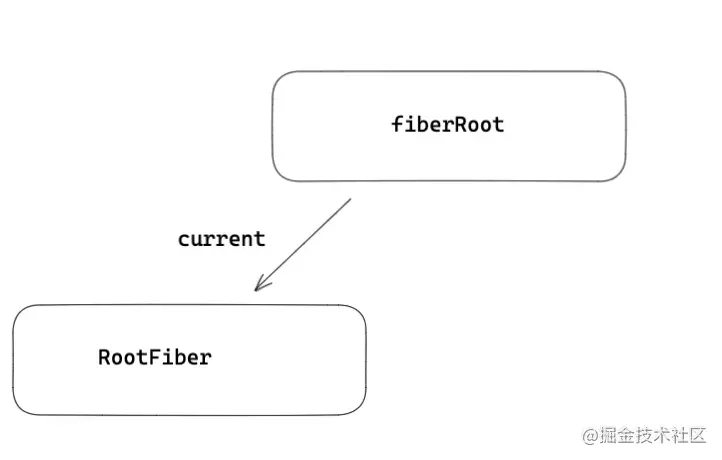
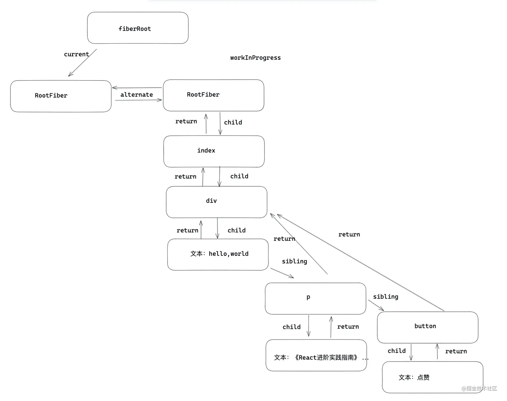
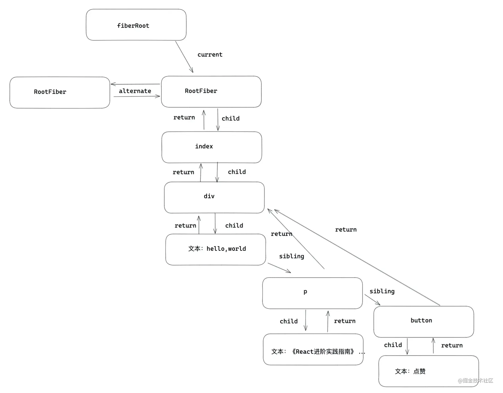
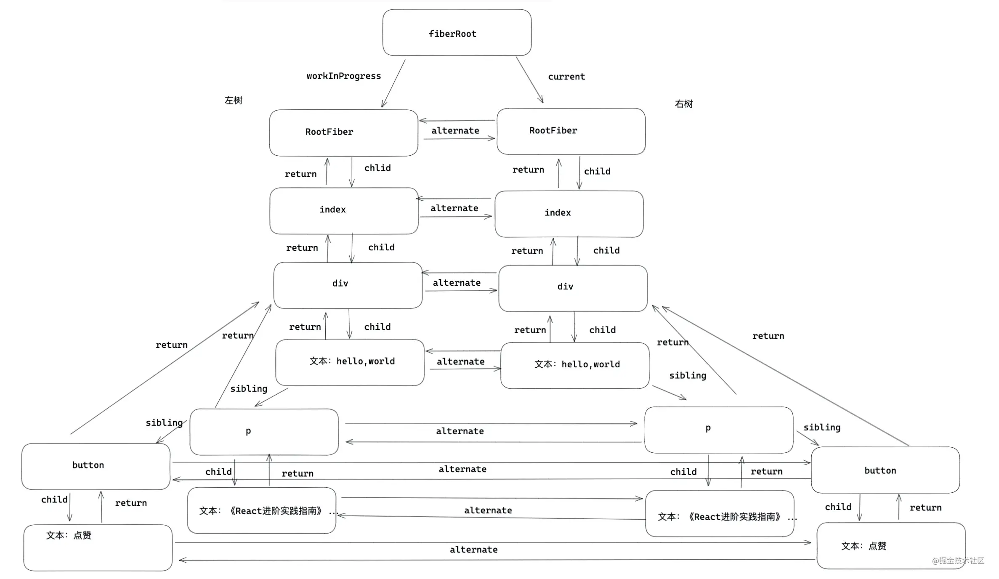
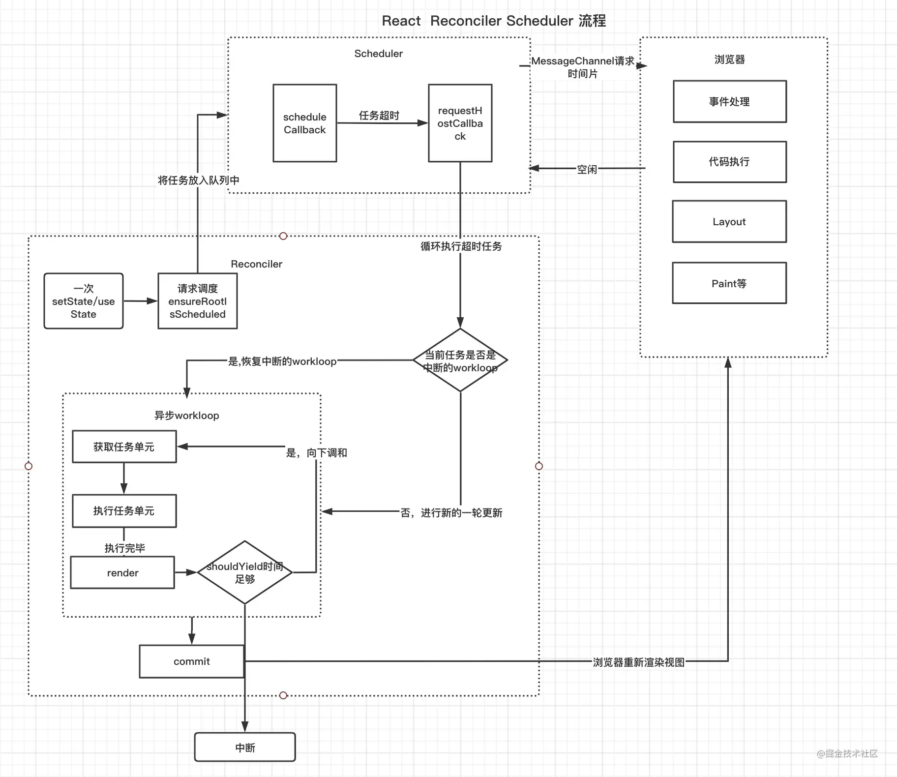

# 原理-调和与fiber

- 什么是fiber  
  fiber诞生在Reactv16版本 目的是解决大型React应用卡顿的问题 fiber在React中式最小粒度的执行单位 无论React还是Vue 在遍历更新每个节点的时候都不是用的真实DOM 都是采用虚拟DOM 可以理解成fiber就是React的虚拟DOM  
- 为什么要用fiber  
  在Reactv15以及之前的版本 React对于虚拟DOM是采用递归方式遍历更新的 一次更新就会从应用根部递归更新 递归一旦开始 中途无法中断 随着项目越来越复杂 层级越来越深 导致更新的时间越来越长 交互上会出现卡顿  
  Reactv16为了解决卡顿问题引入了fiber，更新fiber的过程叫做Reconciler(调和器) 每个fiber都可以作为一个执行单元来处理 每个fiber可以根据自身的expirationTime(过期时间) v17版本中叫lane(优先级) 来判断是否还有空闲时间执行更新 如果没有时间更新 就把主动权交给浏览器去渲染 做一些动画 重排 重绘 这样就能解决交互卡顿的问题 等到浏览器有空余时间 再通过scheduler(调度器) 再次恢复执行更新  

### 全面认识fiber  
- element fiber dom三者的关系  
  - element是React视图层在代码层级上的表象 也就是jsx写的元素都会被创建成element对象的形式 上面保存了props children等信息  
  - DOM是元素在浏览器上的表象  
  - fiber是element和DOM之间的枢纽 每一个类型的element都会一个与之对应的fiber类型 element变化引起更新流程都是通过fiber层面做一次调和改变 然后形成新的DOM做视图渲染  

element与fiber之间的对应关系  
```javascript
export const FunctionComponent = 0;       // 对应函数组件
export const ClassComponent = 1;          // 对应的类组件
export const IndeterminateComponent = 2;  // 初始化的时候不知道是函数组件还是类组件 
export const HostRoot = 3;                // Root Fiber 可以理解为跟元素 ， 通过reactDom.render()产生的根元素
export const HostPortal = 4;              // 对应  ReactDOM.createPortal 产生的 Portal 
export const HostComponent = 5;           // dom 元素 比如 <div>
export const HostText = 6;                // 文本节点
export const Fragment = 7;                // 对应 <React.Fragment> 
export const Mode = 8;                    // 对应 <React.StrictMode>   
export const ContextConsumer = 9;         // 对应 <Context.Consumer>
export const ContextProvider = 10;        // 对应 <Context.Provider>
export const ForwardRef = 11;             // 对应 React.ForwardRef
export const Profiler = 12;               // 对应 <Profiler/ >
export const SuspenseComponent = 13;      // 对应 <Suspense>
export const MemoComponent = 14;          // 对应 React.memo 返回的组件
```

- fiber保存的信息  
  > react-reconciler/src/ReactFiber.js
  ```javascript
  function FiberNode(){

    this.tag = tag;                  // fiber 标签 证明是什么类型fiber。
    this.key = key;                  // key调和子节点时候用到。 
    this.type = null;                // dom元素是对应的元素类型，比如div，组件指向组件对应的类或者函数。  
    this.stateNode = null;           // 指向对应的真实dom元素，类组件指向组件实例，可以被ref获取。
    
    this.return = null;              // 指向父级fiber
    this.child = null;               // 指向子级fiber
    this.sibling = null;             // 指向兄弟fiber 
    this.index = 0;                  // 索引

    this.ref = null;                 // ref指向，ref函数，或者ref对象。

    this.pendingProps = pendingProps;// 在一次更新中，代表element创建
    this.memoizedProps = null;       // 记录上一次更新完毕后的props
    this.updateQueue = null;         // 类组件存放setState更新队列，函数组件存放
    this.memoizedState = null;       // 类组件保存state信息，函数组件保存hooks信息，dom元素为null
    this.dependencies = null;        // context或是时间的依赖项

    this.mode = mode;                //描述fiber树的模式，比如 ConcurrentMode 模式

    this.effectTag = NoEffect;       // effect标签，用于收集effectList
    this.nextEffect = null;          // 指向下一个effect

    this.firstEffect = null;         // 第一个effect
    this.lastEffect = null;          // 最后一个effect

    this.expirationTime = NoWork;    // 通过不同过期时间，判断任务是否过期， 在v17版本用lane表示。

    this.alternate = null;           //双缓存树，指向缓存的fiber。更新阶段，两颗树互相交替。
    }
  ```

- fiber之间如何建立起关联  
  fiber是通过return child sibling三个属性建立起联系的  
  - return 指向父级  
  - child 指向子节点  
  - sibling 指向兄弟节点
  
### fiber更新机制  
比如项目元素结构是这样的  
```javascript
export default class Index extends React.Component{
   state={ number:666 } 
   handleClick=()=>{
     this.setState({
         number:this.state.number + 1
     })
   }
   render(){
     return <div>
       hello，world
       <p > 《React进阶实践指南》 { this.state.number } 👍  </p>
       <button onClick={ this.handleClick } >点赞</button>
     </div>
   }
}
```
- 初始化  
  1. 创建fiberRoot和RootFiber  
     - fiberRoot 首次构建应用 创建一个fiberRoot 作为整个React应用的根基  
     - rootFiber 通过ReactDOM.render渲染出来的应用节点 一个React应用可以有多个rootFiber 但是只能有一个fiberRoot  
    第一次挂载的过程中 会将fiberRoot和rootFiber建立起关联  
    > react-reconciler/src/ReactFiberRoot.js
    ```javascript
    function createFiberRoot(containerInfo,tag){
        /* 创建一个root */
        const root = new FiberRootNode(containerInfo,tag)
        const rootFiber = createHostRootFiber(tag);
        root.current = rootFiber
        return root
    }
    ```
    
  2. workInProgress和current  
     经过第一步的处理 开始到正式渲染阶段 会进入beginwork流程 首先明白两个概念  
     - workInProgress：正在内存中构建的fiber树称为workInProgress树 在一次更新中 所有的更新都是发生在workInProgress树上 在一次更新之后 workInProgress树上的状态时最新的状态 那么它将变成current树用于渲染视图  
     - current：正在视图层渲染的树叫做current树  
     rootFiber渲染的流程 首先会复用当前current树的alternate作为workInProgress 如果没有alternate（初始化的rootFiber没有alternate） 那么会创建一个fiber作为workInProgress 会用alternate将新创建的workInProgress与current树建立关联 这个关联过程只有初始化第一次创建alternate时进行  
     ```javascript
     currentFiber.alternate = workInProgressFiber
     workInProgressFiber.alternate = currentFiber
     ```
      
  3. 深度调和子节点 渲染视图  
     接下来会在新创建的alternate上完成整个fiber树的遍历 包括fiber的创建  
      
     最后会以workInProgress作为最新的渲染树 fiberRoot的current指针指向workInProgress使其变成current树 到此完成初始化流程  
      

- 更新  
  对于上述demo 点击一次按钮发生更新 首先会重新创建一个workInProgress树 复用当前current树上的alternate 作为新的workInProgress 初始化rootfiber有alternate 对于剩余的子节点 还需要创建一份 和current树上的fiber建立起alternate关联 渲染完毕后 workInProgress再次变成current树  
    

- 双缓冲树  
  canvas绘制动画的时候 如果上一帧计算量比较大 导致清除上一帧画面到绘制当前帧画面之间有较长间隙 就会出现白屏 为了解决这个问题 canvas在内存中绘制当前动画 绘制完毕后直接用当前帧替换上一帧画面 由于省去了两帧间的计算时间 不会出现从白屏到出现画面的闪烁情况 这种在内存中构建并直接替换的技术叫做双缓存  
  React用workInProgress树(内存中构建的树)和current树(渲染树)来实现更新逻辑 双缓存一个在内存中构建 一个渲染视图 两颗树用alternate指针相互指向 在下一次渲染的时候 直接复用缓存树做为下一次渲染树 上一次的渲染树又作为缓存树 这样可以防止只用一棵树更新状态的丢失情况 又加快了DOM节点的替换与更新  

### 两大阶段 render和commit  
render阶段和commit阶段是整个fiber reconciler的核心  
- render阶段  
  > react-reconciler/src/ReactFiberWorkLoop.js
  ```javascript
  function workLoop (){
    while (workInProgress !== null ) {
      workInProgress = performUnitOfWork(workInProgress);
    }
  }
  ```
  每个fiber可以看做一个执行的单元 在调和过程中 每一个发生更新的fiber都会作为一次workInProgress 那么workLoop就是执行每一个单元的调度器 如果渲染没有被中断 那么workLoop会遍历一遍fiber树 performUnitOfWork包括两个阶段 beginWork和completeWork  
  > react-reconciler/src/ReactFiberWorkLoop.js
  ```javascript
  function performUnitOfWork(){
    next = beginWork(current, unitOfWork, renderExpirationTime);
    if (next === null) {
       next = completeUnitOfWork(unitOfWork);
    }
  }
  ```
  beginWork是向下调和的过程 是由fiberRoot按照child指针逐层向下调和 期间会执行函数组件 实例化类组件 diff调和子节点 打不同的effectTag  
  completeUnitOfWork是向上归并的过程 如果有兄弟节点 会返回sibling兄弟 如果没有 会返回return父级 一直返回到fiberRoot 期间可以形成effectList 对于初始化流程会创建DOM 对于DOM元素进行事件收集 处理style className等  
  这么一上一下 构成了整个fiber树的调和  
  - 向下调和beginWork  
    > react-reconciler/src/ReactFiberBeginWork.js
    ```javascript
    function beginWork(current,workInProgress){
        switch(workInProgress.tag){
        case IndeterminateComponent:{// 初始化的时候不知道是函数组件还是类组件 
            //....
        }
        case FunctionComponent: {//对应函数组件
            //....
        }
        case ClassComponent:{  //类组件
            //...
        }
        case HostComponent:{
            //...  
        }
        ...
      }
    }
    ```
    总结beginWork作用如下  
    - 对于组件 执行部分生命周期 执行render 得到最新的children  
    - 向下遍历调和children 复用oldFiber(diff算法)  
    - 打不同的副作用标签effectTag 比如类组件的生命周期 或者元素的增加删除更新  
  - reconcileChildren  
    React是如何调和子节点的  
    > react-reconciler/src/ReactFiberBeginWork.js
    ```javascript
    function reconcileChildren(current,workInProgress){
        if(current === null){  /* 初始化子代fiber  */
                workInProgress.child = mountChildFibers(workInProgress,null,nextChildren,renderExpirationTime)
        }else{  /* 更新流程，diff children将在这里进行。 */
                workInProgress.child = reconcileChildFibers(workInProgress,current.child,nextChildren,renderExpirationTime)
        }
    }
    ```
  - 常用的effectTag  
    ```javascript
    export const Placement = /*             */ 0b0000000000010;  // 插入节点
    export const Update = /*                */ 0b0000000000100;  // 更新fiber
    export const Deletion = /*              */ 0b0000000001000;  // 删除fiebr
    export const Snapshot = /*              */ 0b0000100000000;  // 快照
    export const Passive = /*               */ 0b0001000000000;  // useEffect的副作用
    export const Callback = /*              */ 0b0000000100000;  // setState的 callback
    export const Ref = /*                   */ 0b0000010000000;  // ref
    ```
  - 向上归并completeUnitOfWork  
    completeUnitOfWork的流程是自下而上的 主要完成  
    - 首先completeUnitOfWork将effectTag的fiber节点保存在一条被称为effectList的单向链表中 在commit阶段 将不再需要遍历每一个fiber 只需要执行更新effectList就可以了  
    - completeWork阶段对于组件处理context 对于元素标签初始化 会创建真实DOM 将子孙DOM节点插入刚生成的DOM节点中 会触发diffProperties处理props 比如事件收集 style className处理  
  - 调和顺序  
    上述demo 在初始化或者一次更新中调和的顺序是怎样的  
    - beginWork -> rootFiber  
    - beginWork -> Index fiber  
    - beginWork -> div fiber  
    - beginwork -> hello,world fiber  
    - completeWork -> hello,world fiber(返回sibling)  
    - beginWork -> p fiber  
    - completeWork -> p fiber  
    - beginWork -> button fiber  
    - completeWork -> button fiber(此时没有sibling 返回return)  
    - completeWork -> div fiber  
    - completeWork -> Index fiber  
    - completeWork -> rootFiber(完成整个workLoop)  
    > 没有《React进阶实践指南》和 点赞 的文本fiber的beginWork/completeWork流程 是因为作为一种性能优化手段 针对只有单一文本子节点的fiber React会特殊处理  
- commit阶段  
  commit阶段要做的事情  
  - 对一些生命周期和副作用钩子的处理 比如componentDidMount 函数组件的useEffect useLayoutEffect  
  - 在一次更新中 添加节点(Placement) 更新节点(Update) 删除节点(Deletion) 还有一些细节的处理 比如ref的处理  
  commit可以细分为  
  - before mutation阶段（执行DOM操作前）  
    > react-reconciler/src/ReactFiberWorkLoop.js
    ```javascript
    function commitBeforeMutationEffects() {
        while (nextEffect !== null) {
            const effectTag = nextEffect.effectTag;
            if ((effectTag & Snapshot) !== NoEffect) {
            const current = nextEffect.alternate;
            // 调用getSnapshotBeforeUpdates
            commitBeforeMutationEffectOnFiber(current, nextEffect);
            }
            if ((effectTag & Passive) !== NoEffect) {
            scheduleCallback(NormalPriority, () => {
                flushPassiveEffects();
                return null;
                });
            }
            nextEffect = nextEffect.nextEffect;
        }
    }
    ```
    before mutation阶段做的事主要有以下内容  
    - 因为before mutation还没有修改真实的DOM 是获取DOM快照的最佳时机 如果是类组件有getSnapshotBeforeUpdate 那么会执行这个生命周期  
    - 会异步调用useEffect 采用异步调用的目的就是防止同步执行时阻塞浏览器做视图渲染  
  - mutation阶段（执行DOM操作）  
    ```javascript
    function commitMutationEffects(){
        while (nextEffect !== null) {
            if (effectTag & Ref) { /* 置空Ref */
                const current = nextEffect.alternate;
                if (current !== null) {
                    commitDetachRef(current);
                }
            }
            switch (primaryEffectTag) {
                case Placement: {} //  新增元素
                case Update:{}     //  更新元素
                case Deletion:{}   //  删除元素
            }
        } 
    }
    ```
    mutation阶段做的事有以下内容  
    - 置空ref  
    - 对新增元素 更新元素 删除元素 进行真实的DOM操作  
  - layout阶段（执行DOM操作后）  
    ```javascript
    function commitLayoutEffects(root){
        while (nextEffect !== null) {
            const effectTag = nextEffect.effectTag;
            commitLayoutEffectOnFiber(root,current,nextEffect,committedExpirationTime)
            if (effectTag & Ref) {
                commitAttachRef(nextEffect);
            }
        }
    }
    ```
    layout阶段DOM已经更新完毕 这个阶段做的事有  
    - commitLayoutEffectOnFiber对于类组件 会执行生命周期 setState的Callback 对于函数组件会执行useLayoutEffect钩子  
    - 如果有ref 会重新赋值ref
  commit阶段总结 主要做的事情就是执行effectList 更新DOM 执行生命周期 获取ref等操作

- 调和+异步调度流程总图  
  


- 问题总结  
  1. 什么是fiber ? Fiber 架构解决了什么问题？  
  作为架构 fiber是React16的reconciler(协调器)的新架构 
  作为静态数据结构 每个fiber节点对应一个React element 保存了该组件的类型 对应的DOM节点信息等
  作为动态工作单元 每个fiber节点保存了本次更新中该组件改变的状态 要执行的工作
  React15的reconciler采用同步递归的方式遍历虚拟DOM 无法中断 如果层级很深会造成卡顿 
  fiber架构将reconciler重构成异步的可中断的遍历方式

  2. Fiber root 和 root fiber 有什么区别？  
  fiber root 首次执行ReactDOM.render会创建fiber root 是整个应用的根节点 根节点只有一个
  root fiber 通过ReactDOM.render渲染 是所在组件树的根节点 一个应用可能会有多个root fiber

  3. 不同fiber 之间如何建立起关联的？  
  return 父节点
  child 子节点
  sibling 兄弟节点

  4. React 调和流程？  
  reconciler工作阶段（render阶段）的流程
  render阶段开始于performSyncWorkOnRoot(同步)或performConcurrentWorkOnRoot(异步 执行判断多了shouldYield 判断当前浏览器有没有空余时间)方法的调用
  performUnitOfWork 创建下一个fiber节点并赋值给workInProgress 并将workInProgress与已创建的fiber节点连接起来 构成fiber树
  performUnitOfWork的工作可以分成递和归两部分
  递阶段 首先从root fiber开始向下深度优先遍历 为遍历到的每个fiber节点调用beginWork方法
  根据传入的fiber节点创建子fiber节点 并将这两个fiber节点连接起来
  当遍历到叶子节点时就会进入归阶段
  归阶段 会调用completeWork处理fiber节点
  当某个fiber节点执行完completeWork 如果存在兄弟fiber节点 会进入兄弟fiber节点的递阶段
  如果不存在兄弟fiber节点 会进入父级fiber的归阶段
  递和归阶段会交错执行直到归到root fiber

  5. 两大阶段 commit 和 render 都做了哪些事情？  
  render阶段 根据组件返回的jsx在内存中以此创建fiber节点 并连接在一起构建fiber树（workInProgress fiber树）
  commit阶段 根据render阶段为虚拟DOM打的标记 同步执行对应的DOM操作

  6. 什么是双缓冲树？ 有什么作用？  
  React中最多会同时存在两颗fiber树 
  屏幕上显示的fiber树叫current fiber树
  内存中构建的fiber树叫workInProgress fiber树
  每次状态更新都会产生新的workInProgress fiber树 通过current与workInProgress的替换 完成DOM更新
  在内存中构建并直接替换的技术叫双缓存 减少画面白屏闪烁的情况

  7. Fiber 深度遍历流程？  
  分成递和归两部分
  递阶段 首先从root fiber开始向下深度优先遍历 为遍历到的每个fiber节点调用beginWork方法
  将传入的fiber节点创建子fiber节点 并将这两个fiber节点连接起来
  当遍历到叶子节点是就会进入归阶段
  归阶段 会调用completeWork处理fiber节点
  当某个fiber节点执行完completeWork 如果存在兄弟fiber节点 会进入兄弟fiber节点的递阶段
  如果不存在兄弟fiber节点 会进入父级fiber的归阶段
  递和归阶段会交错执行直到归到root fiber

  8. Fiber的调和能中断吗？ 如何中断？  
  可以中断

  9. mount时 fiber.stateNode === null 且在reconcileChildren中调用的mountChildFibers不会为fiber节点赋值effectTag 那么首屏渲染如何完成呢？  
  假设mountChildFibers也会赋值effectTag 那么mount时整棵fiber树所有节点都会有Placement effectTag 那么commit阶段在执行DOM操作时 每个节点都会执行一次插入操作 这样大量的DOM操作是极低效的 为了解决这个问题 在mount时只有rootFiber会赋值Placement effectTag 在commit阶段只会执行一次插入操作

- 备注  
  - Scheduler-Reconciler-Renderer架构体系
  Scheduler（调度器）—— 调度任务的优先级，高优任务优先进入Reconciler
  Reconciler（协调器）—— 负责找出变化的组件
  Renderer（渲染器）—— 负责将变化的组件渲染到页面上

  Scheduler是React实现的功能更完备的requestIdleCallback polyfill 除了在空闲时触发回调的功能外 还提供了多种调度优先级供任务设置
  Reconciler工作的阶段被称为render阶段。因为在该阶段会调用组件的render方法。
  Renderer工作的阶段被称为commit阶段。就像你完成一个需求的编码后执行git commit提交代码。commit阶段会把render阶段提交的信息渲染在页面上。
  render与commit阶段统称为work，即React在工作中。相对应的，如果任务正在Scheduler内调度，就不属于work。

  - React15和16架构的区别
  React15中Reconciler调用render方法 将返回的jsx转换为虚拟DOM 将虚拟DOM和上次更新时的虚拟DOM对比 找出更新中变化的虚拟DOM
  通知Renderer将变化的虚拟DOM渲染到页面上 Reconciler和Renderer交替工作 不能中断

  React16中 Scheduler将任务交给Reconciler Reconciler为变化的虚拟DOM打上代表增删更新的标记 整个Scheduler和Reconciler的工作都在内存中进行 当所有组件都完成Reconciler的工作 才会统一交给Renderer 可中断 异步更新
  Renderer根据Reconciler为虚拟DOM打的标记 同步执行对应的DOM操作 

  - beginWork详细  
  current === null ?来区分组件是处于mount还是update
  工作可以分为两部分：
  1. update时：如果current存在，在满足一定条件时可以复用current节点，这样就能克隆current.child作为workInProgress.child，而不需要新建workInProgress.child  
  子fiber复用条件 oldProps === newProps && workInProgress.type === current.type 即props和fiber.type不变 !includesSomeLane(renderLanes, updateLanes) 即当前fibre节点优先级不够  
  2. mount时：除fiberRootNode以外，current === null。会根据fiber.tag不同，创建不同类型的子Fiber节点  
  最终进入reconcileChildren方法  
   
  - reconcileChildren  
  reconciler模块的核心部分  也是通过current === null ?来区分组件是处于mount还是update
    - 对于mount的组件 创建新的子fiber节点(mountChildFibers)  
    - 对于update的组件 将当前组件与该组件在上次更新时对应的fiber节点比较(Diff算法) 将比较的结果生成新的fiber节点(reconcileChildFibers) 会为生成的fiber节点带上effectTag属性 mountChildFibers不会  
    最终会生成新的子fiber节点 并赋值给workInProgress.child 作为本次beginWork返回值 并作为下次performUnitOfWork执行时workInProgress的传参  
  
  - effectTag  
  render阶段工作结束后 通知Renderer执行DOM操作 要执行DOM操作的具体类型就保存在fiber.effectTag中  
  1. Placement DOM需要插入到页面中  
  2. Update DOM需要更新  
  3. PlacementAndUpdate DOM需要插入到页面中并更新  
  4. Deletion DOM需要删除  
  通知Renderer将fiber节点对应的DOM节点进行操作 需要满足2个条件：  
  1. fiber.stateNode存在 即fiber节点中保存了对应的DOM节点  
  2. fiber节点存在对应的effectTag  

  - completeWork详细  
  和beginWork一样 根据current === null ? 判断是mount还是update  
  判断update时 还需要判断workInProgress.stateNode != null ？即该fiber节点是否存在对应的DOM节点  
  1. update时 fiber节点已经存在对应DOM节点 所以不需要生成DOM节点 需要做的主要是处理props 比如注册事件等函数 style children等 被处理完的props会被赋值给workInProgress.updateQueue(偶数索引的值为变化的propkey 奇数索引的值为变化的propvalue) 并最终会在commit阶段被渲染到页面上
  2. mount时 主要逻辑包括 为fiber节点生成对应的DOM节点 将子孙DOM节点插入刚生成的DOM节点中 处理props  
    - beginWork mount时只会在rootFiber存在Placement effectTag 那么commit阶段是如何通过一次插入DOM操作 将整棵DOM树插入页面的呢  
    原因就在于completeWork中的appendAllChildren方法  
    由于completeWork属于归阶段调用的函数 每次调用appendAllChildren时都会将已生成的子孙DOM节点 插入当前生成的DOM节点下 那么当归到rootFiber时 就已经构建好一个离屏的DOM树了  
    - 作为DOM操作的依据 commit阶段需要找到所有有effectTag的fiber节点并依次执行effectTag对应的操作 为了解决这个问题 在completeWork的上层函数completeUnitOfWork中 每个执行完completeWork且存在effectTag的fiber节点会被保存在一条被称为effectList的单向链表中 在commit阶段只需要遍历effectList就能执行所有effect了

- commit阶段  
  - before mutation阶段(执行DOM操作前)  
    beforeMutation阶段的主函数commitBeforeMutationEffects整体可以分成三部分
    - 处理DOM节点渲染/删除后的autofocus、blur逻辑  
    - 调用getSnapshotBeforeUpdate生命周期钩子  
    - 调度useEffect  
      useEffect异步执行的原因主要是防止同步执行时阻塞浏览器渲染
  - mutation阶段(执行DOM操作)  
    执行commitMutationEffects遍历effectList 对每个fiber节点执行如下操作  
    1. 根据ContentReset effectTag重置文字节点  
    2. 更新ref  
    3. 根据effectTag分别处理 其中effectTag包括(Placement|Update|Deletion|Hydrating)
      - Placement  
        调用commitPlacement  
        1. 获取父级DOM节点  
        2. 获取fiber节点的兄弟DOM节点  
        3. 根据兄弟节点是否存在决定调用insertBefore还是appendChild执行DOM插入操作
      - Update  
        调用commitWork 根据fiber.tag分别处理
        - FunctionComponent  
          会执行useLayoutEffect的销毁函数
        - HostComponent  
          会将render阶段completeWork中为fiber节点赋值的updateQueue对应的内容渲染在页面上
      - Deletion  
        调用commitDeletion  
        1. 递归调用fiber节点及其子孙fiber节点中fiber.tag为ClassComponent的componentWillUnmount 从页面移除fiber节点对应的DOM节点  
        2. 解绑ref  
        3. 调度useEffect的销毁函数  
  - layout阶段(执行DOM操作后)  
    该阶段触发的生命周期钩子和hook可以直接访问到已经改变后的DOM  
    遍历effectList 执行commitLayoutEffects  
    1. 调用生命周期钩子和hook相关操作  
       对于ClassComponent 通过current === null?区分是mount还是update 调用componentDidMount或是componentDidUpdate setState的回调函数也在此时调用  
       对于FunctionComponent 会调用useLayoutEffect的回调函数 调度useEffect的销毁与回调函数
    2. 赋值ref  
    current fiber树切换 在mutation结束后 layout阶段开始前  
    componentWillUnmount会在mutation阶段执行 此时current fiber树还是前一次更新的fiber树 生命周期钩子内获取DOM还是更新前的
    componentDidMount和componentDidUpdate会在layout阶段执行 此时current fiber树已经指向更新后的fiber树 在生命周期钩子内获取的DOM是更新后的
  
  
  