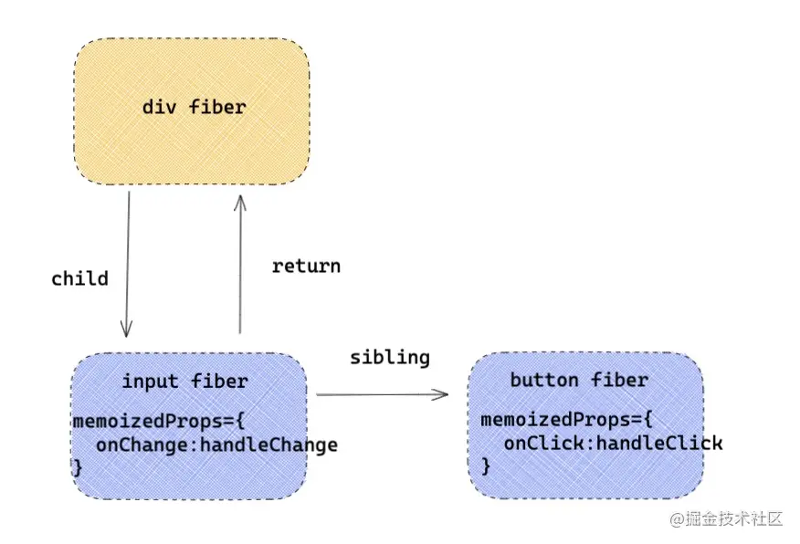

# 原理-事件原理
React事件都是假的  
- 给元素绑定的事件 不是真正的事件处理函数  
- 在冒泡/捕获阶段绑定的事件 也不是在冒泡/绑定阶段执行的  
- 甚至在事件处理函数中拿到的事件源e 也不是真正的事件源e  

React为什么要写出一套自己的事件系统呢  
对于不同的浏览器 对事件存在不同的兼容性 为了实现一个兼容全浏览器的框架 就需要创建一个兼容全浏览器的事件系统 以抹平不同浏览器的差异  

### 独特的事件处理  
- 冒泡阶段和捕获阶段  
  - 冒泡阶段：开发者正常给React绑定的事件比如onClick 默认会在模拟冒泡阶段执行  
  - 捕获阶段：如果想要在捕获阶段执行可以将事件后面加上Capture后缀 比如onClickCapure
- 阻止冒泡  
  React中如果想要阻止事件冒泡 可以用e.stopPropagation()  
  写法和原生事件中的差不多 但是底层原理完全不同  
- 阻止默认行为  
  React阻止默认行为和原生的事件有一些区别  
  原生事件：e.preventDefault()和return false可以用来阻止事件默认行为 由于在React中给元素的事件并不是真正的事件处理函数 所以导致return false在React应用中完全失去了作用  
  React事件：可以用e.preventDefault()阻止事件默认行为 这个方法并非原生事件的preventDefault 由于React事件源e也是独立组建的 所以preventDefault也是单独处理的
### 事件合成
React事件合成可分为三个部分  
- 第一个部分是事件合成系统 初始化会注册不同的事件插件  
- 第二个就是在一次渲染过程中 对事件标签中事件的收集 向container注册事件
- 第三个就是一次用户交互 事件触发 到事件执行一系列过程  

- 事件合成概念  
  - React的事件不是绑定在元素上的 而是统一绑定在顶部容器上 在V17之前是绑定在document上的 在V17改成了APP容器上 这样更便利于一个HTML下存在多个应用（微前端）
  - 绑定事件并不是一次性绑定所有事件 比如发现了onClick事件 就会绑定click事件 比如发现了onChange事件 就会绑定blur change focus keydown keyup多个事件
  - React事件合成的概念：React应用中 元素绑定的事件并不是原生事件 而是React合成的事件 比如onClick是由click合成 onChange是由blur change focue等多个事件合成
- 事件插件机制
  React有一种事件插件机制 比如onClick和onChange 会有不同的事件插件SimpleEventPlugin和ChangeEventPlugin处理 需要记住两个对象 对后续的了解很有帮助  

  > const registrationNameModules = {
        onBlur: SimpleEventPlugin,
        onClick: SimpleEventPlugin,
        onClickCapture: SimpleEventPlugin,
        onChange: ChangeEventPlugin,
        onChangeCapture: ChangeEventPlugin,
        onMouseEnter: EnterLeaveEventPlugin,
        onMouseLeave: EnterLeaveEventPlugin,
        ...
    }

  registrationNameModules记录了React事件和与之对应的处理插件的映射 应用于事件触发阶段 根据不同事件使用不同的插件  

  > const registrationNameDependencies = {
        onBlur: ['blur'],
        onClick: ['click'],
        onClickCapture: ['click'],
        onChange: ['blur', 'change', 'click', 'focus', 'input', 'keydown', 'keyup', 'selectionchange'],
        onMouseEnter: ['mouseout', 'mouseover'],
        onMouseLeave: ['mouseout', 'mouseover'],
        ...
    }

  registrationNameDependencies对象保存了React事件和原生事件的对应关系 这就解释了为什么只写了一个onChange 会有很多原生事件绑定在document上 在事件绑定阶段 如果发现有React事件 比如onChange 就会找到对应的原生事件数组 逐一绑定

### 事件绑定
所谓事件绑定 就是在React处理props时 如果遇到事件 比如onClick 就会通过addEventListener注册原生事件  
```javascript
export default function Index(){
  const handleClick = () => console.log('点击事件')
  const handleChange =() => console.log('change事件)
  return <div >
     <input onChange={ handleChange }  />
     <button onClick={ handleClick } >点击</button>
  </div>
}
```  
对于如上结构 最后onClick和onChange会保存在对应的DOM元素类型fiber对象(hostComponent)的memoizedProps属性上  
  
接下来就是React根据事件注册事件监听器  
> react-dom/src/client/ReactDOMComponent.js    
```javascript
function diffProperties(){
    /* 判断当前的 propKey 是不是 React合成事件 */
    if(registrationNameModules.hasOwnProperty(propKey)){
         /* 这里多个函数简化了，如果是合成事件， 传入成事件名称 onClick ，向document注册事件  */
         legacyListenToEvent(registrationName, document）;
    }
}
```  
diffProperties函数在diff props如果发现是合成事件 就会调用legacyListenToEvent函数 注册事件监听器  
> react-dom/src/events/DOMLegacyEventPluginSystem.js  
```javascript
function legacyListenToEvent(registrationName，mountAt){
   const dependencies = registrationNameDependencies[registrationName]; // 根据 onClick 获取  onClick 依赖的事件数组 [ 'click' ]。
    for (let i = 0; i < dependencies.length; i++) {
    const dependency = dependencies[i];
    //  addEventListener 绑定事件监听器
    ...
  }
}
```  
这个就是应用registrationNameDependencies对React合成事件 分别绑定原生事件的事件监听器  
那么绑定在document的事件处理函数时如上写的handleChange handleClick吗  
答案是否定的 绑定在document的事件是React统一的事件处理函数dispatchEvent React需要一个统一流程去代理事件逻辑 包括React批量更新等逻辑  
只要是React事件触发 首先执行的就是dispatchEvent 那么dispatchEvent是如何知道是什么事件触发的呢 实际在注册的时候就已经通过bind 把参数绑定给dispatchEvent了  
比如绑定click事件  
```javascript
const listener = dispatchEvent.bind(null,'click',eventSystemFlags,document) 
/* TODO: 重要, 这里进行真正的事件绑定。*/
document.addEventListener('click',listener,false) 
```  

### 事件触发
假设DOM结构如下  
```javascript
export default function Index(){
    const handleClick1 = () => console.log(1)
    const handleClick2 = () => console.log(2)
    const handleClick3 = () => console.log(3)
    const handleClick4 = () => console.log(4)
    return <div onClick={ handleClick3 }  onClickCapture={ handleClick4 }>
        <button onClick={ handleClick1 }  onClickCapture={ handleClick2 }>点击</button>
    </div>
}
```
点击按钮 触发点击事件 流程如下  
1. 批量更新  
   首先执行dispatchEvent 执行时会传入真实的事件源button元素本身  
   通过元素可以找到button对应的fiber 进入批量更新环节  
   > react-dom/src/events/ReactDOMUpdateBatching.js
   ```javascript
   export function batchedEventUpdates(fn,a){
        isBatchingEventUpdates = true; //打开批量更新开关
        try{
        fn(a)  // 事件在这里执行
        }finally{
            isBatchingEventUpdates = false //关闭批量更新开关
        }
    }
   ```
2. 合成事件源  
   通过onClick找到对应的处理插件SimpleEventPlugin 合成新的事件源e 里面包含了preventDefault和stopPropagation等方法
3. 形成事件执行队列  
   在第一步通过原生DOM获取到对应的fiber 接着会从这个fiber向上遍历 用一个数组收集事件  
   - 如果遇到捕获阶段事件onClickCapture就会unshift放在数组前面 以此模拟事件捕获阶段  
   - 如果遇到冒泡阶段事件onClick 就会push到数组后面 模拟事件冒泡阶段  
   - 一直收集到最顶端app 形成执行队列 在接下来阶段 依次执行队列里面的函数  
   ```javascript
    while (instance !== null) {
        const {stateNode, tag} = instance;
        if (tag === HostComponent && stateNode !== null) { /* DOM 元素 */
            const currentTarget = stateNode;
            if (captured !== null) { /* 事件捕获 */
                /* 在事件捕获阶段,真正的事件处理函数 */
                const captureListener = getListener(instance, captured); // onClickCapture
                if (captureListener != null) {
                /* 对应发生在事件捕获阶段的处理函数，逻辑是将执行函数unshift添加到队列的最前面 */
                    dispatchListeners.unshift(captureListener);
                    
                }
            }
            if (bubbled !== null) { /* 事件冒泡 */
                /* 事件冒泡阶段，真正的事件处理函数，逻辑是将执行函数push到执行队列的最后面 */
                const bubbleListener = getListener(instance, bubbled); // 
                if (bubbleListener != null) {
                    dispatchListeners.push(bubbleListener); // onClick
                }
            }
        }
        instance = instance.return;
    }
   ```
   那么如上点击一次按钮 4个事件执行顺序是这样的  
   1. 第一次收集是在button上 handleClick1冒泡事件push处理 handleClick2捕获事件unshift处理 形成[handleClick2, handleClick1]  
   2. 接着向上收集 遇到父级 收集父级div上的事件 同理形成[handleClick4, handleClick2, handleClick1, handleClick3]  
   3. 依次执行数组里面的事件 打印4 2 1 3
  

### React如何模拟阻止事件冒泡  
事件队列的执行  
> legacy-events/EventBatching.js
```javascript
function runEventsInBatch(){
    const dispatchListeners = event._dispatchListeners;
    if (Array.isArray(dispatchListeners)) {
    for (let i = 0; i < dispatchListeners.length; i++) {
      if (event.isPropagationStopped()) { /* 判断是否已经阻止事件冒泡 */
        break;
      }    
      dispatchListeners[i](event) /* 执行真正的处理函数 及handleClick1... */
    }
  }
}
```
对于上述队列handleClick4, handleClick2, handleClick1, handleClick3]  
假设在上述队列中 handleClick2中调用e.stopPropagation() 那么事件源里面将有状态证明此次事件已经停止冒泡 那么下次遍历的时候 event.isPropagationStopped()就会返回true 跳出循环 handleClick1 handleClick3不在执行 模拟了阻止事件冒泡的过程

### 问答
问：为什么要用不同的事件插件处理不同的React事件
答：首先对于不同的事件 有不同的处理逻辑 对应的事件源对象也有所不同 React的事件和事件源是自己合成的 所以对于不同事件需要不同的事件插件处理  

问：fiber和原生DOM之间是如何建立起联系的  
答：React在初始化真实DOM的时候 用一个随机的key internalInstanceKey指针指向了当前DOM对应的fiber对象 fiber对象用stateNode指向了当前的DOM元素