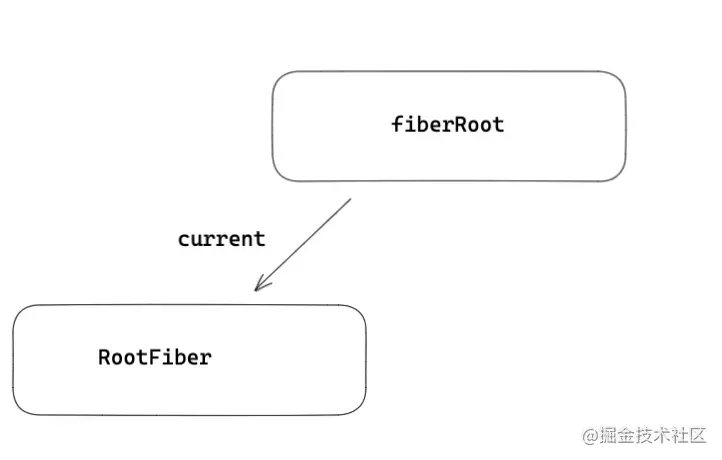
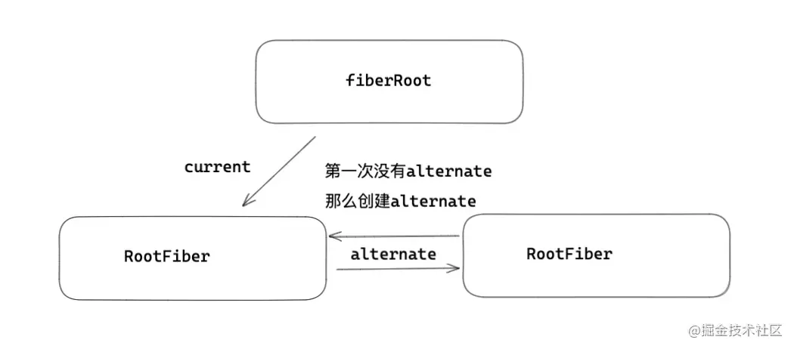
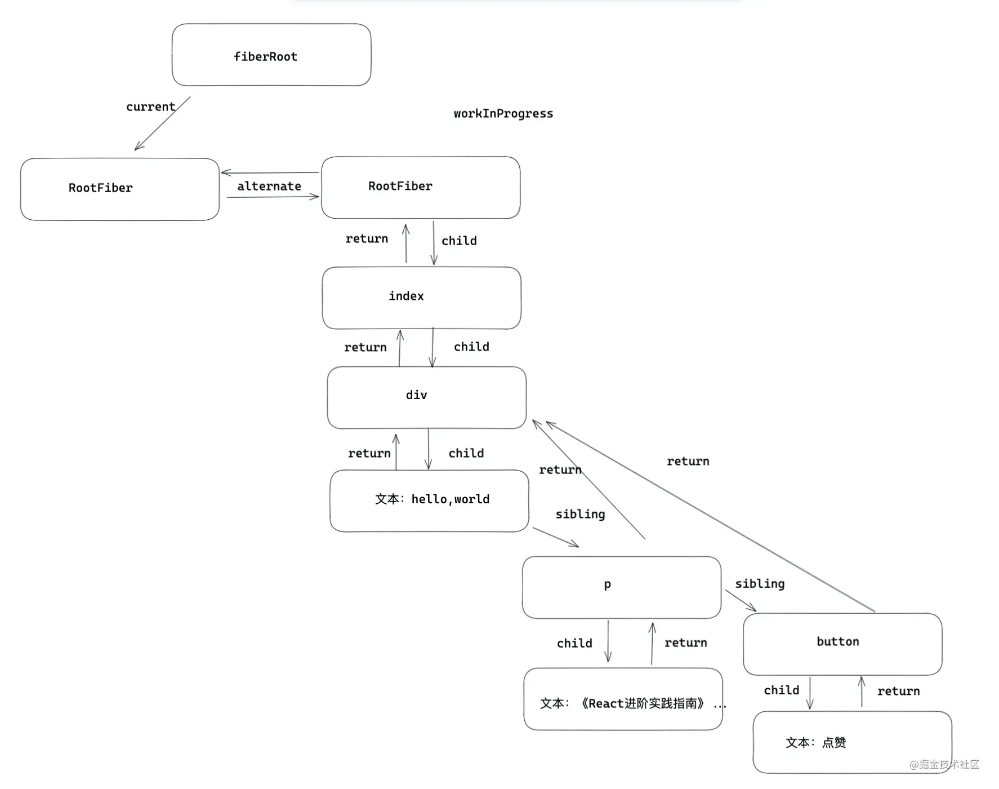
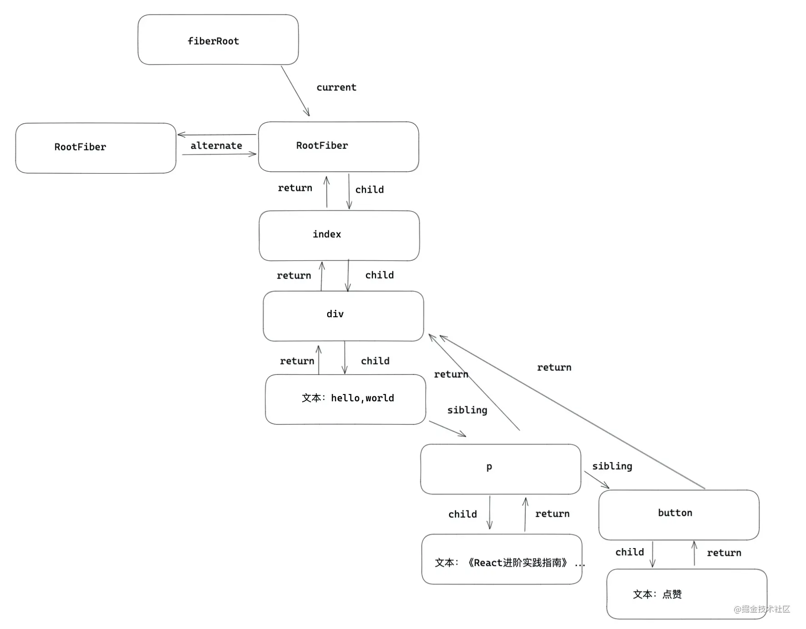
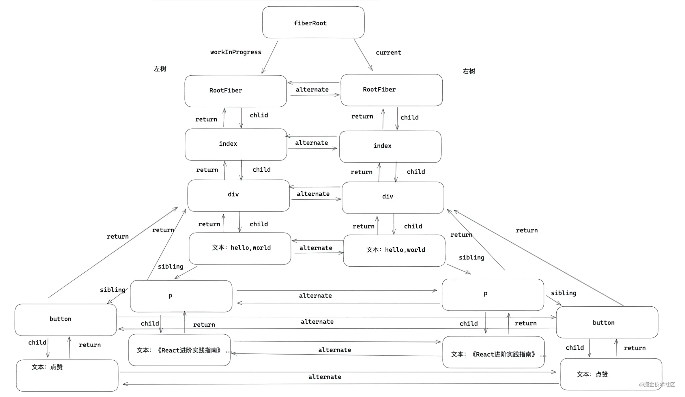

# 原理-调和与fiber

- 什么是fiber  
  fiber诞生在Reactv16版本 目的是解决大型React应用卡顿的问题 fiber在React中式最小粒度的执行单位 无论React还是Vue 在遍历更新每个节点的时候都不是用的真实DOM 都是采用虚拟DOM 可以理解成fiber就是React的虚拟DOM  
- 为什么要用fiber  
  在Reactv15以及之前的版本 React对于虚拟DOM是采用递归方式遍历更新的 一次更新就会从应用根部递归更新 递归一旦开始 中途无法中断 随着项目越来越复杂 层级越来越深 导致更新的时间越来越长 交互上会出现卡顿  
  Reactv16为了解决卡顿问题引入了fiber，更新fiber的过程叫做Reconciler(调和器) 每个fiber都可以作为一个执行单元来处理 每个fiber可以根据自身的expirationTime(过期时间) v17版本中叫lane(优先级) 来判断是否还有空闲时间执行更新 如果没有时间更新 就把主动权交给浏览器去渲染 做一些动画 重排 重绘 这样就能解决交互卡顿的问题 等到浏览器有空余时间 再通过scheduler(调度器) 再次恢复执行更新  

### 全面认识fiber  
- element fiber dom三者的关系  
  - element是React视图层在代码层级上的表象 也就是jsx写的元素都会被创建成element对象的形式 上面保存了props children等信息  
  - DOM是元素在浏览器上的表象  
  - fiber是element和DOM之间的枢纽 每一个类型的element都会一个与之对应的fiber类型 element变化引起更新流程都是通过fiber层面做一次调和改变 然后形成新的DOM做视图渲染  

element与fiber之间的对应关系  
```javascript
export const FunctionComponent = 0;       // 对应函数组件
export const ClassComponent = 1;          // 对应的类组件
export const IndeterminateComponent = 2;  // 初始化的时候不知道是函数组件还是类组件 
export const HostRoot = 3;                // Root Fiber 可以理解为跟元素 ， 通过reactDom.render()产生的根元素
export const HostPortal = 4;              // 对应  ReactDOM.createPortal 产生的 Portal 
export const HostComponent = 5;           // dom 元素 比如 <div>
export const HostText = 6;                // 文本节点
export const Fragment = 7;                // 对应 <React.Fragment> 
export const Mode = 8;                    // 对应 <React.StrictMode>   
export const ContextConsumer = 9;         // 对应 <Context.Consumer>
export const ContextProvider = 10;        // 对应 <Context.Provider>
export const ForwardRef = 11;             // 对应 React.ForwardRef
export const Profiler = 12;               // 对应 <Profiler/ >
export const SuspenseComponent = 13;      // 对应 <Suspense>
export const MemoComponent = 14;          // 对应 React.memo 返回的组件
```

- fiber保存的信息  
  > react-reconciler/src/ReactFiber.js
  ```javascript
  function FiberNode(){

    this.tag = tag;                  // fiber 标签 证明是什么类型fiber。
    this.key = key;                  // key调和子节点时候用到。 
    this.type = null;                // dom元素是对应的元素类型，比如div，组件指向组件对应的类或者函数。  
    this.stateNode = null;           // 指向对应的真实dom元素，类组件指向组件实例，可以被ref获取。
    
    this.return = null;              // 指向父级fiber
    this.child = null;               // 指向子级fiber
    this.sibling = null;             // 指向兄弟fiber 
    this.index = 0;                  // 索引

    this.ref = null;                 // ref指向，ref函数，或者ref对象。

    this.pendingProps = pendingProps;// 在一次更新中，代表element创建
    this.memoizedProps = null;       // 记录上一次更新完毕后的props
    this.updateQueue = null;         // 类组件存放setState更新队列，函数组件存放
    this.memoizedState = null;       // 类组件保存state信息，函数组件保存hooks信息，dom元素为null
    this.dependencies = null;        // context或是时间的依赖项

    this.mode = mode;                //描述fiber树的模式，比如 ConcurrentMode 模式

    this.effectTag = NoEffect;       // effect标签，用于收集effectList
    this.nextEffect = null;          // 指向下一个effect

    this.firstEffect = null;         // 第一个effect
    this.lastEffect = null;          // 最后一个effect

    this.expirationTime = NoWork;    // 通过不同过期时间，判断任务是否过期， 在v17版本用lane表示。

    this.alternate = null;           //双缓存树，指向缓存的fiber。更新阶段，两颗树互相交替。
    }
  ```

- fiber之间如何建立起关联  
  fiber是通过return child sibling三个属性建立起联系的  
  - return 指向父级  
  - child 指向子节点  
  - sibling 指向兄弟节点
  
### fiber更新机制  
比如项目元素结构是这样的  
```javascript
export default class Index extends React.Component{
   state={ number:666 } 
   handleClick=()=>{
     this.setState({
         number:this.state.number + 1
     })
   }
   render(){
     return <div>
       hello，world
       <p > 《React进阶实践指南》 { this.state.number } 👍  </p>
       <button onClick={ this.handleClick } >点赞</button>
     </div>
   }
}
```
- 初始化  
  1. 创建fiberRoot和RootFiber  
     - fiberRoot 首次构建应用 创建一个fiberRoot 作为整个React应用的根基  
     - rootFiber 通过ReactDOM.render渲染出来的应用节点 一个React应用可以有多个rootFiber 但是只能有一个fiberRoot  
    第一次挂载的过程中 会将fiberRoot和rootFiber建立起关联  
    > react-reconciler/src/ReactFiberRoot.js
    ```javascript
    function createFiberRoot(containerInfo,tag){
        /* 创建一个root */
        const root = new FiberRootNode(containerInfo,tag)
        const rootFiber = createHostRootFiber(tag);
        root.current = rootFiber
        return root
    }
    ```
    
  2. workInProgress和current  
     经过第一步的处理 开始到正式渲染阶段 会进入beginwork流程 首先明白两个概念  
     - workInProgress：正在内存中构建的fiber树称为workInProgress树 在一次更新中 所有的更新都是发生在workInProgress树上 在一次更新之后 workInProgress树上的状态时最新的状态 那么它将变成current树用于渲染视图  
     - current：正在视图层渲染的树叫做current树  
     rootFiber渲染的流程 首先会复用当前current树的alternate作为workInProgress 如果没有alternate（初始化的rootFiber没有alternate） 那么会创建一个fiber作为workInProgress 会用alternate将新创建的workInProgress与current树建立关联 这个关联过程只有初始化第一次创建alternate时进行  
     ```javascript
     currentFiber.alternate = workInProgressFiber
     workInProgressFiber.alternate = currentFiber
     ```
      
  3. 深度调和子节点 渲染视图  
     接下来会在新创建的alternate上完成整个fiber树的遍历 包括fiber的创建  
      
     最后会以workInProgress作为最新的渲染树 fiberRoot的current指针指向workInProgress使其变成current树 到此完成初始化流程  
      

- 更新  
  对于上述demo 点击一次按钮发生更新 首先会重新创建一个workInProgress树 复用当前current树上的alternate 作为新的workInProgress 初始化rootfiber有alternate 对于剩余的子节点 还需要创建一份 和current树上的fiber建立起alternate关联 渲染完毕后 workInProgress再次变成current树  
    

- 双缓冲树  
  canvas绘制动画的时候 如果上一帧计算量比较大 导致清除上一帧画面到绘制当前帧画面之间有较长间隙 就会出现白屏 为了解决这个问题 canvas在内存中绘制当前动画 绘制完毕后直接用当前帧替换上一帧画面 由于省去了两帧间的计算时间 不会出现从白屏到出现画面的闪烁情况 这种在内存中构建并直接替换的技术叫做双缓存  
  React用workInProgress树(内存中构建的树)和current树(渲染树)来实现更新逻辑 双缓存一个在内存中构建 一个渲染视图 两颗树用alternate指针相互指向 在下一次渲染的时候 直接复用缓存树做为下一次渲染树 上一次的渲染树又作为缓存树 这样可以防止只用一棵树更新状态的丢失情况 又加快了DOM节点的替换与更新  

### 两大阶段 render和commit  
render阶段和commit阶段是整个fiber reconciler的核心  
- render阶段  
  > react-reconciler/src/ReactFiberWorkLoop.js
  ```javascript
  function workLoop (){
    while (workInProgress !== null ) {
      workInProgress = performUnitOfWork(workInProgress);
    }
  }
  ```
  每个fiber可以看做一个执行的单元 在调和过程中 每一个发生更新的fiber都会作为一次workInProgress 那么workLoop就是执行每一个单元的调度器 如果渲染没有被中断 那么workLoop会遍历一遍fiber树 performUnitOfWork包括两个阶段 beginWork和completeWork  
  > react-reconciler/src/ReactFiberWorkLoop.js
  ```javascript
  function performUnitOfWork(){
    next = beginWork(current, unitOfWork, renderExpirationTime);
    if (next === null) {
       next = completeUnitOfWork(unitOfWork);
    }
  }
  ```
  beginWork是向下调和的过程 是由fiberRoot按照child指针逐层向下调和 期间会执行函数组件 实例化类组件 diff调和子节点 打不同的effectTag  
  completeUnitOfWork是向上归并的过程 如果有兄弟节点 会返回sibling兄弟 如果没有 会返回return父级 一直返回到fiberRoot 期间可以形成effectList 对于初始化流程会创建DOM 对于DOM元素进行事件收集 处理style className等  
  这么一上一下 构成了整个fiber树的调和  
  - 向下调和beginWork  
    > react-reconciler/src/ReactFiberBeginWork.js
    ```javascript
    function beginWork(current,workInProgress){
        switch(workInProgress.tag){
        case IndeterminateComponent:{// 初始化的时候不知道是函数组件还是类组件 
            //....
        }
        case FunctionComponent: {//对应函数组件
            //....
        }
        case ClassComponent:{  //类组件
            //...
        }
        case HostComponent:{
            //...  
        }
        ...
      }
    }
    ```
    总结beginWork作用如下  
    - 对于组件 执行部分生命周期 执行render 得到最新的children  
    - 向下遍历调和children 复用oldFiber(diff算法)  
    - 打不同的副作用标签effectTag 比如类组件的生命周期 或者元素的增加删除更新  
  - reconcileChildren  
    React是如何调和子节点的  
    > react-reconciler/src/ReactFiberBeginWork.js
    ```javascript
    function reconcileChildren(current,workInProgress){
        if(current === null){  /* 初始化子代fiber  */
                workInProgress.child = mountChildFibers(workInProgress,null,nextChildren,renderExpirationTime)
        }else{  /* 更新流程，diff children将在这里进行。 */
                workInProgress.child = reconcileChildFibers(workInProgress,current.child,nextChildren,renderExpirationTime)
        }
    }
    ```
  - 常用的effectTag  
    ```javascript
    export const Placement = /*             */ 0b0000000000010;  // 插入节点
    export const Update = /*                */ 0b0000000000100;  // 更新fiber
    export const Deletion = /*              */ 0b0000000001000;  // 删除fiebr
    export const Snapshot = /*              */ 0b0000100000000;  // 快照
    export const Passive = /*               */ 0b0001000000000;  // useEffect的副作用
    export const Callback = /*              */ 0b0000000100000;  // setState的 callback
    export const Ref = /*                   */ 0b0000010000000;  // ref
    ```
  - 向上归并completeUnitOfWork  
    completeUnitOfWork的流程是自下而上的 主要完成  
    - 首先completeUnitOfWork将effectTag的fiber节点保存在一条被称为effectList的单向链表中 在commit阶段 将不再需要遍历每一个fiber 只需要执行更新effectList就可以了  
    - completeWork阶段对于组件处理context 对于元素标签初始化 会创建真实DOM 将子孙DOM节点插入刚生成的DOM节点中 会触发diffProperties处理props 比如事件收集 style className处理  
  - 调和顺序  
    上述demo 在初始化或者一次更新中调和的顺序是怎样的  
    - beginWork -> rootFiber  
    - beginWork -> Index fiber  
    - beginWork -> div fiber  
    - beginwork -> hello,world fiber  
    - completeWork -> hello,world fiber(返回sibling)  
    - beginWork -> p fiber  
    - completeWork -> p fiber  
    - beginWork -> button fiber  
    - completeWork -> button fiber(此时没有sibling 返回return)  
    - completeWork -> div fiber  
    - completeWork -> Index fiber  
    - completeWork -> rootFiber(完成整个workLoop)  
    > 没有《React进阶实践指南》和 点赞 的文本fiber的beginWork/completeWork流程 是因为作为一种性能优化手段 针对只有单一文本子节点的fiber React会特殊处理  
- commit阶段  
  commit阶段要做的事情  
  - 对一些生命周期和副作用钩子的处理 比如componentDidMount 函数组件的useEffect useLayoutEffect  
  - 在一次更新中 添加节点(Placement) 更新节点(Update) 删除节点(Deletion) 还有一些细节的处理 比如ref的处理  
  commit可以细分为  
  - before mutation阶段（执行DOM操作前）  
    > react-reconciler/src/ReactFiberWorkLoop.js
    ```javascript
    function commitBeforeMutationEffects() {
        while (nextEffect !== null) {
            const effectTag = nextEffect.effectTag;
            if ((effectTag & Snapshot) !== NoEffect) {
            const current = nextEffect.alternate;
            // 调用getSnapshotBeforeUpdates
            commitBeforeMutationEffectOnFiber(current, nextEffect);
            }
            if ((effectTag & Passive) !== NoEffect) {
            scheduleCallback(NormalPriority, () => {
                flushPassiveEffects();
                return null;
                });
            }
            nextEffect = nextEffect.nextEffect;
        }
    }
    ```
    before mutation阶段做的事主要有以下内容  
    - 因为before mutation还没有修改真实的DOM 是获取DOM快照的最佳时机 如果是类组件有getSnapshotBeforeUpdate 那么会执行这个生命周期  
    - 会异步调用useEffect 采用异步调用的目的就是防止同步执行时阻塞浏览器做视图渲染  
  - mutation阶段（执行DOM操作）  
    ```javascript
    function commitMutationEffects(){
        while (nextEffect !== null) {
            if (effectTag & Ref) { /* 置空Ref */
                const current = nextEffect.alternate;
                if (current !== null) {
                    commitDetachRef(current);
                }
            }
            switch (primaryEffectTag) {
                case Placement: {} //  新增元素
                case Update:{}     //  更新元素
                case Deletion:{}   //  删除元素
            }
        } 
    }
    ```
    mutation阶段做的事有以下内容  
    - 置空ref  
    - 对新增元素 更新元素 删除元素 进行真实的DOM操作  
  - layout阶段（执行DOM操作后）  
    ```javascript
    function commitLayoutEffects(root){
        while (nextEffect !== null) {
            const effectTag = nextEffect.effectTag;
            commitLayoutEffectOnFiber(root,current,nextEffect,committedExpirationTime)
            if (effectTag & Ref) {
                commitAttachRef(nextEffect);
            }
        }
    }
    ```
    layout阶段DOM已经更新完毕 这个阶段做的事有  
    - commitLayoutEffectOnFiber对于类组件 会执行生命周期 setState的Callback 对于函数组件会执行useLayoutEffect钩子  
    - 如果有ref 会重新赋值ref
  commit阶段总结 主要做的事情就是执行effectList 更新DOM 执行生命周期 获取ref等操作

- 调和+异步调度流程总图  
  
