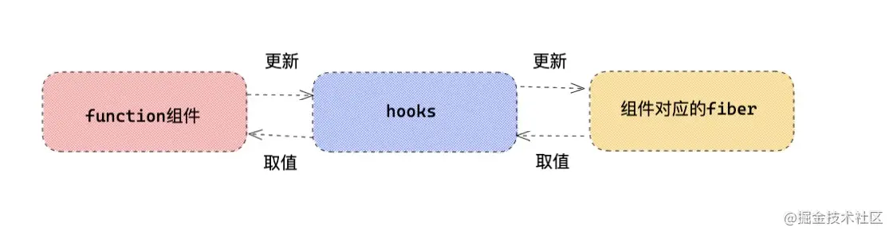
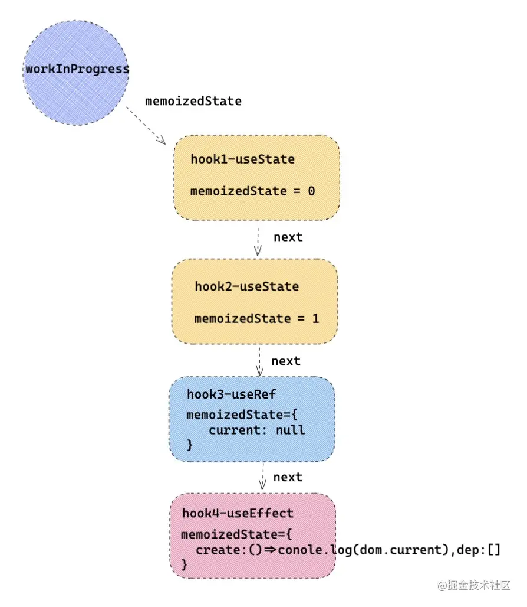
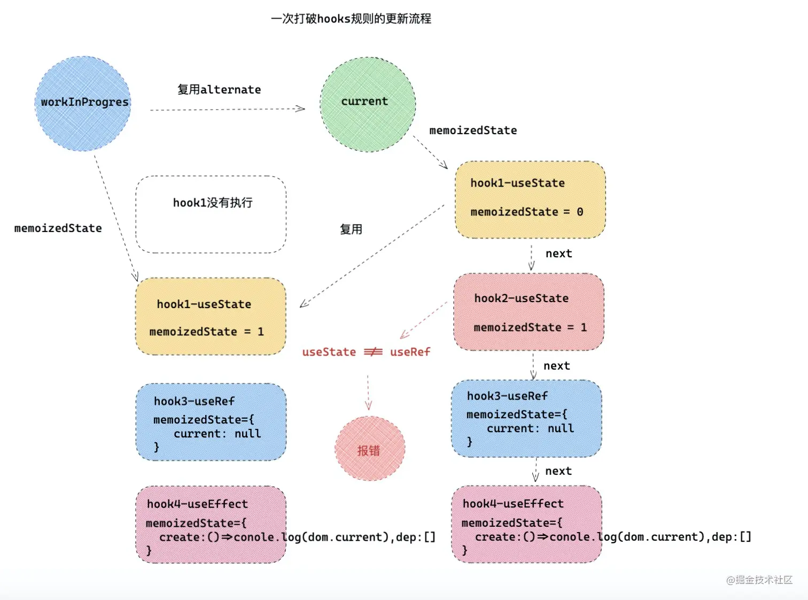
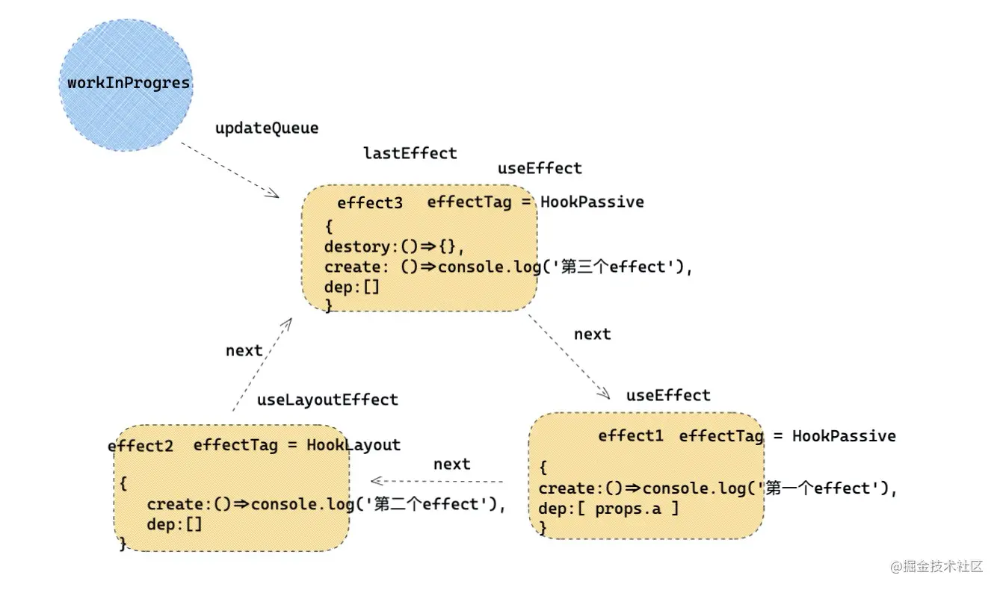

# 原理-Hooks  
Hooks出现的原因  
- 让函数组件也能做类组件的事 有自己的状态 可以处理一些副作用 能获取ref 能做数据缓存  
- 解决逻辑复用难的问题  
- 拥抱函数式编程  

### hooks与fiber(workInProgress)   
类组件的状态比如state context props本质上是存在类组件对应的fiber上 包括生命周期比如componentDidMount 也是以副作用effect形式存在的 那么hooks既然赋予了函数组件如上功能 所以hook本质是离不开函数组件对应的fiber的 hooks可以作为函数组件本身和函数组件对应的fiber之间的沟通桥梁  
  
hooks对象本质上是主要以三种处理策略存在React中  
- ContextOnlyDispatcher 第一种形态是防止开发者在函数组件外部调用hooks 所以第一种就是抱错形态 只要开发者调用了这个形态下的hooks 就会抛出异常  
- HooksDispatcherOnMount 第二种形态是函数组件初始化mount 因为hooks是函数组件和对应fiber的桥梁 这个时候的作用就是建立这个桥梁 初次建立hooks与fiber之间的关系  
- HooksDispatchOnUpdate 第三种形态是函数组件的更新 既然与fiber之间的桥梁已经建立 那么组件更新就需要hooks去获取或者更新维护状态  
一个hooks对象  
```javascript
const HooksDispatcherOnMount = { /* 函数组件初始化用的 hooks */
    useState: mountState,
    useEffect: mountEffect,
    ...
}
const  HooksDispatcherOnUpdate ={/* 函数组件更新用的 hooks */
   useState:updateState,
   useEffect: updateEffect,
   ...
}
const ContextOnlyDispatcher = {  /* 当hooks不是函数内部调用的时候，调用这个hooks对象下的hooks，所以报错。 */
   useEffect: throwInvalidHookError,
   useState: throwInvalidHookError,
   ...
}
```
- 函数组件触发  
  所有函数组件的触发是在renderWithHooks方法中 在fiber调和过程中 遇到FunctionComponent类型的fiber 就会用updateFunctionComponent更新fiber 在updateFunctionComponent内部就会调用renderWithHooks  
  > react-reconciler/src/ReactFiberHooks.js
  ```javascript
  let currentlyRenderingFiber
  function renderWithHooks(current,workInProgress,Component,props){
        currentlyRenderingFiber = workInProgress;
        workInProgress.memoizedState = null; /* 每一次执行函数组件之前，先清空状态 （用于存放hooks列表）*/
        workInProgress.updateQueue = null;    /* 清空状态（用于存放effect list） */
        ReactCurrentDispatcher.current =  current === null || current.memoizedState === null ? HooksDispatcherOnMount : HooksDispatcherOnUpdate /* 判断是初始化组件还是更新组件 */
        let children = Component(props, secondArg); /* 执行我们真正函数组件，所有的hooks将依次执行。 */
        ReactCurrentDispatcher.current = ContextOnlyDispatcher; /* 将hooks变成第一种，防止hooks在函数组件外部调用，调用直接报错。 */
    }
  ```
  workInProgress正在调和更新函数组件对应的fiber树  
  - 对于类组件fiber 用memorizedState保存state信息 对于函数组件fiber 用memorizedState保存hooks信息  
  - 对于函数组件fiber updateQueue存放每个useEffect/useLayoutEffect产生的副作用组成的链表 在commit阶段更新这些副作用  
  - 然后判断组件是初始化流程还是更新流程 如果初始化用HooksDispatchOnMount对象 如果更新用HooksDispatchOnUpdate对象 引用的React hooks都是从ReactCurrentDispatcher.current中的 React就是通过赋予current不同的hooks对象达到监控hooks是否在函数组件内部调用  
  - Component(props, secondArg)这个时候函数组件被真正的执行 里面每个hooks也将依次执行  
  - 每个hooks内部为什么能够读取当前fiber信息 因为currentlyRenderingFiber 函数组件初始化已经把当前fiber赋值给currentlyRenderingFiber 每个hooks内部读取的就是currentlyRenderingFiber的内容  

- hooks初始化-hooks如何建立和fiber的关系  
  hooks初始化流程使用的是mountState mountEffect等初始化节点的hooks将hooks和fiber建立起联系 每个hooks初始化都会执行mountWorkInProgressHook  
  > react-reconciler/src/ReactFiberHooks.js
  ```javascript
  function mountWorkInProgressHook() {
      const hook = {  memoizedState: null, baseState: null, baseQueue: null,queue: null, next: null,};
      if (workInProgressHook === null) {  // 只有一个 hooks
         currentlyRenderingFiber.memoizedState = workInProgressHook = hook;
      } else {  // 有多个 hooks
         workInProgressHook = workInProgressHook.next = hook;
      }
      return workInProgressHook;
   }
  ```
  首先函数组件对应fiber用memorizedState保存hooks信息 每个hooks执行都会产生一个hooks对象 hooks对象中保存着当前hooks的信息 不同的hooks保存的形式不同 每个hooks通过next链表建立起关系  
  假设在一个组件中  
  ```javascript
  export default function Index(){
    const [ number,setNumber ] = React.useState(0) // 第一个hooks
    const [ num, setNum ] = React.useState(1)      // 第二个hooks
    const dom = React.useRef(null)                 // 第三个hooks
    React.useEffect(()=>{                          // 第四个hooks
        console.log(dom.current)
    },[])
    return <div ref={dom} >
        <div onClick={()=> setNumber(number + 1 ) } > { number } </div>
        <div onClick={()=> setNum(num + 1) } > { num }</div>
    </div>
  }
  ```
  那么如上四个hooks初始化 每个hooks内部执行mountWorkInProgressHook 然后每个hooks通过next和下一个hook建立起关联 最后在fiber上的结构会变成这样  
    
  - hooks更新  
  更新hooks逻辑和双缓冲树更新差不多 首先会取出workInProgress.alternate里面对应的hooks 然后根据之前的hooks复制一份 形成新的hooks链表关系 这个过程中解释了hooks为什么要放在顶部 hooks不能放在if条件语句中 因为在更新过程中 如果通过if条件语句 增加或者删除hooks 在复用hooks过程中 会产生复用hooks状态和当前hooks不一致的问题  
  举一个例子 将如上demo修改 将第一个hooks变成条件判断形式  
  ```javascript
  export default function Index({ showNumber }){
    let number, setNumber
    showNumber && ([ number,setNumber ] = React.useState(0)) // 第一个hooks
  }
  ```
  第一次渲染的时候showNumber = true 那么第一个hooks会渲染 第二次渲染的时候 父组件将showNumber设置为false 那么第一个hooks将不执行 那么更新逻辑会变成  
  | hook复用顺序    | 缓存的老hooks | 新的hooks |
  | --------------- | ------------- | --------- |
  | 第一次hooks复用 | useState      | useState  |
  | 第二次hooks复用 | useState      | useRef    |
    
  第二次复用的时候发现hooks类型不同 useState !== useRef 直接报错 开发的时候一定要注意hooks顺序一致性  
### 状态派发  
useState解决了函数组件没有state的问题 让无状态组件有了自己的状态 useState和useReducer原理大同小异 本质上都是触发更新的函数都是dispatchAction  
比如有一段代码  
```javascript
const [ number,setNumber ] = React.useState(0)
```
setNumber本质就是dispatchAction 首先需要看一下执行useState(0)本质上做了些什么  
> react-reconciler/src/ReactFiberHooks.js
```javascript
function mountState(initialState){
     const hook = mountWorkInProgressHook();
    if (typeof initialState === 'function') {initialState = initialState() } // 如果 useState 第一个参数为函数，执行函数得到初始化state
     hook.memoizedState = hook.baseState = initialState;
    const queue = (hook.queue = { ... }); // 负责记录更新的各种状态。
    const dispatch = (queue.dispatch = (dispatchAction.bind(  null,currentlyRenderingFiber,queue, ))) // dispatchAction 为更新调度的主要函数 
    return [hook.memoizedState, dispatch];
}
```
- 上面的state会被当前hooks的memorizedState保存下来 每一个useState都会创建一个queue里面保存了更新的信息  
- 每一个useState都会创建一个更新函数 比如如上的setNumber本质上就是dispatchAction 那么值得注意一点 当前的fiber被bind绑定了固定的参数传入dispatchAction和queue 所以当用户触发setNumber的时候 能够直观反映出来自哪个fiber的更新  
- 最后把memorizedState dispatch返回给开发者使用  
dispatchAction的底层处理逻辑  
```javascript
function dispatchAction(fiber, queue, action){
    /* 第一步：创建一个 update */
    const update = { ... }
    const pending = queue.pending;
    if (pending === null) {  /* 第一个待更新任务 */
        update.next = update;
    } else {  /* 已经有带更新任务 */
       update.next = pending.next;
       pending.next = update;
    }
    if( fiber === currentlyRenderingFiber ){
        /* 说明当前fiber正在发生调和渲染更新，那么不需要更新 */
    }else{
       if(fiber.expirationTime === NoWork && (alternate === null || alternate.expirationTime === NoWork)){
            const lastRenderedReducer = queue.lastRenderedReducer;
            const currentState = queue.lastRenderedState;                 /* 上一次的state */
            const eagerState = lastRenderedReducer(currentState, action); /* 这一次新的state */
            if (is(eagerState, currentState)) {                           /* 如果每一个都改变相同的state，那么组件不更新 */
               return 
            }
       }
       scheduleUpdateOnFiber(fiber, expirationTime);    /* 发起调度更新 */
    }
}
```
当每一次改变state  
- 首先每一次调用dispatchAction都会先创建一个update 然后把他放入待更新pending队列中  
- 然后判断如果当前的fiber正在更新 那么就不需要再更新了  
- 反之 说明当前fiber没有更新任务 那么会拿出上一次state和这一次state进行对比 如果相同 那么直接退出更新 如果不相同 那么发起更新调度任务 这就解释了为什么函数组件useState改变相同的值 组件不更新  
下面模拟一个更新场景  
```javascript
export default  function Index(){
    const [ number , setNumber ] = useState(0)
    const handleClick=()=>{
        setNumber(num=> num + 1 ) // num = 1
        setNumber(num=> num + 2 ) // num = 3 
        setNumber(num=> num + 3 ) // num = 6
    }
    return <div>
        <button onClick={() => handleClick() } >点击 { number } </button>
    </div>
}
```
- 当点击一次按钮 触发了三次setNumber 等于触发了三次dispatchAction 这三次update会在当前hooks的pending队列中 事件批量更新会统一合并成一次更新 接下来就是组件渲染 再一次执行useState 此时走的是更新流程 在更新逻辑中useState内部要做的事就是得到最新的state  
```javascript
function updateReducer(){
    // 第一步把待更新的pending队列取出来。合并到 baseQueue
    const first = baseQueue.next;
    let update = first;
   do {
        /* 得到新的 state */
        newState = reducer(newState, action);
    } while (update !== null && update !== first);
     hook.memoizedState = newState;
     return [hook.memoizedState, dispatch];
}
```
- 当再次执行useState的时候 会触发更新hooks逻辑 本质上调用的就是updateReducer 如上会把待更新的队列pendingQueue拿出来 合并到baseQueue 循环进行更新  
- 循环更新的流程 说白了就是执行每个num => num + 1 得到最新的state 接下来就可以从useState中得到最新的值  
  
### 处理副作用  
- 初始化  
  在render阶段 实际没有进行真正的DOM元素的增加 删除 React把想要做的不同操作打成不用的effectTag 等到commit阶段 统一处理这些副作用 包括DOM元素增删改 执行一些生命周期等 hooks中的useEffect和useLayoutEffect也是副作用  
  以effect为例子  
  ```javascript
   function mountEffect(create,deps){
      const hook = mountWorkInProgressHook();
      const nextDeps = deps === undefined ? null : deps;
      currentlyRenderingFiber.effectTag |= UpdateEffect | PassiveEffect;
      hook.memoizedState = pushEffect( 
         HookHasEffect | hookEffectTag, 
         create, // useEffect 第一次参数，就是副作用函数
         undefined, 
         nextDeps, // useEffect 第二次参数，deps    
      )
   }
  ```
  - mountWorkInProgressHook产生一个hooks 并和fiber建立起关系  
  - 通过pushEffect创建一个effect 并保持到当前hooks的memorizedState属性下  
  - pushEffect除了创建一个effect 还有一个重要作用 就是如果存在多个effect或者layoutEffect会形成一个副作用链表 绑定在函数组件fiber的updateQueue上  
  为什么React会这么设计呢 首先对于类组件有componentDidMount/componentDidUpdate固定的生命周期钩子 用于执行初始化/更新的副作用逻辑 但是对于函数组件 可能存在多个useEffect/useLayoutEffect hooks把这些effect 独立形成链表结构 在commit阶段统一处理和执行  
  如果函数组件这么写  
  ```javascript
   React.useEffect(()=>{
      console.log('第一个effect')
   },[ props.a ])
   React.useLayoutEffect(()=>{
      console.log('第二个effect')
   },[])
   React.useEffect(()=>{
      console.log('第三个effect')
      return () => {}
   },[])
  ```
    
- 更新  
  ```javascript
   function updateEffect(create,deps){
      const hook = updateWorkInProgressHook();
      if (areHookInputsEqual(nextDeps, prevDeps)) { /* 如果deps项没有发生变化，那么更新effect list就可以了，无须设置 HookHasEffect */
         pushEffect(hookEffectTag, create, destroy, nextDeps);
         return;
      } 
      /* 如果deps依赖项发生改变，赋予 effectTag ，在commit节点，就会再次执行我们的effect  */
      currentlyRenderingFiber.effectTag |= fiberEffectTag
      hook.memoizedState = pushEffect(HookHasEffect | hookEffectTag,create,destroy,nextDeps)
   }
  ```
  更新effect的过程非常简单  
  - 就是判断deps项有没有发生变化 如果没有发生变化 更新副作用链表就可以了 如果发生变化 更新链表的同时 打执行副作用的标签 fiber => fiberEffectTag, hook => HookHasEffect 在commit阶段就会根据这些标签重新执行副作用  
- 不同的effect  
  - React会用不同的EffectTag来标记不同的effect 对于useEffect会标记UpdateEffect|PassiveEffect UpdateEffect是证明此次更新需要更新effect HookPassive是useEffect的标识符 对于useLayoutEffect第一次更新会打上HookLayout的标识符 React就是在commit阶段 通过标识符 证明是useEffect还是useLayoutEffect 接下来React会同步处理useLayoutEffect 异步处理useEffect  
  - 如果函数组件需要更新副作用 会标记UpdateEffect 至于哪个effect需要更新 那就看hooks上有没有HookHasEffect标记 初始化或者deps不相等 就会给当前hooks标记上HookHasEffect 所以会执行组件的副作用钩子  

### 状态获取与状态缓存  
- 对于ref的处理  
  useRef就是创建并维护一个ref原始对象  用于获取原生DOM或者组件实例 或者保存一些状态等  
  创建  
  ```javascript
   function mountRef(initialValue) {
      const hook = mountWorkInProgressHook();
      const ref = {current: initialValue};
      hook.memoizedState = ref; // 创建ref对象。
      return ref;
   }
  ```
  更新  
  ```javascript
   function updateRef(initialValue){
      const hook = updateWorkInProgressHook()
      return hook.memoizedState // 取出复用ref对象。
   }
  ```
  如上ref创建和更新过程 就是ref对象的创建和复用过程  
- 对于useMemo的处理  
  创建  
  ```javascript
   function mountMemo(nextCreate,deps){
      const hook = mountWorkInProgressHook();
      const nextDeps = deps === undefined ? null : deps;
      const nextValue = nextCreate();
      hook.memoizedState = [nextValue, nextDeps];
      return nextValue;
   }
  ```
  - useMemo初始化会执行第一个函数等到想要缓存的值 将值缓存到hook的memorizedState上  
  ```javascript
   function updateMemo(nextCreate,deps){
      const hook = updateWorkInProgressHook();
      const prevState = hook.memoizedState; 
      const prevDeps = prevState[1]; // 之前保存的 deps 值
      if (areHookInputsEqual(nextDeps, prevDeps)) { //判断两次 deps 值
         return prevState[0];
      }
      const nextValue = nextCreate(); // 如果deps，发生改变，重新执行
      hook.memoizedState = [nextValue, nextDeps];
      return nextValue;
   }
  ```
  - useMemo更新流程就是对比两次的deps是否发生变化 如果没有发生变化 直接返回缓存值 如果发生变化 执行第一个参数函数 重新生成缓存值 缓存下来  
