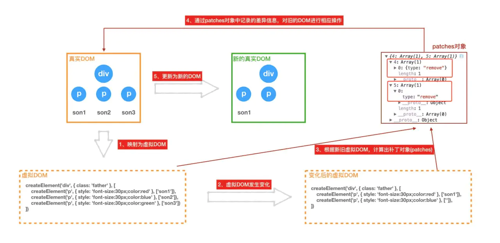

###合成事件
在react中，我们绑定的事件onClick等，并不是原生事件，而是由原生事件合成的react事件。  
为什么采取这种合成事件的模式？  
1. 将事件绑定在document统一管理，避免大量节点绑定事件占用内存 
2. 抹平不同浏览器的差异
- 合成事件原理  
    1. react对事件是如何合成的  
        事件初始化阶段主要形成几个重要的对象，构建初始化React合成事件和原生事件的对应关系，合成事件和对应的事件处理插件关系  
        * namesToPlugins 事件名->事件模块插件的映射  
        ```javascript
        const namesToPlugins = {
            SimpleEventPlugin,
            EnterLeaveEventPlugin,
            ChangeEventPlugin,
            SelectEventPlugin,
            BeforeInputEventPlugin,
        }
        ```
        * plugins 存放上面注册的所有插件列表，初始化为空  
        * registrationNameModules 记录合成的事件-对应的事件插件的关系  
        处理props中事件的时候，会根据不同的事件名称，找到对应的事件插件，然后统一绑定在document上。  
        对于没有出现过的事件，就不会绑定。  
        ```javascript
        {
            onBlur: SimpleEventPlugin,
            onClick: SimpleEventPlugin,
            onClickCapture: SimpleEventPlugin,
            onChange: ChangeEventPlugin,
            onChangeCapture: ChangeEventPlugin,
            onMouseEnter: EnterLeaveEventPlugin,
            onMouseLeave: EnterLeaveEventPlugin,
            ...
        }
        ```
        * 事件插件  
        事件插件是一个对象，有两个属性  
        第一个extractEvent作为事件统一处理函数  
        第二个eventTypes是一个对象，保存了原生事件名和对应的配置项dispatchConfig的映射关系  
        由于v16React的事件是统一绑定在document上的，react用独特的事件名称比如onClick和onClickCapture， 来说明绑定的函数是在冒泡事件阶段，还是捕获事件阶段执行  
        以SimpleEventPlugin为例  
        ```javascript
        const SimpleEventPlugin = {
            eventTypes:{ 
                'click':{ /* 处理点击事件  */
                    phasedRegistrationNames:{
                        bubbled: 'onClick',       // 对应的事件冒泡 - onClick 
                        captured:'onClickCapture' //对应事件捕获阶段 - onClickCapture
                    },
                    dependencies: ['click'], //事件依赖
                    ...
                },
                'blur':{ /* 处理失去焦点事件 */ },
                ...
            }
            extractEvents:function(topLevelType,targetInst,){ /* eventTypes 里面的事件对应的统一事件处理函数，接下来会重点讲到 */ }
        }
        ```
        * registrationNameDependencies  
        用来记录合成事件和原生事件的对应关系  
        ```javascript
        {
            onBlur: ['blur'],
            onClick: ['click'],
            onClickCapture: ['click'],
            onChange: ['blur', 'change', 'click', 'focus', 'input', 'keydown', 'keyup', 'selectionchange'],
            onMouseEnter: ['mouseout', 'mouseover'],
            onMouseLeave: ['mouseout', 'mouseover'],
            ...
        }
        ```
       * injectEventPluginsByName() 形成上述的namesToPlugins  
       * recomputePluginOrdering() 形成上述的plugins  
       * publishEventForPlugin() 形成上述的registrationNameModules和registrationNameDependencies
    2. react事件是怎么绑定的  
       流程:  
       1. diffProperties处理react合成事件  
       ```javascript
         function diffProperties(){
             /* 判断当前的 propKey 是不是 React合成事件 */
             if(registrationNameModules.hasOwnProperty(propKey)){
                  /* 这里多个函数简化了，如果是合成事件， 传入成事件名称 onClick ，向document注册事件  */
                  legacyListenToEvent(registrationName, document）;
             }
         }
       ```
       2. legacyListenToEvent注册事件监听器  
       ```javascript
       //  registrationName -> onClick 事件
       //  mountAt -> document or container
       function legacyListenToEvent(registrationName，mountAt){
          const dependencies = registrationNameDependencies[registrationName]; // 根据 onClick 获取  onClick 依赖的事件数组 [ 'click' ]。
           for (let i = 0; i < dependencies.length; i++) {
           const dependency = dependencies[i];
           //这个经过多个函数简化，如果是 click 基础事件，会走 legacyTrapBubbledEvent ,而且都是按照冒泡处理
            legacyTrapBubbledEvent(dependency, mountAt);
         }
       }
       ```
       在legacyListenToEvent函数中，先找到React合成事件对应的原生事件集合，然后遍历依赖项的数组，绑定事件。（只给原生绑定onChange事件，结果在document上出现很多事件监听的原因）
        按照事件捕获处理的事件：  
        ```javascript
        case TOP_SCROLL: {                                // scroll 事件
            legacyTrapCapturedEvent(TOP_SCROLL, mountAt); // legacyTrapCapturedEvent 事件捕获处理。
            break;
        }
        case TOP_FOCUS: // focus 事件
        case TOP_BLUR:  // blur 事件
        legacyTrapCapturedEvent(TOP_FOCUS, mountAt);
        legacyTrapCapturedEvent(TOP_BLUR, mountAt);
        break;
        ```
       3. 绑定dispatchEvent，进行事件监听  
       ```javascript
        /*
          targetContainer -> document
          topLevelType ->  click
          capture = false
        */
        function addTrappedEventListener(targetContainer,topLevelType,eventSystemFlags,capture){
           const listener = dispatchEvent.bind(null,topLevelType,eventSystemFlags,targetContainer) 
           if(capture){
               // 事件捕获阶段处理函数。
           }else{
               /* TODO: 重要, 这里进行真正的事件绑定。*/
              targetContainer.addEventListener(topLevelType,listener,false) // document.addEventListener('click',listener,false)
           }
        }
        ```
       真正的事件绑定,添加事件监听器addEventListener
       总结:  
       * 在React，diff DOM元素类型的fiber的props的时候，如果发现是React合成事件，比如onClick，会按照事件系统逻辑单独处理。  
       * 根据React合成事件类型，找到对应的原生事件的类型，然后调用判断原生事件类型，大部分事件都按照冒泡逻辑处理，少数事件会按照捕获逻辑处理（比如scroll事件）。  
       * 调用addTrappedEventListener进行真正的事件绑定，绑定在document上，dispatchEvent为统一的事件处理函数。  
       * 有一点值得注意: 只有上述那几个特殊事件比如scorll,focus,blur等是在事件捕获阶段发生的，其他的都是在事件冒泡阶段发生的，无论是onClick还是onClickCapture都是发生在冒泡阶段  
    3. react事件触发流程  
       * 事件触发处理函数dispatchEvent  
       首先执行dispatchEvent，dispatchEvent前三个参数已经被bind， 真正的事件源对象event，被默认绑定成第四个参数  
       ```javascript
        function dispatchEvent(topLevelType,eventSystemFlags,targetContainer,nativeEvent){
            /* 尝试调度事件 */
            const blockedOn = attemptToDispatchEvent( topLevelType,eventSystemFlags, targetContainer, nativeEvent);
        }
       /*
       topLevelType -> click
       eventSystemFlags -> 1
       targetContainer -> document
       nativeEvent -> 原生事件的 event 对象
       */
       function attemptToDispatchEvent(topLevelType,eventSystemFlags,targetContainer,nativeEvent){
           /* 获取原生事件 e.target */
           const nativeEventTarget = getEventTarget(nativeEvent)
           /* 获取当前事件，最近的dom类型fiber ，我们 demo中 button 按钮对应的 fiber */
           let targetInst = getClosestInstanceFromNode(nativeEventTarget); 
           /* 重要：进入legacy模式的事件处理系统 */
           dispatchEventForLegacyPluginEventSystem(topLevelType,eventSystemFlags,nativeEvent,targetInst,);
           return null;
       }
       ```
       在这个阶段主要做了这几件事：  
       1. 首先根据真实的事件源对象，找到e.target真实的dom元素  
       2. 然后根据dom元素，找到与它对应的fiber对象targetInst  
       3. 然后正式进入legacy模式的事件处理系统  
       React怎么样通过原生的dom元素，找到对应的fiber的呢?（getClosestInstanceFromNode原理）  
       首先getClosestInstanceFormNode可以找到当前传入的dom对应的最近的元素类型的fiber对象  
       React在初始化真实dom的时候，用一个随机的key internalInstanceKey指针指向了当前dom对应的fiber对象，  
       fiber对象用stateNode指向了当前的dom元素。  
       ```javascript
         // 声明随机key
         var internalInstanceKey = '__reactInternalInstance$' + randomKey;
         
         // 使用随机key 
         function getClosestInstanceFromNode(targetNode){
           // targetNode -dom  targetInst -> 与之对应的fiber对象
           var targetInst = targetNode[internalInstanceKey];
         }
       ```
       * legacy事件处理系统与批量更新  
       ```javascript
        /* topLevelType - click事件 ｜ eventSystemFlags = 1 ｜ nativeEvent = 事件源对象  ｜ targetInst = 元素对应的fiber对象  */
        function dispatchEventForLegacyPluginEventSystem(topLevelType,eventSystemFlags,nativeEvent,targetInst){
            /* 从React 事件池中取出一个，将 topLevelType ，targetInst 等属性赋予给事件  */
            const bookKeeping = getTopLevelCallbackBookKeeping(topLevelType,nativeEvent,targetInst,eventSystemFlags);
            try { /* 执行批量更新 handleTopLevel 为事件处理的主要函数 */
            batchedEventUpdates(handleTopLevel, bookKeeping);
          } finally {
            /* 释放事件池 */  
            releaseTopLevelCallbackBookKeeping(bookKeeping);
          }
        }
       function batchedEventUpdates(fn,a){
           isBatchingEventUpdates = true;
           try{
              fn(a) // handleTopLevel(bookKeeping)
           }finally{
               isBatchingEventUpdates = false
           }
       }
       ```
       批量更新简化成如上的样子，从上面我们可以看到，React通过开关isBatchingEventUpdates来控制是否启用批量更新。  
       fn(a)，事件上调用的是 handleTopLevel(bookKeeping) ，由于js是单线程的，我们真正在组件中写的事件处理函数，  
       比如demo 的 handerClick实际执行是在handleTopLevel(bookKeeping)中执行的。  
       所以如果我们在handerClick里面触发setState，那么就能读取到 isBatchingEventUpdates = true  
       这就是React的合成事件为什么具有批量更新的功能了。
       * 执行事件插件函数  
       ```javascript
        // 流程简化后
        // topLevelType - click  
        // targetInst - button Fiber
        // nativeEvent
        function handleTopLevel(bookKeeping){
            const { topLevelType,targetInst,nativeEvent,eventTarget, eventSystemFlags} = bookKeeping
            for(let i=0; i < plugins.length;i++ ){
                const possiblePlugin = plugins[i];
                /* 找到对应的事件插件，形成对应的合成event，形成事件执行队列  */
                const  extractedEvents = possiblePlugin.extractEvents(topLevelType,targetInst,nativeEvent,eventTarget,eventSystemFlags)  
            }
            if (extractedEvents) {
                events = accumulateInto(events, extractedEvents);
            }
            /* 执行事件处理函数 */
            runEventsInBatch(events);
        }
       ```
       handleTopLevel最后的处理逻辑就是执行我们说的事件处理插件(SimpleEventPlugin)中的处理函数extractEvents  
       这样的好处是，不需要跨浏览器单独处理兼容问题，交给react底层统一处理。  
       * extractEvent形成事件对象event和事件处理函数队列  
       已SimpleEventPlugin为例  
       ```javascript
        const  SimpleEventPlugin = {
            extractEvents:function(topLevelType,targetInst,nativeEvent,nativeEventTarget){
                const dispatchConfig = topLevelEventsToDispatchConfig.get(topLevelType);
                if (!dispatchConfig) {
                    return null;
                }
                switch(topLevelType){
                    default:
                    EventConstructor = SyntheticEvent;
                    break;
                }
                /* 产生事件源对象 */
                const event = EventConstructor.getPooled(dispatchConfig,targetInst,nativeEvent,nativeEventTarget)
                const phasedRegistrationNames = event.dispatchConfig.phasedRegistrationNames;
                const dispatchListeners = [];
                const {bubbled, captured} = phasedRegistrationNames; /* onClick / onClickCapture */
                const dispatchInstances = [];
                /* 从事件源开始逐渐向上，查找dom元素类型HostComponent对应的fiber ，收集上面的React合成事件，onClick / onClickCapture  */
                 while (instance !== null) {
                      const {stateNode, tag} = instance;
                      if (tag === HostComponent && stateNode !== null) { /* DOM 元素 */
                           const currentTarget = stateNode;
                           if (captured !== null) { /* 事件捕获 */
                                /* 在事件捕获阶段,真正的事件处理函数 */
                                const captureListener = getListener(instance, captured);
                                if (captureListener != null) {
                                /* 对应发生在事件捕获阶段的处理函数，逻辑是将执行函数unshift添加到队列的最前面 */
                                    dispatchListeners.unshift(captureListener);
                                    dispatchInstances.unshift(instance);
                                    dispatchCurrentTargets.unshift(currentTarget);
                                }
                            }
                            if (bubbled !== null) { /* 事件冒泡 */
                                /* 事件冒泡阶段，真正的事件处理函数，逻辑是将执行函数push到执行队列的最后面 */
                                const bubbleListener = getListener(instance, bubbled);
                                if (bubbleListener != null) {
                                    dispatchListeners.push(bubbleListener);
                                    dispatchInstances.push(instance);
                                    dispatchCurrentTargets.push(currentTarget);
                                }
                            }
                      }
                      instance = instance.return;
                 }
                  if (dispatchListeners.length > 0) {
                      /* 将函数执行队列，挂到事件对象event上 */
                    event._dispatchListeners = dispatchListeners;
                    event._dispatchInstances = dispatchInstances;
                    event._dispatchCurrentTargets = dispatchCurrentTargets;
                 }
                return event
            }
        }
        ```
       事件插件系统的核心extractEvent主要的功能：  
       1. 首先形成react事件独有的合成事件源对象，这个对象保存了整个事件的信息。将作为参数传递给真正的事件处理函数（handerClick）  
       2. 然后声明事件执行队列，按照冒泡和捕获的逻辑，从事件源开始逐渐向上，查找dom元素类型HostComponent对应的fiber，收集上面的react合成事件，  
       对于冒泡阶段的事件，将push到执行队列后面，对于捕获阶段的事件，将unShift到执行队列的前面  
       3. 最后将事件执行队列，保存到react事件源对象上，等待执行  
       * 事件触发  
       react事件源对象，以上面代码中的SyntheticEvent为例  
       ```javascript
        function SyntheticEvent( dispatchConfig,targetInst,nativeEvent,nativeEventTarget){
          this.dispatchConfig = dispatchConfig;
          this._targetInst = targetInst;
          this.nativeEvent = nativeEvent;
          this._dispatchListeners = null;
          this._dispatchInstances = null;
          this._dispatchCurrentTargets = null;
          this.isPropagationStopped = () => false; /* 初始化，返回为false  */
        
        }
        SyntheticEvent.prototype={
            stopPropagation(){ this.isPropagationStopped = () => true;  }, /* React单独处理，阻止事件冒泡函数 */
            preventDefault(){ },  /* React单独处理，阻止事件捕获函数  */
            ...
        }
        ```
        runEventsInBatch，所有事件绑定函数，就是在这里触发的  
        ```javascript
        function runEventsInBatch(){
            const dispatchListeners = event._dispatchListeners;
            const dispatchInstances = event._dispatchInstances;
            if (Array.isArray(dispatchListeners)) {
            for (let i = 0; i < dispatchListeners.length; i++) {
              if (event.isPropagationStopped()) { /* 判断是否已经阻止事件冒泡 */
                break;
              }
              
              dispatchListeners[i](event)
            }
          }
          /* 执行完函数，置空两字段 */
          event._dispatchListeners = null;
          event._dispatchInstances = null;
        }
        ```
        dispatchListeners[i](event)就是执行我们的事件处理函数比如handerClick,  
        从这里我们知道，我们在事件处理函数中，返回false，并不会阻止浏览器默认行为，应该用e.preventDefault()  
        另一方面React对于阻止冒泡，就是通过isPropagationStopped，判断是否已经阻止事件冒泡。  
        如果我们在事件函数执行队列中，某一个函数中，调用e.stopPropagation()，就会赋值给isPropagationStopped=()=>true，  
        当再执行 e.isPropagationStopped()就会返回 true ,接下来事件处理函数，就不会执行了
        * 事件池  
        ```javascript
         handerClick = (e) => {
            console.log(e.target) // button 
            setTimeout(()=>{
                console.log(e.target) // null
            },0)
        }
        ```
        对于一次点击事件的处理函数，在正常的函数执行上下文中打印e.target就指向dom元素，但是在setTimeout中却是null，  
        如果这不是react事件系统，两次打印的应该是一样的。为什么会不一样呢？  
        react采取了一个事件池的概念，每次我们用的事件源对象，在事件函数执行后，可以通过releaseTopLevelCallbackBookKeeping等方法将事件源对象  
        释放到事件池中，这样的好处每次我们不必再创建事件源对象，可以从事件池中取出一个事件源对象进行复用，在事件处理函数执行完毕后，会释放事件源到事件池中，  
        清空属性，这就是setTimeout中打印为null的原因  
        * 总结  
        1. 首先通过统一的事件处理函数dispatchEvent，进行批量更新batchUpdate  
        2. 然后执行事件对应的处理插件中的extractEvent，合成事件源对象，每次react会从事件源开始，向上遍历类型为hostComponent即dom类型的fiber，  
        判断props中是否有当前事件，最终形成一个事件执行队列，用这个队列来模拟事件捕获->事件源->事件冒泡这个过程  
        3. 最后通过runEventsInBatch执行事件队列，如果发现阻止冒泡，那么就break跳出循环，最后重置事件源，放回到事件池中，完成整个流程  
     4. ReactV17版本的事件系统的改动  
        * 事件统一绑定在container上，ReactDOM.render(app, container); 而不是document上，这样有利于微前端，因为微前端一个前端系统中可能有多个应用，  
        如果继续采取全部绑定在document上，可能多应用下会出现问题  
        * 对齐原生浏览器事件  
        ReactV17支持了原生捕获事件的支持，对齐了浏览器原生标准。同时onScroll事件不再进行事件冒泡。onFocus和onBlur使用原生focusin，focusout合成  
        * 取消事件池  
        取消事件池复用解决了上述在setTimeout中找不到e.target的问题
###virtual-dom  
- 什么是virtual-dom  
用JavaScript模拟的dom结构  
- 为什么要用virtual-dom  
dom重绘相当消耗浏览器性能
采用JavaScript对象模拟的方法，将dom的比对操作放在JavaScript层，减少浏览器不必要的重绘，提高效率  
上述性能优势仅仅适用于大量数据的渲染并且改变的数据只是一小部分的情况  
小量数据的时候真实dom操作更快，因为虚拟dom还存在在JavaScript中diff算法的比对过程。
虚拟DOM更加优秀的地方在于:
1、它打开了函数式的UI编程的大门，即UI = f(data)这种构建UI的方式。
2、可以将JS对象渲染到浏览器DOM以外的环境中，也就是支持了跨平台开发，比如ReactNative。
- diff算法
1. 什么是diff算法
所谓diff算法，就是用来找出两段文本之间差异的一种算法  
2. 虚拟dom为什么用diff算法  
dom操作是非常昂贵的，因此我们需要尽量的减少dom操作。这就需要找出本次dom必须更新的节点来更新，其他的不更新，这个找出的过程就要用到diff算法  
3. dom-diff的原理  
diff算法会比较前后虚拟DOM，从而得到patches(补丁)，然后与老Virtual DOM进行对比，将其应用在需要更新的地方，得到新的Virtual DOM  
  
4. 虚拟dom中diff算法的策略  
* tree diff  
只会对同一层级的节点进行比较，当发现节点不存在时，就会删除整个节点及其子节点，不会再进行比较  
对于不同层级的节点，只有创建和删除操作，这种操作会影响到性能，不建议进行这种操作。  
在开发组件时，保持稳定的dom结构会有助于性能的提升  
* component diff
如果是同一类型的组件，按照原策略继续比较虚拟dom树  
如果不是，则将该组件判断为dirty component，从而替换整个组件下的所有子节点  
对于同一类型的组件，有可能其虚拟dom没有任何变化，如果能够确切的知道这点，可以节省大量的diff运算的时间，  
因此react允许用户通过shouldComponentUpdate判断该组件是否需要进行diff  
* element diff
对同一层级的同组子节点，添加唯一key进行区分，来优化策略  
diff会对新集合的节点进行遍历，通过唯一key判断老集合中是否存在相同的节点，  
如果存在，则进行移动操作，但在移动前需要将当前节点在老集合中的位置（_mountIndex）与参考位置（lastIndex）进行比较，  
如果_mountIndex < lastIndex，则进行节点移动操作，否则不执行。  
lastIndex一直在更新，表示访问过的节点在老集合中最右的位置（即最大的位置），  
如果新集合中当前访问的节点比lastIndex大，说明当前访问节点在老集合中就比上一个节点位置靠后，  
则该节点不会影响其他节点的位置，因此不用添加到差异队列中，即不执行移动操作，  
只有当访问的节点比lastIndex小时，才需要进行移动操作  
当出现老集合中不存在的节点时，创建新节点，更新lastIndex，并将新节点的位置更新为新集合中的位置  
当完成新集合中的所有节点的diff时，最后还需要对老集合进行循环遍历，判断是否存在新集合中没有但老集合中存在的节点，进行删除操作

