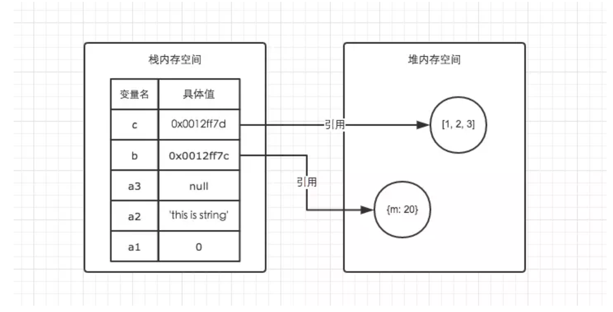
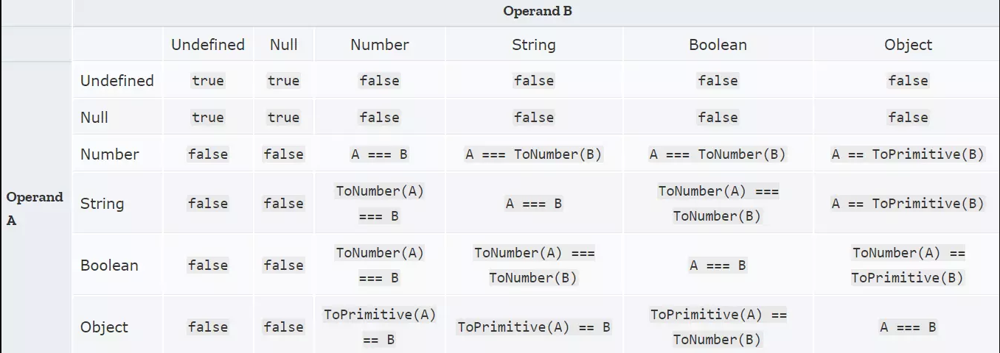
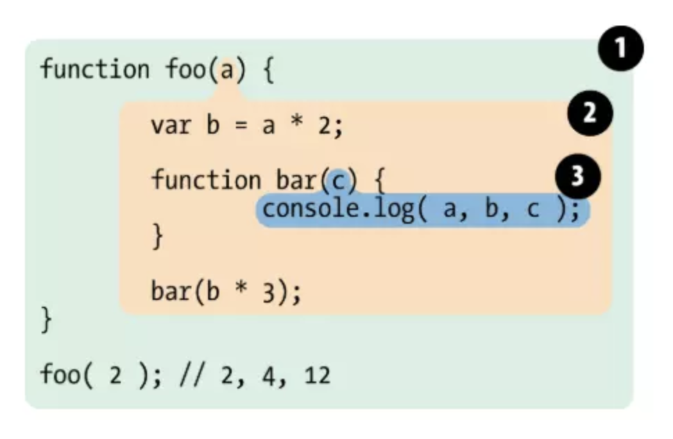

## 变量和类型
#### JavaScript规定了几种语言类型

一个变量可以存放两种类型的值 基本类型的值和引用类型的值  

JavaScript中有6种基本数据类型

1. Undefined
2. Null
3. Boolean
4. String
5. Number
6. Symbol (ES6新增)

剩下的就是引用类型 统称Object类型 细分的话有

1. Object
2. Array
3. Date
4. RegExp
5. Function

--

#### JavaScript对象的底层数据结构是什么  

todo

--

#### Symbol类型在实际开发中的应用 可手动实现一个简单的Symbol

1.消除魔法字符  
    当代码中充斥着大量的魔法字符时，纵使是原开发者在经过一段时间后再回头看也会变得难以理解，更不必说是交由后来开发者维护。
    假如现有一个 Tabs 切换的功能

```
if (type === 'basic') {
    return <div>basic tab</div>
}

if (type === 'super') {
    return <div>super tab</div>
}
```

上面代码中字符串 basic、super 就是与业务代码无关的魔法字符，接下来使用 Symbol 对这块代码进行改造

```
const tabTypes = {
    basic: Symbol(),
    super: Symbol(),
}

if (type === tabTypes.basic) {
    return <div>basic tab</div>
}

if (type === tabTypes.super) {
    return <div>super tab</div>
}
```

2.作为对象属性  
当一个复杂对象中含有多个属性的时候 很容易将某个属性名覆盖掉 利用Symbol值作为属性名可以很好的避免

```
const name = Symbol('name');
const obj = {
    [name]: 'ClickPaas',
}
```

3.模拟类的私有方法  
ES6中的类是没有private关键字来声明类的私有方法和私有变量的 但是我们可以利用Symbol的唯一性来模拟

```
const speak = Symbol();
class Person {
    [speak]() {
        ...
    }
}
```

[手写Symbol Demo](./demo/手写Symbol.js)

--

#### JavaScript中的变量在内存中的具体存储形式

在JavaScript中 每个数据都需要一个内存空间 内存空间又被分为两种  
* 栈内存（stack）  
存放基本类型数据
* 堆内存（heap）  
存放引用类型数据

```
var a1 = 0;   // 栈 
var a2 = 'this is string'; // 栈
var a3 = null; // 栈

var b = { m: 20 }; // 变量b存在于栈中，{m: 20} 作为对象存在于堆内存中  
var c = [1, 2, 3]; // 变量c存在于栈中，[1, 2, 3] 作为对象存在于堆内存中  
```



JavaScript的内存生命周期
> 1. 分配所需的内存
> 2. 使用分配的内存（读/写）
> 3. 不需要是将其释放/归还

```
var a = 20;  // 在堆内存中给数值变量分配空间
alert(a + 100);  // 使用内存
var a = null; // 使用完毕之后，释放内存空间
```

--

#### 基本类型对应的内置对象 以及他们之间的装箱拆箱操作

JavaScript有三大对象 分别是本地对象 内置对象 宿主对象

> 本地对象
>
> 与宿主无关，独立于宿主环境的ECMAScript实现提供的对象。  
> 简单来说，本地对象就是 ECMA-262 定义的类（引用类型）。  
> 这些引用类型在运行过程中需要通过new来创建所需的实例对象。  
> 包含：Object、Array、Date、RegExp、Function、Boolean、Number、String等。
> 
> 内置对象
> 
> 与宿主无关，独立于宿主环境的ECMAScript实现提供的对象。  
> 在 ECMAScript 程序开始执行前就存在，本身就是实例化内置对象，开发者无需再去实例化。  
> 内置对象是本地对象的子集。  
> 包含：Global和Math。  
> ECMAScript5中增添了JSON这个存在于全局的内置对象。  
> 
> 宿主对象
> 
> 由 ECMAScript 实现的宿主环境提供的对象，包含两大类，一个是宿主提供，一个是自定义类对象。 
> 所有非本地对象都属于宿主对象。  
> 对于嵌入到网页中的JS来说，其宿主对象就是浏览器提供的对象，浏览器对象有很多，如Window和Document等。  
> 所有的DOM和BOM对象都属于宿主对象。

Object类型
    
属性  

* constructor  
* prototype

实例方法  
1.toString()   
功能：返回当前对象的字符串形式 返回值为String类型  

```
[1,'2',true].toString(); //"1,2,true"
(new Date()).toString(); //"Sun Sep 24 2017 14:52:20 GMT+0800 (CST)"
({name:'ryan'}).toString(); //"[object Object]"
```
2.toLocaleString()
功能：返回当前对象的“本地化”字符串形式 以便于当前环境的用户辨识和使用 返回值为String类型
```
(1234567).toLocaleString(); //"1,234,567"  
(6.37588).toLocaleString(); //"6.376"  
(new Date()).toLocaleString(); //"2017/9/24 下午2:58:21"
```

3.valueOf()
功能：返回指定对象的原始值

> JavaScript的许多内置对象都重写了该函数，以实现更适合自身的功能需要。因此，不同类型对象的valueOf()方法的返回值和返回值类型均可能不同。

静态方法  
1.Object.assign(target, ...sources)  
功能：把一个或多个源对象的可枚举、自有属性复制到目标对象中 返回值为目标对象    
参数：  
* 目标对象（必须）  
* 至少一个源对象（可选）  
 
```
var target = {
    a:1
};
var source1 = {
    b:2
};
var source2 = {
    c:function(){
      console.log('c');
    }
};
Object.assign(target,source1,source2);
console.log(target); //{a: 1, b: 2, c: ƒ}
```
拓展：自定义一个assign方法

```
//自定义一个assign方法
function copy(target){
	if(target == null){
	  throwError('出错：Cannot convert undefined or null to object');
	}
	var target = new Object(target);
	for(var i = 1;i < arguments.length;i ++){
	  var source = arguments[i];
	  for(var key in source){
	    if(source.hasOwnProperty(key)){
	      //若当前属性为源对象自有属性，则拷贝至目标对象
	      target[key] = source[key];
	    }
	  }
	}
	return target;
}
```
2.Object.create(proto[, propertiesObject])  
功能：创建一个对象 其原型为prototype 同时可添加多个属性  
参数：  
* proto（必须）：原型对象 可以为null表示没有原型  
* descriptors（可选）：包含一个或多个属性描述符的对象
 
propertiesObject参数详解：

* 数据属性
	* value：值
	* writeable：是否可修改属性的值
	* configurable：是否可通过delete删除属性 重新定义
	* enumerable：是否可for-in枚举
* 访问属性
	* get()：访问
	* set()：设置

```
function Person(name){
    this.name = name;
  }
  Person.prototype.say = function(){console.log('my name is ' + this.name +',my age is ' + this.age);}

  var person = new Person('ryan');
  var p = Object.create(person,{
    age:{
      value: 23,
      writeable: true,
      configurable: true
    },
    sex:{
      configurable: true,
      get:function(){return sex + '士';},
      set:function(value){sex = value;}
    }
  });
  
  p.sex = '男';
  p.say(); //'my name is ryan,my age is 23'
  console.log(p.sex); //'男士'
  p.sex = '女';
  console.log(p.sex); //'女士'
```

3.Object.defineProperty(obj, prop, descriptor)  
功能：在一个对象上定义一个新属性或修改一个现有属性 并返回该对象  
参数：  
* obj（必须）：被操作的目标对象
* prop（必须）：被定义或修改的目标属性
* descriptor（必须）：属性的描述符

```
var obj = {};
Object.defineProperty(obj,'name',{
    writeable: true,
    configurable: true,
    enumerable: false,
    value: '张三'
});

console.log(obj.name); //'张三'
for(var key in obj){
    console.log(obj[key]); //无结果
}
```

> 在参数 descriptor中，如果不指定configurable, writeable, enumerable ，则这些属性默认值为false，如果不指定value, get, set，则这些属性默认值为undefined

4.Object.defineProperies(obj, props)   
功能：在一个对象上定义一个或多个新属性或修改现有属性 并返回该对象  
参数：  
* obj（必须）：被操作的目标对象  
* props（必须）：该对象的一个或多个键值对定义了将要为对象添加或修改的属性的具体配资

```
var obj = {};
Object.defineProperties(obj,{
    name:{
      writeable: true,
      configurable: true,
      enumerable: false,
      value: '张三'
    },
    age:{
      writeable: true,
      configurable: true,
      enumerable: true,
      value: 23
    }
});

console.log(obj.name); //'张三'
console.log(obj.age); //23
for(var key in obj){
    console.log(obj[key]); //23
}
```

5.Object.seal(obj)/Object.isSealed(obj)  
功能：密封对象 阻止其修改现有属性的配置特性 即将对象的所有属性的configurable特性设置false（也就是全部属性都无法重新配置 唯独可以把writeable的值由true改为false 即冻结作用） 并阻止添加新属性 返回该对象  
参数：  
* obj（必须）： 被密封的对象

```
var obj = {name:'张三'};

Object.seal(obj);
console.log(Object.isSealed(obj)); //true

obj.name = '李四'; //修改值成功
console.log(obj.name); //'李四'
obj.age = 23; //无法添加新属性
console.log(obj.age); //undefined

Object.defineProperty(obj,'name',{ 
    writeable: true,
    configurable: true,
    enumerable: true
}); //报错：Cannot redefine property: name
```

补充： Object.isSealed（obj）用于判断目标对象是否被密封 返回布尔值

6.Object.freeze(obj)/Object.isFrozen(obj)  
功能：完全冻结对象 在seal的基础上 属性值也不可以修改 即每个属性的writeable也被设为false  
参数：  
* obj（必须）：被冻结的对象

```
var obj = {name:'张三'};

Object.freeze(obj);
console.log(Object.isFrozen(obj)); //true

obj.name = '李四'; //修改值失败
console.log(obj.name); //'张三'
obj.age = 23; //无法添加新属性
console.log(obj.age); //undefined

Object.defineProperty(obj,'name',{ 
    writable: true,
    configurable: true,
    enumerable: true
}); //报错：Cannot redefine property: name
```

补充：Object.isFrozen(obj)用于判断目标对象是否被冻结 返回布尔值

7.getOwnPropertyDescriptor(obj, prop)  
功能：获取目标对象上某自有属性的配置特性（属性描述符） 返回值为配置对象  
参数：  
* obj（必须）：目标对象  
* prop（必须）：目标自有属性

```
var obj = {};

Object.defineProperty(obj,'name',{
    writable: true,
    configurable: false,
    enumerable: true,
    value: '张三'
});

var prop = Object.getOwnPropertyDescriptor(obj,'name');
console.log(prop); //{value: "张三", writable: true, enumerable: true, configurable: false}
```
8.Object.getOwnPropertyNames(obj)  
功能：获取目标对象上的全部自有属性名（包括不可枚举属性）组成的数组  
参数：  
* obj(必须)：目标对象

```
var obj = {};
obj.say = function(){};

Object.defineProperties(obj,{
    name:{
      writable: true,
      configurable: true,
      enumerable: true,
      value: '张三'
    },
    age:{
      writable: true,
      configurable: true,
      enumerable: false,
      value: 23
    }
});

var arr = Object.getOwnPropertyNames(obj);
console.log(arr); //["say", "name", "age"]
```

9.Object.getPrototypeOf(obj)  
功能：获取指定对象的原型 即目标对象的prototype属性的值  
参数：  
* obj（必须）：目标对象

```
var obj = {};
obj.say = function(){};

Object.defineProperties(obj,{
    name:{
      writable: true,
      configurable: true,
      enumerable: true,
      value: '张三'
    },
    age:{
      writable: true,
      configurable: true,
      enumerable: false,
      value: 23
    }
});

var arr = Object.getOwnPropertyNames(obj);
console.log(arr); //["say", "name", "age"]
```

10.Object.setPrototypeOf(obj, proto)  
功能：设置目标对象的原型为另一个对象或null 返回该目标对象  
参数：  
* obj（必须）： 目标对象  
* proto（必须）：原型对象

```
var obj = {a:1};
var proto = {};
Object.setPrototypeOf(obj,proto); //设置obj对象的原型

proto.b = 2; //为该原型对象添加属性
proto.c = 3;

console.log(obj.a); //1
console.log(obj.b); //2
console.log(obj.c); //3
```

解析：  
上述代码将proto对象设置为obj对象的原型 所有从obj对象上可以顺利读取到proto对象的属性 也就是原型链上单属性

> Object.setPrototypeOf()方法的作用与__proto__相同，用来设置当前对象的原型指向的对象(prototype)。它是 ES6 正式推荐的设置原型对象的方法。

11.Object.keys(obj)  
功能：获取目标对象上所有可枚举属性组成的数组  
参数：  
* obj（必须）：目标对象

```
var person = {
    type:'person',
    say:function(){}
  };
  //以person对象为原型，创建obj对象
  var obj = Object.create(person,{
    sex:{
      writable: true,
      configurable: true,
      enumerable: false, //设置sex属性为不可枚举
      value: 'male'
    },
    age:{
      writable: true,
      configurable: true,
      enumerable: true, //设置age属性为可枚举
      value: 23
    }
  });

  obj.name = '张三'; //自定义属性name默认为可枚举
  console.log(obj.propertyIsEnumerable('name')); //true，成功验证name属性为可枚举

  //用for-in可获取obj上全部可枚举的属性（包括自有和原型链上的）
  var arr = [];
  for(var key in obj){
    arr.push(key);
  }
  console.log(arr); //["age", "name", "type", "say"]

  //用Object.keys()可获取obj上全部可枚举的自有属性
  console.log(Object.keys(obj)); // ["age", "name"]s
```

> Object.keys(obj)方法获取的集合和for-in遍历获取的不同在于，Object.keys()只获取目标对象上可枚举的自有属性，而for-in遍历会包含原型链上可枚举属性一并获取。
> 
> Object.keys()和Object.getOwnPropertyNames()的相同之处都是获取目标对象的自有属性，区别在于，后者会连同不可枚举的自有属性也一并获取组成数组并返回。

12.Object.preventExtensions(obj)/Object.isExtensible(obj)  
功能：使某一对象不可扩展 也就是不能为其添加新属性  
参数：  
* obj（必须）：目标对象

补充：Object.isExtensible(obj)方法用于判断一个对象是否可扩展 即是否可以添加新属性

```
var obj = {
  name: '张三'
};

Object.preventExtensions(obj); //阻止obj的可扩展性
console.log(Object.isExtensible(obj)); //false，表明obj对象为不可扩展，即阻止成功

obj.age = 23; //默认添加失败
console.log(obj.age); //undefined
```

Array类型  

属性

* length  
设置或返回数组中元素的数目  

> 设置 length 属性可改变数组的大小。如果设置的值比其当前值小，数组将被截断，其尾部的元素将丢失。如果设置的值比它的当前值大，数组将增大，新的元素被添加到数组的尾部，它们的值为 undefined。

* constructor  
返回对创建此对象的数组函数的引用  

* prototype  
使有能力向对象添加属性和方法  

对象方法  
1.concat()  

* 用于连接两个或多个数组 该方法不会改变现有的数组 而是返回被连接数组的一个副本
* 如果要进行concat()操作的参数是数组 那么添加的是数组中的元素 而不是数组

2.join()

* 把数组中的所有元素放入一个字符串 元素是通过指定的分隔符进行分隔的
* 若省略了分隔符参数 则使用逗号作为分隔符

3.push()

* 向数组的末尾添加一个或多个元素 并返回新的数组长度

4.pop()

* 用于删除数组的最后一个元素 把数组长度减1 并返回被删除的元素
* 如果数组已经为空 则pop()不改变数组 并返回undefined

5.shift()

* 用于把数组的第一个元素从其中删除 并返回被移除的这个元素
* 如果数组是空的 那么将不进行任何操作 返回undefined
* 该方法是直接修改原数组

6.unshift()

* 向数组的开头添加一个或更多元素 并返回新的数组长度
* 该方法是直接修改原数组

7.reverse()

* 用于颠倒数组中元素的顺序
* 该方法会直接修改原数组 而不会创建新数组

8.sort()

* 用于对数组的元素进行排序
* 该排序直接修改原数组 不生成副本
* 该方法接受一个可选参数 若未使用参数 将按字母顺序对数组元素进行排序 说得更精确点 是按照字符编码的顺序进行排序 要实现这一点 首先应把数组的元素都转换成字符串（如有必要） 以便进行比较
* 如果想按照其他标准排序 就需要提供比较函数 该函数要比较两个值 然后返回一个用于说明这两个值的相对顺序的数字 比较函数应具有两个参数a和b 其返回值如下：
	* 若a小于b 排序后a应该在b之前 则返回一个小于0的值
	* 若a等于b 则返回0
	* 若a大于b 则返回一个大0的值

9.slice(start[, end])  

* 截取原数组从start到end位置（不包含它）元素组成的子数组
* 该方法返回一个新数组 不会修改原数组
* 若未指定end参数 那么会截取尾巴直到原数组最后一个元素（包含它）

10.splice(index, howmany[, item1, item2...])

* 删除从index处开始的howmany个元素 并且用可选参数列表中声名的一个或多个值来替换那些被删除的元素
* 该方法返回的是含有被删除的元素组成的数组 若无被删元素 则返回空数组
* 若参数只有index 那么原数组将从index开始删除直至结尾
* 该方法直接修改原数组

11.map()

* 返回一个新的array 每个元素为调用func的结果

12.filter()

* 返回一个符合func条件的元素素组

13。some()

* 返回一个boolean 判断是否有元素是否符合func条件

14.every()

* 返回一个boolean 判断每个元素是否符合func条件

15.forEach()

* 没有返回值 只是针对每个元素调用func

16.reduce()

* reduce方法有两个参数 第一个是一个callback 用于针对数组项的操作 第二个参数则是传入的初始值 这个初始值用于单个数组项的操作 需要注意的是 reduce方法返回值并不是数组 而是形如初始值的经过叠加处理的操作

Date类型
 
Date对象：封装一个时间点，提供操作时间的API。Date对象中封装的是从1970年1月1日0点至今的毫秒数

创建Date对象4种方式

> var now = new Date(); //获取客户端的当前系统时间  
var date - new Date("1994/02/04 03:23:55"); //创建自定义时间  
var date = new Date(yyyy, MM, dd, hh, mm, ss); //创建自定义时间  
var oldDate = new Date("1994/02/04");  
var newDate = new Date(oldDate); //复制一个时间对象  

日期API

日期分量：FullYear、Month、Date、Day、Hours、Minutes、Seconds、Milliseconds。  
每一个日期分量都有一个get和set方法（除了Day没有set方法），分别用于获取和设置时间对象。

> 日期的单位及范围:  
  年FullYear (无范围)  
  月Month (0~11, 0开始,没有12)   
  日Date (1~31, 和现实生活一样)   
  星期Day (0~6, 0是星期日,没有7)  
  时Hours (0~23. 0开始，没有24)  
  分Minutes (0~59)  
  秒Seconds (0~59)  
  毫秒MilliSeconds  

RegExp类型

RegExp对象属性

1.global

* 描述：RegExp 对象是否具有标志 g，即全局匹配。

* 值：true或false。

2.ignoreCase

* 描述：RegExp 对象是否具有标志 i，即忽略大小写。

* 值：一个整数，它声明的是上一次匹配文本之后的第一个字符的位置。

3.lastIndex

* 描述：lastIndex用于规定下次匹配的起始位置。

* 值：true或false。

> 不具有标志 g 和不表示全局模式的 RegExp 对象不能使用 lastIndex 属性。

RegExp对象方法

1.compile()
  
* compile() 方法用于在脚本执行过程中编译正则表达式。

* compile() 方法也可用于改变和重新编译正则表达式。

2.exec()

* 功能：用于检索字符串中的正则表达式的匹配。

* 参数：string，必须，要检索的字符串。

* 返回值：返回一个数组，其中存放匹配的结果。如果未找到匹配，则返回值为 null。

3.test()

* 功能：用于检测一个字符串是否匹配某个模式。

* 参数：string，必须，要检索的字符串。

* 返回值：true或者false。

> 注意：支持正则表达式的 String 对象的方法有：search()、match()、replace()和split()。

Function类型

Function对象属性

1.arguments

* length：获取函数实参的个数

* callee：获取函数对象本身的引用

* callee.length：获取函数形参的个数

> Javascrip中每个函数都会有一个Arguments对象实例arguments，它引用着函数的实参，可以用数组下标的方式"[]"引用每个实际传入的参数。

```
function say(a,b,c){
  console.log(arguments.length); //2
  console.log(arguments[0],arguments[1]); //hello world
}
say('hello','world');
```

Function对象方法

1.toString()

* 功能：将函数体转换成对应的字符串。

Boolean类型

常用方法

1.toString()

* 功能：根据布尔值返回字符串 "true" 或 "false"。

> 注释：在 Boolean 对象被用于字符串环境中时，此方法会被自动调用。

2.valueOf()

* 功能：返回 Boolean 对象的原始值。

Number类型

常用方法

1.toString()

* 功能：将Number数值转换为字符串，该方法接受一个可选参数基数，若省略该参数，则默认基数为10，即十进制。

```
var num = 10;
console.log(num.toString(2)); //1010
```

2.toLocaleString()

* 功能：把一个 Number 对象转换为本地格式的字符串。

3.valueOf()

* 功能：返回一个 Number 对象的基本数字值。

> valueOf() 方法通常由 JavaScript 在后台自动进行调用，而不是显式地处于代码中。

String类型

String对象属性

1.length

* 功能：String 对象的 length 属性声明了该字符串中的字符数。

String对象方法

1.charAt()

* 功能：返回指定位置的字符。

* 参数：必须，为目标字符的下标位置。

> 若参数 index 不在 0 与 string.length 之间，该方法将返回一个空字符串。

2.charCodeAt()

* 功能：返回在指定的位置的字符的 Unicode 编码。

* 参数：必须，为目标字符的下标位置。

> 若参数 index 不在 0 与 string.length 之间，该方法将返回NaN。

3.indexOf()

* 功能：检索字符串，返回指定子字符串在字符串中首次出现的位置。

* 参数1：检索目标子字符串，必须。

* 参数2：在字符串中开始检索的位置，可选。其合法取值是 0 到 stringObject.length - 1。如省略该参数，则将从字符串的首字符开始检索。

> 注意：indexOf() 方法对大小写敏感！  
  注意：如果要检索的字符串值没有出现，则该方法返回 -1。

4.lastIndexOf()

* 功能：从后向前搜索字符串，返回指定子字符串在字符串中首次出现的位置。

* 参数1：检索目标子字符串，必须。

* 参数2：在字符串中开始检索的位置，可选。其合法取值是 0 到 stringObject.length - 1。如省略该参数，则将从字符串的最后一个字符开始检索。

5.match()

* 功能：返回指定位置的字符。

* 参数：必须，规定要检索的字符串值或待匹配的 RegExp 对象。

* 返回值：存放匹配结果的数组。该数组的内容依赖于 regexp 是否具有全局标志 g。

> 如果 regexp 没有标志 g，那么 match() 方法就只能在 stringObject 中执行一次匹配。如果没有找到任何匹配的文本， match() 将返回 null。否则，它将返回一个数组，其中存放了与它找到的匹配文本有关的信息。该数组的第 0 个元素存放的是匹配文本，而其余的元素存放的是与正则表达式的子表达式匹配的文本。除了这些常规的数组元素之外，返回的数组还含有两个对象属性。index 属性声明的是匹配文本的起始字符在 stringObject 中的位置，input 属性声明的是对 stringObject 的引用。  
>
> 如果 regexp 具有标志 g，则 match() 方法将执行全局检索，找到 stringObject 中的所有匹配子字符串。若没有找到任何匹配的子串，则返回 null。如果找到了一个或多个匹配子串，则返回一个数组。不过全局匹配返回的数组的内容与前者大不相同，它的数组元素中存放的是 stringObject 中所有的匹配子串，而且也没有 index 属性或 input 属性。

```
var s = 'hello21 world21';
console.log(s.match(/\d{2}/)); //[ '21', index: 5, input: 'hello21 world21' ]

var s = 'hello21 world21';
console.log(s.match(/\d{2}/g)); //[ '21', '21' ]
```

6.replace()

* 功能：在字符串中用一些字符替换另一些字符，或替换一个与正则表达式匹配的子串。

* 参数1：regexp/substr，必须，规定子字符串或要匹配的 RegExp 对象。

* 参数2：replacement，必须，用于替换的字符串值。

* 返回值：替换后的一个新字符串。

```
var s = 'hello world hello';
console.log(s.replace('hello','hi')); //hi world hello
console.log(s.replace(/hello/,'hi')); //hi world hello
console.log(s.replace(/hello/g,'hi')); //hi world hi
```
> replace方法返回一个新字符串，并不会修改原字符串。

7.search()

* 功能：用于检索字符串中指定的子字符串，或检索与正则表达式相匹配的子字符串。

* 参数：regexp/substr，必须，规定子字符串或要匹配的 RegExp 对象。

* 返回值：原字符串中第一次匹配到目标字符串的起始位置。

```
var s = 'hello world hello';
console.log(s.search('hello')); //0
console.log(s.search(/hello/g)); //0
console.log(s.search(/hello2/)); //-1
```
> search()方法不执行全局匹配，它将忽略标志 g。也就是说，它只匹配一次。若没匹配到结果，则返回-1。

8.toLowerCase() & toUpperCase()

* 功能：把字符串转换为小写/大写。

* 返回值：一个新的字符串。

```
var s = 'Hello World';
console.log(s.toLowerCase()); //hello world
console.log(s.toUpperCase()); //HELLO WORLD
```

9.concat()

* 功能：用于连接两个或多个字符串。

* 语法：stringObject.concat(stringX,stringX,...,stringX)

* 返回值：衔接后的一个新字符串。

> concat方法不会修改原字符串。  
  stringObject.concat() 与 Array.concat() 很相似。  
  通常使用 " + " 运算符来进行字符串的连接运算通常会更简便一些。

```var s1 = 'hello ';
   var s2 = 'world ';
   var s3 = '233';
   console.log(s1.concat(s2,s3)); //hello world 233
```

10.split()

* 功能：用于把一个字符串分割成字符串数组，是 Array.join( ) 的逆操作。

* 参数1：separator，必须，字符串或正则表达式，从该参数指定的地方分割原字符串。

* 参数2：howmany，可选，指定返回数组的最大长度。

* 返回值：一个字符串数组。

```
var s = 'hi baby';
console.log(s.split('')); //[ 'h', 'i', ' ', 'b', 'a', 'b', 'y' ]
console.log(s.split(' '));  //[ 'hi', 'baby' ]
console.log(s.split('b')); //[ 'hi ', 'a', 'y' ]
```

11.slice()

* 功能：截取字符串的某个部分，并以新的字符串返回被提取的部分。

* 参数1：截取的起始位置，必须。

* 参数2：截取的结束位置，可选。

* 返回值：截取部分，一个新的字符串。

> 注意：String.slice() 与 Array.slice() 相似。  
  slice方法的两个参数接受负值，若为负数，则该参数规定的是从字符串的尾部开始算起的位置。也就是说，-1 指字符串的最后一个字符，-2 指倒数第二个字符，以此类推。  
  若未指定第二个参数，则默认截取至字符串的末尾。  
  slice方法不修改原字符串。
  
```
var s = 'hi baby';
console.log(s.slice(3)); //baby
console.log(s.slice(1,5)); //i ba
console.log(s.slice(-4)); //baby
console.log(s.slice(-4,-2)); //ba
```

12.substr()

* 功能：截取从指定下标开始的指定数目的字符。

* 参数1：start，必须，截取的起始位置，接受负值。

* 参数2：length，可选，截取字符串的长度，若未指定，则默认截取到原字符串的末尾。

* 返回值：截取部分，一个新的字符串。

> 注意：ECMAscript 没有对该方法进行标准化，因此不建议使用它。

```
var s = 'hi baby';
console.log(s.substr(3)); //baby
console.log(s.substr(3,2)); //ba
console.log(s.substr(-3,2)); //ab
```

13.substring()

* 功能：截取字符串中介于两个指定下标之间的字符。

* 参数1：start，必须，截取的起始位置。

* 参数2：end，可选，截取的结束位置，若未指定，则默认截取到原字符串的末尾。

* 返回值：截取部分，一个新的字符串。

```
var s = 'hi baby';
console.log(s.substring(3)); //baby
console.log(s.substring(3,5)); //ba
console.log(s.substring(5,3)); //ba
console.log(s.substring(3,3)); //''
```

> 注意：与 slice() 和 substr() 方法不同的是，substring() 不接受负的参数。  
 如果参数 start 与 stop 相等，那么该方法返回的一个空串。  
 如果 start 比 stop 大，那么该方法在提取子串之前会先交换这两个参数。

Global对象（全局对象）

> 关于全局对象：全局对象只是一个对象，而不是类。既没有构造函数，也无法实例化一个新的全局对象。

属性

Infinity: 代表正的无穷大的数值。

```
console.log(6/0); //Infinity
console.log(-6/0); //-Infinity
console.log(0/0); //NaN
console.log(1.7976931348623157E+10308); //Infinity
console.log(-1.7976931348623157E+10308); //-Infinity
```
> Infinity代表了超出JavaScript处理范围的数值。也就是说JS无法处理的数值都是Infinity。实践证明，JS所能处理的最大值是1.7976931348623157e+308，而最小值是5e-324。

NaN: 代表非数字的值。

```
var a = Number('100');
var b = Number('hello world');

console.log(a); //100
console.log(b); //NaN
console.log(isNaN(a)); //false
console.log(isNaN(b)); //true
```
> 提示：请使用 isNaN() 方法来判断一个值是否是数字，原因是 NaN 与所有值都不相等，包括它自己。

Undefined: 代表未定义的值。

```
var a;
var b = '';
var c = null;

console.log(a === undefined); //true
console.log(b === undefined); //false
console.log(c == undefined); //true
```
> 提示：判断一个变量是否未定义，只能用 === undefined 运算来测试，因为 == 运算符会认为 undefined 值等价于 null，即undefined == null会返回true。  
>
> 注释：null 表示无值，而 undefined 表示一个未声明的变量，或已声明但没有赋值的变量，或一个并不存在的对象属性。

方法

1.encodeURI(URIString)

* 功能：将字符串作为URI进行编码，返回值为URIstring 的副本。

* 参数：URIString(必须)：一个待编码的字符串。

```
console.log(encodeURI('http://www.baidu.com')); //http://www.baidu.com
console.log(encodeURI('http://www.baidu.com/my mind')); //http://www.baidu.com/my%20mind
console.log(encodeURI(',/?:@&=+$#')); //,/?:@&=+$#
```
> 该方法不会对 ASCII 字母和数字进行编码，也不会对这些 ASCII 标点符号进行编码： - _ . ! ~ * ' ( ) 。
>  
> 该方法的目的是对 URI 进行完整的编码，因此对以下在 URI 中具有特殊含义的 ASCII 标点符号，encodeURI() 函数是不会进行转义的：;/?:@&=+$,#
>  
> 提示：如果 URI 组件中含有分隔符，比如 ? 和 #，则应当使用 encodeURIComponent() 方法分别对各组件进行编码。

2.encodeURIComponent(URIString)

* 功能：将字符串作为URI组件进行编码，返回值为URIstring的副本。
  
  该方法不会对 ASCII 字母和数字进行编码，也不会对这些 ASCII 标点符号进行编码： - _ . ! ~ * ' ( ) 。
  
  其他字符（比如 ：;/?:@&=+$,# 这些用于分隔 URI 组件的标点符号），都是由一个或多个十六进制的转义序列替换的。
  
* 参数：URIString(必须)：一个待编码的字符串。

> encodeURI和encodeURIComponent的区别：  
> 它们都是编码URL，唯一区别就是编码的字符范围，其中encodeURI方法不会对下列字符编码 ASCII字母、数字、~!@#$&*()=:/,;?+'  
encodeURIComponent方法不会对下列字符编码 ASCII字母、数字、~!*()'  
所以encodeURIComponent比encodeURI编码的范围更大。  
实际例子来说，encodeURIComponent会把 http:// 编码成 http%3A%2F%2F 而encodeURI却不会。

使用场景：

* 当你需要编码整个URL，然后使用这个URL，则使用encodeURI。

```
console.log(encodeURI('http://www.baidu.com/home/some other thing'));
//编码后为：http://www.baidu.com/home/some%20other%20thing; 其中，空格被编码成了%20

//但是如果你用了encodeURIComponent
console.log(encodeURIComponent('http://www.baidu.com/home/some other thing'));
//http%3A%2F%2Fwww.baidu.com%2Fhome%2Fsome%20other%20thing 连 "/" 都被编码了，整个URL已经没法用了
```

* 当你需要编码URL中的参数时，那么使用encodeURIComponent。

```
var param = "http://www.baidu.com/home/"; //param为参数
param = encodeURIComponent(param);
var url = "http://www.baidu.com?next=" + param;
console.log(url) //'http://www.baidu.com?next=http%3A%2F%2Fwww.baidu.com%2Fhome%2F'
//显然，参数中的 "/" 被编码了，而如果用encodeURI肯定要出问题，因为后面的/是需要编码的。
```
补充：相应的，存在decodeURI()和decodeURIComponent是用来解码的，逆向操作。

3.parseInt(string,radix)

功能：解析一个字符串，并返回一个整数。

参数：

* string(必须)：待解析的字符串

* radix(可选)：表示要解析的数字的基数。该值介于 2 ~ 36 之间。  
如果省略该参数或其值为 0，则数字将以 10 为基础来解析。如果它以 “0x” 或 “0X” 开头，将以 16 为基数。如果该参数小于 2 或者大于 36，则 parseInt() 将返回 NaN。

```
console.log(parseInt('10')); //10
console.log(parseInt('11',9)); //10 (9+1)
console.log(parseInt('11',2)); //3 (2+1)
console.log(parseInt('17',8)); //15 (8+7)
console.log(parseInt('1f',16)); //31 (16+15)
console.log(parseInt('010')); //10
console.log(parseInt('0x0011')); //17
```

4.parseFloat()

功能：解析一个字符串，并返回一个浮点数。  
该函数指定字符串中的首个字符是否是数字。如果是，则对字符串进行解析，直到到达数字的末端为止。

参数：

* string(必须)：待解析的字符串

```console.log(parseFloat('10')); //10
   console.log(parseFloat('10.00')); //10 
   console.log(parseFloat('10.33')); //10.33
   console.log(parseFloat(' 60 ')); //60 首尾的空格会忽略
   console.log(parseFloat('23 34 45')); //23 中间的空格不会忽略，会中断
   console.log(parseFloat('23 years')); //23
   console.log(parseFloat('i am 23')); //NaN
```
> 提示：开头和结尾的空格是允许的。如果字符串的第一个字符不能被转换为数字，那么 parseFloat() 会返回 NaN。如果只想解析数字的整数部分，请使用 parseInt() 方法。

5.isFinite(number)

功能：用于检查其参数是否是无穷大。

参数：

* number(必须)：待检测数字。  
如果 number 是有限数字（或可转换为有限数字），那么返回 true。否则，如果 number 是 NaN（非数字），或者是正、负无穷大的数，则返回 false。

```console.log(isFinite(123)); //true
   console.log(isFinite(-1.23)); //true
   console.log(isFinite(5-2)); //true
   console.log(isFinite(0)); //true
   console.log(isFinite(0/0)); //false
   console.log(isFinite('Hello')); //false
```
6.isNaN(number)

功能：用于检查其参数是否为非数字值。

参数：

* number(必须)：待检测数字。  
如果 number 是非数字值 NaN（或者能被转换成NaN），返回 true，否则返回 false。

```
console.log(isNaN(123)); //false
console.log(isNaN(-1.23)); //false
console.log(isNaN(5-2)); //false
console.log(isNaN(0)); //false
console.log(isNaN(0/0)); //true
console.log(isNaN('Hello')); //true
```
> 提示：isNaN() 函数通常用于检测 parseFloat() 和 parseInt() 的结果，以判断它们表示的是否是合法的数字。当然也可以用 isNaN() 函数来检测算数错误，比如用 0 作除数的情况。

7.Number(object)
  
功能：把对象的值转换为数字。

参数：
  
* object(必须)：待转换的对象。  
  如果参数是 Date 对象，Number() 返回从1970年1月1日至今的毫秒数，即时间戳。如果对象的值无法转换为数字，那么 Number() 函数返回 NaN。

```
console.log(Number(new Boolean(true))); //1
console.log(Number(new Boolean(false))); //0
console.log(Number(new Date())); //1506266494726
console.log(Number(new String('999'))); //999
console.log(Number(new String('999 888'))); //NaN
```
8.String(object)
  
功能：把对象的值转换为字符串。

参数：
  
* object(必须)：待转换的对象。

```
console.log(String(new Boolean(true))); //'true'
console.log(String(new Boolean(false))); //'false'
console.log(String(new Date())); //'Sun Sep 24 2017 23:25:43 GMT+0800 (CST)'
console.log(String(new String('999'))); //'999'
console.log(String(new String('999 888'))); //'999 888'
console.log(String(12345)); //'12345'
```
Math对象

常用方法

> Math.abs(); //取绝对值  
  Math.ceil(); //向上取整  
  Math.floor(); //向下取整  
  Math.round(); //四舍五入取整  
  Math.random(); //生成0~1间的随机数(>0)  
  Math.max(x,y); //取x、y中较大的那个  
  Math.min(x,y); //取x、y中较小的那个

JSON对象

我们常说的对象字面量其实不是JSON对象，但是有真正的JSON对象。

两者完全不一样概念，在新版的浏览器里JSON对象已经被原生的内置对象了，目前有2个静态方法：JSON.parse用来将JSON字符串反序列化成对象，JSON.stringify用来将对象序列化成JSON字符串。

老版本的浏览器不支持这个对象，但你可以通过json2.js来实现同样的功能。

JSON对象方法

1.JSON.parse()
  
* 功能：将字符串反序列化成对象
* 参数：JSON字符串
* 返回值：对象

```
var jsonString = '{"name":"ryan"}'; //JSON字符串（比如从AJAX获取字符串信息）
var obj = JSON.parse(jsonString); //将字符串反序列化成对象
console.log(obj); //{ name: 'ryan' }
console.log(obj.name == 'ryan'); //true
```
2.JSON.stringify()
  
* 功能：将一个对象解析为JSON字符串
* 参数：对象
* 返回值：JSON字符串

```
var obj = {name:'ryan',age:23};
var jsonString = JSON.stringify(obj);
console.log(jsonString); //'{"name":"ryan","age":23}'
```

装箱转换

每一种基本类型 number, string, boolean, symbol 在 Object(build-in type) 中都有对应的类。所谓装箱转换，正是把基本类型转换为对应的对象，他是类型转换中一种相当重要的种类。

JavaScript 语言设计上试图模糊对象和基本类型之间的关系，比如，我们可以直接在基本类型上使用对象的方法：

```
console.log('abc'.charAt()); // a
```
甚至我们在原型上添加方法，都可以应用于基本类型。

实际上是 . 运算符提供了装箱操作，它会根据基础类型构造一个临时对象，使得我们能在基础类型上调用对应对象的方法。

拆箱转换

在 JavaScript 标准中，规定了 ToPrimitive 函数，它是对象类型到基本类型的转换（即，拆箱转换）。

对象到 String 和 Number 的转换都遵循“先拆箱再转换”的规则。通过拆箱转换，把对象变成基本类型，再从基本类型转换为对应的 String 或者 Number。

拆箱转换会尝试调用 valueOf 和 toString 来获得拆箱后的基本类型。如果 valueOf 和 toString 都不存在，或者没有返回基本类型，则会产生类型错误 TypeError。

ToPrimitive

ToPrimitive 用于将 Object 转为 Primitive Value

对于我们平常遇到的 Object，其处理逻辑是：

* 调用 Object.valueOf，如果结果是 Primitive Value，则返回;  
* 调用 Object.toString，如果结果是 Primitive Value，则返回;  
* 都不是，返回 TypeError

普通对象和数组的这两个方法返回的结果如下：

```
var a = [12]
var b = {a: 123}

// [12]
a.valueOf()

// '12'
a.toString()

// {a: 123}
b.valueOf()

// '[object Object]'
b.toString()
```
如上，两者的 valueOf 返回的都不是 Primitive Value (返回了自身，还是 Object 类型)。那么，根据规范，两者调用 ToPrimitive 返回的将是一个 字符串。

显示类型转换

ToBoolean

这个方法用于将不是 Boolean 类型的值转换为 Boolean 类型。

* Undefined 返回 false
* Null 返回 false
* 所有 Object 类型都会被转换为 true;
* Number 类型中，0，NaN 会被转换为 false，其它都为 true
* 只有空字符串为 false，其它都为 true

ToNumber

其它类型转换为 Number 类型。

* Undefined 返回 NaN
* Null 返回 0
* Boolean 类型，true 为 1； false 为 0
* String 类型，如果满足数字语义则转为数字，否则转换为 NaN
* Object 类型，先转换为 Primitive Value 再递归调用自身 ToNumber 来转换。

```
// '56' ==> 56
Number([56])

// ',56' ==> NaN
Number([,56])

// '55,56' ==> NaN
Number([55, 56])
```

ToString

* Number 返回 对应数值字符串
* Boolean 返回字符串 “true” 或者 “false”
* Undefined 返回 “undefined”
* Null 返回 “null”

隐式类型转换

了解了上面的知识，可以开始进入我们的正题了，在 JavaScript 中可以触发隐式类型转换的操作有：

* 四则运算: +, -, *, /
* 比较运算符: ==, <, >, >=, <=
* 判断语句: if, while
* Native调用: console, alert 输入时会自动转换成 String 类型
* 逻辑非 !，将直接调用 ToBoolean 方法，然后取反返回。

比较运算符

非严格比较（==）

* 如果 Type 相同，等价于 A === B
* 特别的, undefined == null
* String == Number，则把 String 转换成 Number
* 有 Boolean 值的，将 Boolean 转换成 Number
* Object String/Number/Symbol，将 Object 转换成 Primitive Value
* 否则，返回 false

```
// '12' ==> 12;
// 返回 true
12 == '12'

// 转 boolean: [] == 0
// 转 object: '' == 0
// 转 string: 0 == 0
// 返回 true
[] == false

// 转 object: '45' == 45
// 转 string: 45 == 45
// 返回 true
[45] == 45

// 单目: {} == false
// 转 boolean: {} == 0
// 转 object: '[object Object]' == 0
// 转 string: NaN == 0
// 返回 false
{} == !{}

// 单目：[] == fasle
// 转 boolean： [] == 0
// 转 array: "" == 0
// 转 string: 0 == 0
// 返回 true
[] == ![]

[] == []
[] == 0
```
严格比较 (===)

* 类型不同，直接返回 false
* Number 类型判断：有 NaN 就 false；
* 特别的 +0 === -0；
* 最后调用 SameValueNonNumber

> 另外 != 和 !== 则是指出了 A != B 与 !(A == B) 是完全等价的。在判断 !=/!== 时，其实就是在判断 == / ===.

不等关系

* 两边操作数调用 ToPrimitive 转换为 Primitive Value
* 由于 Primitive Value 出来有 String 和 Number 两种结果，分别有不同的比较规则；

 1.如果两边的值都是 String，则 按 code unit 比较，  
 2.如果一边是 Number，则将另一边也转换为 Number;注意 Number 需要处理 +0/-0/NaN/Infinity 等情况

```
// 注意转换后为 '45' < '46'
// 按字符串规则比较 最终比较的是 '5'.charCodeAt() < '6'.charCodeAt() => 53 < 54
// 返回 true
[45] < [46]

// 同理 [10] < [9] 最后进行的是 '10' < '9' 的比较，是字符串之间的比较，不会转换为数字间的比较，
// 其实最终比较的是 '1'.charCodeAt() < '9'.charCodeAt() => 49 < 57.
[10] < [9]
```
--
#### 理解值类型和引用类型
值类型

1.值是不可变的

```
var name = 'java';
name.toUpperCase(); // 输出 'JAVA'
console.log(name); // 输出  'java'
```
由此可得，基本数据类型的值是不可改变的

2.存放在栈区

原始数据类型直接存储在栈(stack)中的简单数据段，占据空间小、大小固定，属于被频繁使用数据，所以放入栈中存储。

3.值的比较

```
var a = 1;
var b = true;
console.log(a == b);    // true
console.log(a === b);   // false
```
== : 只进行值的比较,会进行数据类型的转换。  
=== : 不仅进行值得比较，还要进行数据类型的比较。

引用类型

1.值是可变的

```
var a={age:20}；
a.age=21；
console.log(a.age)//21
```
上面代码说明引用类型可以拥有属性和方法，并且是可以动态改变的。

2.同时保存在栈内存和堆内存

引用数据类型存储在堆(heap)中的对象,占据空间大、大小不固定,如果存储在栈中，将会影响程序运行的性能；引用数据类型在栈中存储了指针，该指针指向堆中该实体的起始地址。当解释器寻找引用值时，会首先检索其在栈中的地址，取得地址后从堆中获得实体。

3.比较是引用的比较

当从一个变量向另一个变量赋引用类型的值时，同样也会将存储在变量中的对象的值复制一份放到为新变量分配的空间中。

```
var a={age:20};
var b=a;
b.age=21;
console.log(a.age==b.age)//true
```
上面我们讲到基本类型和引用类型存储于内存的位置不同，引用类型存储在堆中的对象，与此同时，在栈中存储了指针，而这个指针指向正是堆中实体的起始位置。变量a初始化时，a指针指向对象{age:20}的地址，a赋值给b后,b又指向该对象{age:20}的地址，这两个变量指向了同一个对象。因此，改变其中任何一个变量，都会相互影响。

此时，如果取消某一个变量对于原对象的引用，不会影响到另一个变量。

```
var a={age:20};
var b=a;
a = 1;
b // {age:20}
```
上面代码中，a和b指向同一个对象，然后a的值变为1，这时不会对b产生影响，b还是指向原来的那个对象。

--

#### null和undefined的区别
undefined表示"缺少值"，就是此处应该有一个值，但是还没有定义

1. 变量被声明了，但没有赋值时，就等于undefined。
2. 调用函数时，应该提供的参数没有提供，该参数等于undefined。
3. 对象没有赋值的属性，该属性的值为undefined。
4. 函数没有返回值时，默认返回undefined。

```
var i;
i // undefined

function f(x){console.log(x)}
f() // undefined

var  o = new Object();
o.p // undefined

var x = f();
x // undefined
```

null表示"没有对象"，即该处不应该有值

1. 作为函数的参数，表示该函数的参数不是对象。
2. 作为对象原型链的终点。

--

#### 至少可以说出三种判断JavaScript数据类型的方式，以及他们的优缺点，如何准确的判断数组类型
1.typeof

typeof返回一个表示数据类型的字符串，返回结果包括：number、boolean、string、symbol、object、undefined、function等7种数据类型，但不能判断null、array等

```
typeof Symbol(); // symbol 有效
typeof ''; // string 有效
typeof 1; // number 有效
typeof true; //boolean 有效
typeof undefined; //undefined 有效
typeof new Function(); // function 有效
typeof null; //object 无效
typeof [] ; //object 无效
typeof new Date(); //object 无效
typeof new RegExp(); //object 无效
```

数组和对象返回的都是object，这时就需要使用instanceof来判断

2.instanceof

instanceof 是用来判断A是否为B的实例，表达式为：A instanceof B，如果A是B的实例，则返回true,否则返回false。instanceof 运算符用来测试一个对象在其原型链中是否存在一个构造函数的 prototype 属性。

```
[] instanceof Array; //true
{} instanceof Object;//true
new Date() instanceof Date;//true
new RegExp() instanceof RegExp//true
```
关于数组的类型判断，还可以用ES6新增Array.isArray()
```
Array.isArray([]);   // true
```
instanceof 三大弊端：

* 对于基本数据类型来说，字面量方式创建出来的结果和实例方式创建的是有一定的区别的
```
console.log(1 instanceof Number)//false
console.log(new Number(1) instanceof Number)//true
```
从严格意义上来讲，只有实例创建出来的结果才是标准的对象数据类型值，也是标准的Number这个类的一个实例；对于字面量方式创建出来的结果是基本的数据类型值，不是严谨的实例，但是由于JS的松散特点，导致了可以使用Number.prototype上提供的方法。

* 只要在当前实例的原型链上，我们用其检测出来的结果都是true。在类的原型继承中，我们最后检测出来的结果未必准确。

```
var arr = [1, 2, 3];
console.log(arr instanceof Array) // true
console.log(arr instanceof Object);  // true
function fn(){}
console.log(fn instanceof Function)// true
console.log(fn instanceof Object)// true
```

* 不能检测null 和 undefined

对于特殊的数据类型null和undefined，他们的所属类是Null和Undefined，但是浏览器把这两个类保护起来了，不允许我们在外面访问使用。

3.严格运算符===

只能用于判断null和undefined，因为这两种类型的值都是唯一的。
```
var a = null
typeof a // "object"
a === null // true
```
undefined 还可以用typeof来判断
```
var b = undefined;
typeof b === "undefined" // true
b === undefined // true
```
4.constructor

constructor作用和instanceof非常相似。但constructor检测 Object与instanceof不一样，还可以处理基本数据类型的检测。
```
var aa=[1,2];
console.log(aa.constructor===Array);//true
console.log(aa.constructor===RegExp);//false
console.log((1).constructor===Number);//true
var reg=/^$/;
console.log(reg.constructor===RegExp);//true
console.log(reg.constructor===Object);//false 
```
constructor 两大弊端：

* null 和 undefined 是无效的对象，因此是不会有 constructor 存在的，这两种类型的数据需要通过其他方式来判断。

* 函数的 constructor 是不稳定的，这个主要体现在把类的原型进行重写，在重写的过程中很有可能出现把之前的constructor给覆盖了，这样检测出来的结果就是不准确的

```
function Fn(){}
Fn.prototype = new Array()
var f = new Fn()
console.log(f.constructor)//Array
```
5.Object.prototype.toString.call()

Object.prototype.toString.call() 最准确最常用的方式。首先获取Object原型上的toString方法，让方法执行，让toString方法中的this指向第一个参数的值。

关于toString重要补充说明：

* 本意是转换为字符串，但是某些toString方法不仅仅是转换为字符串
* 对于Number、String，Boolean，Array，RegExp、Date、Function原型上的toString方法都是把当前的数据类型转换为字符串的类型（它们的作用仅仅是用来转换为字符串的）
* Object上的toString并不是用来转换为字符串的。

Object上的toString它的作用是返回当前方法执行的主体（方法中的this）所属类的详细信息即"[object Object]",其中第一个object代表当前实例是对象数据类型的(这个是固定死的)，第二个Object代表的是this所属的类是Object。
```
Object.prototype.toString.call('') ;   // [object String]
Object.prototype.toString.call(1) ;    // [object Number]
Object.prototype.toString.call(true) ; // [object Boolean]
Object.prototype.toString.call(undefined) ; // [object Undefined]
Object.prototype.toString.call(null) ; // [object Null]
Object.prototype.toString.call(new Function()) ; // [object Function]
Object.prototype.toString.call(new Date()) ; // [object Date]
Object.prototype.toString.call([]) ; // [object Array]
Object.prototype.toString.call(new RegExp()) ; // [object RegExp]
Object.prototype.toString.call(new Error()) ; // [object Error]
Object.prototype.toString.call(document) ; // [object HTMLDocument]
Object.prototype.toString.call(window) ; //[object global] window是全局对象global的引用
```
--

#### 可能发生隐式类型转换的场景以及转换原则，应如何避免或巧妙应用

类型转换需要使用到的函数

* 对于布尔值,用到的是Boolean()
* 对于数值，用到的是Number(),当然还有parseInt()、parseFloat(),但是对于隐式类型转换的时候，调用的是前者。
* 对于字符串，用到的是toString()、String()

Boolean()

* Boolean类型: true -> true, false -> false
* String类型: 任何非空字符 -> true, 空字符 -> false
* Number类型: 任何非零数字(包括无穷大) -> true, 0和NaN -> false
* Object类型: 任何对象 -> true, null(特殊的对象，实质是是Object的派生) -> false
* Undefined类型: 始终为转换为false

Number()

* Boolean类型: true -> 1, false -> 0
* Number类型: 只是简单的传入和传出
* null： 返回0
* Undefined类型: 返回NaN
* 字符串类型:
    * 若字符串中只包含数字(包含正负号)，则将其转换为十进制数，注意011 -> 11会忽略前面的0
    * 如果字符串中包含有效的浮点格式，如'1.1',则将其转换为对应的浮点数值(同样也会忽略前导零)
    * 如果字符串包含有效的十六进制格式，例如oxf，则将其转换为相同大小的十进制整数
    * 如果字符串是空的，转换为0
    * 如果字符串包含上述格式之外的字符，则将其转换为NaN
* 对象:先调用对象的valueOf()方法，然后依照前面列举的规则转换返回的值，如果转换的结果是NaN,再调用对象的toString()方法，也依照前面的规则转换返回的字符串值

toString()、String()

除了null、undefined，其他数据类型都含有toString()这个方法，直接调用即可，null、undefined可用String()来转换

什么时候进行隐式类型转换

规则

只要你的数据类型和你使用的操作符所适用的数据类型不同时(除了相等操作符==、!=)，就会调用前面提到的相应的类型转换方法来进行转换。  
如果被转换类型是Object，那么会先调用自身的valueOf()，根据情况决定是否继续调用toString()，并将得到的值传入类型转换方法中。  
如果是二元加性操作符(+)，如果有一个值为字符串，那么结果始终为字符串。  
如果是关系运算符<、<=、>、>=,对于两边都是字符串的情况，会比较两个字符串对应的字符编码，而不是将其转换为number。

数值类型操作符

一元操作符++、--，一元加减操作符+、-，位操作符~、&、|、^、<<、>>、>>>，乘性操作符*、/、%，加性操作符加法+、减法-,关系操作符<、>、<=、>=,它们都是对Number类型的值进行操作，如果发现类型不对，就会调用Number()来转换。

布尔操作符

对于操作布尔类型的操作符如!、&&、||,如果任意一边不是布尔值，则会调用Boolean()来转换。

相等操作符==、!=

对于相等操作符，它的类型转换就比较复杂了，我们上面的规则也不适用于它，这里还是列出来。  
这个表展示的是对于不同类型的组合，是怎么转换的，并且将最终转换的结果使用全等===来比较。


--

#### 出现小数精度丢失的原因，JavaScript可以存储的最大数字、最大安全数字，JavaScript处理大数字的方法、避免精度丢失的方法

原因

十进制小数转为二进制小数时 转换成了无限二进制小数 精度在转换过程中丢失

> 最大数字 2^1023 ? todo

> 最大的安全数为 Math.pow(2, 53) - 1，即 9007199254740991

处理大数字的方法

* 数据展示类  
  当你拿到 1.4000000000000001 这样的数据要展示时，建议使用 toPrecision 凑整并 parseFloat 转成数字后再显示
  
```
function strip(num, precision = 12) {
  return +parseFloat(num.toPrecision(precision));
}
```

* 数据运算类  
对于运算类操作，如 +-*/，就不能使用 toPrecision 了。正确的做法是把小数转成整数后再运算。

```
function add(num1, num2) {
  const num1Digits = (num1.toString().split('.')[1] || '').length;
  const num2Digits = (num2.toString().split('.')[1] || '').length;
  const baseNum = Math.pow(10, Math.max(num1Digits, num2Digits));
  return (num1 * baseNum + num2 * baseNum) / baseNum;
}
```

* 使用[number-precision](https://github.com/nefe/number-precision)第三方库

--

### 原型和原型链 [参考](https://segmentfault.com/a/1190000018196125)
#### 理解原型设计模式以及JavaScript中的原型规则

原型模式 （Prototype pattern）：通俗点讲就是创建一个共享的原型，并通过拷贝这些原型创建新的对象。用于创建重复的对象，这种类型的设计模式属于创建型模式，它提供了一种创建对象的不错选择。

原型

JavaScript中模拟 "面向对象" 中 "类" 的实现方式，是利用了JavaScript中函数的一个特性（属性）——prototype（本身是一个对象）。

每个函数默认都有一个 prototype 属性，它就是我们所说的 "原型"，或称 "原型对象"。每个实例化创建的对象都有一个 __proto__ 属性（隐式原型），它指向创建它的构造函数的 prototype 属性。

原型链

"对象由函数创建"，既然 prototype 也是对象，那么它的 __proto__ 原型链上应该还有属性。Person.prototype.__proto__ 指向 Function.prototype，而Function.prototype.__proto__ 最终指向 Object.prototype。

> Object.prototype.__proto__ 指向 null（特例）。

日常调用对象的 toString()/valueOf() 方法，虽然没有去定义它们，但却能正常使用。实际上这些方法来自 Object.prototype，所有普通对象的原型链最终都会指向 Object.prototype，而对象通过原型链关联（继承）的方式，使得实例对象可以调用 Object.prototype 上的属性 / 方法。

访问一个对象的属性时，会先在其基础属性上查找，找到则返回值；如果没有，会沿着其原型链上进行查找，整条原型链查找不到则返回 undefined。这就是原型链查找。

屏蔽属性

修改对象属性时，如果属性名与原型链上属性重名，则在实例对象上创建新的属性，屏蔽对象对原型属性的使用（发生屏蔽属性）。屏蔽属性的前提是，对象基础属性名与原型链上属性名存在重名。

创建对象属性时，属性特性对屏蔽属性的影响

1.对象原型链上有同名属性，且可写，在对象上创建新属性（屏蔽原型属性）；

2.对象原型链上有同名属性，且只读，忽略；

3.对象原型链上有同名属性，存在访问器属性 set()，调用 set()

--

#### instanceof的底层实现原理，手动实现一个instanceof

instanceof 只能处理对象与函数的关系判断。instanceof 左边是对象，右边是函数。判断规则：沿着对象的__proto__ 进行查找，沿着函数的 prototype 进行查找，如果有关联引用则返回 true，否则返回 false。

[手写instanceof](./demo/手写instanceof.js)

--

#### 实现继承的几种方式以及他们的优缺点

传统的面向对象语言中，"类" 继承的原理是 "类" 的复制。但JavaScript模拟 "类" 继承则是通过 "原型关联" 来实现，并不是 "类" 的复制。正如《你不知道的JavaScript》中提出的观点，这种模拟 "类" 继承的方式，更像是 "委托"，而不是 "继承"。

以下列举JavaScript中常用的继承方式，预先定义两个类：

1."Person" 父类（超类）

2."Student" 子类（用来继承父类）

```
// 父类统一定义
function Person(name, age) {
  // 构造函数定义初始化属性
  this.name = name;
  this.age = age;
}
// 原型定义公共方法
Person.prototype.eat = function() {};
Person.prototype.sleep = function() {};
```

原型继承

```
// 原型继承
function Student(name, age, grade) {
  this.grade = grade;
};
Student.prototype = new Person();  // Student原型指向Person实例对象
Student.prototype.constructor = Student;  // 原型对象修改，需要修复constructor属性
let pupil = new Student(name, age, grade);
```

原理：

子类的原型对象为父类的实例对象，因此子类原型对象中拥有父类的所有属性

缺点：

1.无法向父类构造函数传参，初始化属性值

2.属性值是引用类型时，存在内存共用的情况

3.无法实现多继承（只能为子类指定一个原型对象）

构造函数继承

```
// 构造函数继承
function Student(name, age, grade) {
  Person.call(this, name, age);
  this.grade = grade;
}
```

原理：

调用父类构造函数，传入子类的上下文对象，实现子类参数初始化赋值。仅实现部分继承，无法继承父类原型上的属性。可 call 多个父类构造函数，实现多继承。

缺点：

属性值为引用类型时，需开辟多个内存空间，多个实例对象无法共享公共方法的存储，造成不必要的内存占用。

原型 + 构造函数继承（经典）

```
// 原型 + 构造函数继承
function Student(name, age, grade) {
  Person.call(this, name, age);  // 第一次调用父类构造函数
  this.grade = grade;
}
Student.prototype = new Person();  // 第二次调用父类构造函数
Student.prototype.constructor = Student;  // 修复constructor属性
```

原理：

结合原型继承 + 构造函数继承两者的优点，"构造函数继承并初始化属性，原型继承公共方法"。

缺点：

父类构造函数被调用了两次。

待优化：

父类构造函数第一次调用时，已经完成父类构造函数中 "属性的继承和初始化"，第二次调用时只需要 "继承父类原型属性" 即可，无须再执行父类构造函数。

寄生组合式继承（理想）

```
// 寄生组合式继承
function Student(name, age, grade) {
  Person.call(this, name, age);
  this.grade = grade;
}
Student.prototype = Object.create(Person.prototype);  
// Object.create() 会创建一个新对象，该对象的__proto__指向Person.prototype
Student.prototype.constructor = Student;

let pupil = new  Student('小明', 10, '二年级');
```

原理：

创建一个新对象，将该对象原型关联至父类的原型对象，子类 Student 已使用 call 来调用父类构造函数完成初始化，所以只需再继承父类原型属性即可，避免了经典组合继承调用两次父类构造函数。（较完美的继承方案）

ES6的class语法

```
class Person {
  constructor(name, age) {
    this.name = name;
    this.grade = grade;
  }
  
  eat () {  //...  }
  sleep () {  //...  }
}

class Student extends Person {
  constructor (name, age, grade) {
    super(name, age);
    this.grade = grade;
  }

  play () {  //...  }
}
```

优点：ES6提供的 class 语法使得类继承代码语法更加简洁。

Object.create(...)

> Object.create()方法会创建一个新对象，使用现有对象来提供新创建的对象的__proto__

Object.create 实现的其实是"对象关联"，直接上代码更有助于理解：

```
let person = {
  eat: function() {};
  sleep: function() {};
}

let father = Object.create(person); 
// father.__proto__ -> person, 因此father上有eat/sleep/talk等属性

father.eat();
father.sleep();
```

上述代码中，我们并没有使用构造函数 / 类继承的方式，但 father 却可以使用来自 person 对象的属性方法，底层原理依赖于原型和原型链的魔力。

```
// Object.create实现原理/模拟
Object.create = function(o) {
  function F() {}
  F.prototype = o;
  return new F();
}
```

Object.create(...) 实现的 "对象关联" 的设计模式与 "面向对象" 模式不同，它并没有父类，子类的概念，甚至没有 "类" 的概念，只有对象。它倡导的是 "委托" 的设计模式，是基于 "面向委托" 的一种编程模式。

--

#### 至少说出一种开源项目(如Node)中应用原型继承的案例

util.inherits todo

--

#### 可以描述new一个对象的详细过程，手动实现一个new操作符

1.创建（构造）一个全新的空对象

2.“这个新对象会被执行"原型"链接（新对象的__proto__会指向函数的prototype)”

3.构造函数的this会指向这个新对象，并对this属性进行赋值

4.如果函数没有返回其他对象，则返回这个新对象（注意构造函数的return，一般不会有return)

[手写New](./demo/手写New.js)

--

#### 理解es6 class构造以及继承的底层实现原理

[参考](https://segmentfault.com/a/1190000014798678)

--

### 作用域和闭包
#### 理解词法作用域和动态作用域

JavaScript 采用词法作用域(lexical scoping)，也就是静态作用域。

因为 JavaScript 采用的是词法作用域，函数的作用域在函数定义的时候就决定了。

而与词法作用域相对的是动态作用域，函数的作用域是在函数调用的时候才决定的。

让我们认真看个例子就能明白之间的区别：

```
var value = 1;

function foo() {
    console.log(value);
}

function bar() {
    var value = 2;
    foo();
}

bar();

// 结果是 ???
```
假设JavaScript采用静态作用域，让我们分析下执行过程：

执行 foo 函数，先从 foo 函数内部查找是否有局部变量 value，如果没有，就根据书写的位置，查找上面一层的代码，也就是 value 等于 1，所以结果会打印 1。

假设JavaScript采用动态作用域，让我们分析下执行过程：

执行 foo 函数，依然是从 foo 函数内部查找是否有局部变量 value。如果没有，就从调用函数的作用域，也就是 bar 函数内部查找 value 变量，所以结果会打印 2。

前面我们已经说了，JavaScript采用的是静态作用域，所以这个例子的结果是 1。

--

#### 理解JavaScript的作用域和作用域链

作用域是在运行时代码中的某些特定部分中变量，函数和对象的可访问性。换句话说，作用域决定了代码区块中变量和其他资源的可见性。可能这两句话并不好理解，我们先来看个例子：

```
function outFun2() {
    var inVariable = "内层变量2";
}
outFun2();//要先执行这个函数，否则根本不知道里面是啥
console.log(inVariable); // Uncaught ReferenceError: inVariable is not defined
```
从上面的例子可以体会到作用域的概念，变量inVariable在全局作用域没有声明，所以在全局作用域下取值会报错。我们可以这样理解：作用域就是一个独立的地盘，让变量不会外泄、暴露出去。也就是说作用域最大的用处就是隔离变量，不同作用域下同名变量不会有冲突。
ES6 之前 JavaScript 没有块级作用域,只有全局作用域和函数作用域。

ES6的到来，为我们提供了‘块级作用域’,可通过新增命令let和const来体现。

在代码中任何地方都能访问到的对象拥有全局作用域，一般来说以下几种情形拥有全局作用域：
* 最外层函数 和在最外层函数外面定义的变量拥有全局作用域
```
var outVariable = "我是最外层变量"; //最外层变量
function outFun() { //最外层函数
    var inVariable = "内层变量";
    function innerFun() { //内层函数
        console.log(inVariable);
    }
    innerFun();
}
console.log(outVariable); //我是最外层变量
outFun(); //内层变量
console.log(inVariable); //inVariable is not defined
innerFun(); //innerFun is not defined
```
* 所有末定义直接赋值的变量自动声明为拥有全局作用域
```
function outFun2() {
    variable = "未定义直接赋值的变量";
    var inVariable2 = "内层变量2";
}
outFun2();//要先执行这个函数，否则根本不知道里面是啥
console.log(variable); //未定义直接赋值的变量
console.log(inVariable2); //inVariable2 is not defined
```
* 所有window对象的属性拥有全局作用域

一般情况下，window对象的内置属性都拥有全局作用域，例如window.name、window.location、window.top等等。
全局作用域有个弊端：如果我们写了很多行 JS 代码，变量定义都没有用函数包括，那么它们就全部都在全局作用域中。这样就会 污染全局命名空间, 容易引起命名冲突。

```
// 张三写的代码中
var data = {a: 100}

// 李四写的代码中
var data = {x: true}
```
这就是为何 jQuery、Zepto 等库的源码，所有的代码都会放在(function(){....})()中。因为放在里面的所有变量，都不会被外泄和暴露，不会污染到外面，不会对其他的库或者 JS 脚本造成影响。这是函数作用域的一个体现。
函数作用域,是指声明在函数内部的变量，和全局作用域相反，局部作用域一般只在固定的代码片段内可访问到，最常见的例如函数内部。

```
function doSomething(){
    var blogName="浪里行舟";
    function innerSay(){
        alert(blogName);
    }
    innerSay();
}
alert(blogName); //脚本错误
innerSay(); //脚本错误
```
作用域是分层的，内层作用域可以访问外层作用域的变量，反之则不行。我们看个例子，用泡泡来比喻作用域可能好理解一点：



最后输出的结果为 2, 4, 12

* 泡泡1是全局作用域，有标识符foo；
* 泡泡2是作用域foo，有标识符a,bar,b；
* 泡泡3是作用域bar，仅有标识符c。

值得注意的是：块语句（大括号“｛｝”中间的语句），如 if 和 switch 条件语句或 for 和 while 循环语句，不像函数，它们不会创建一个新的作用域。在块语句中定义的变量将保留在它们已经存在的作用域中。

```
if (true) {
    // 'if' 条件语句块不会创建一个新的作用域
    var name = 'Hammad'; // name 依然在全局作用域中
}
console.log(name); // logs 'Hammad'
```
JS 的初学者经常需要花点时间才能习惯变量提升，而如果不理解这种特有行为，就可能导致 bug 。正因为如此， ES6 引入了块级作用域，让变量的生命周期更加可控。


--

#### 理解JavaScript的执行上下文栈，可以应用堆栈信息快速定位问题


--

#### this的原理以及几种不同使用场景的取值

--

#### 闭包的实现原理和作用，可以列举几个开发中闭包的实际应用

--

#### 理解堆栈溢出和内存泄漏的原理，如何防止

--

#### 如何处理循环的异步操作

--

#### 理解模块化解决的实际问题，可列举几个模块化方案并理解其中原理

--

### 执行机制
#### 为何try里面放return，finally还会执行，理解其内部机制

--

#### JavaScript如何实现异步编程，可以详细描述EventLoop机制

--

#### 宏任务和微任务分别有哪些

--

#### 可以快速分析一个复杂的异步嵌套逻辑，并掌握分析方法

--

#### 使用Promise实现串行

--

#### Node与浏览器EventLoop的差异

--

#### 如何在保证页面运行流畅的情况下处理海量数据

--

### 语法和API
#### 理解ECMAScript和JavaScript的关系

--

#### 熟练运用es5、es6提供的语法规范，

--

#### 熟练掌握JavaScript提供的全局对象（例如Date、Math）、全局函数（例如decodeURI、isNaN）、全局属性（例如Infinity、undefined）

--

#### 熟练应用map、reduce、filter 等高阶函数解决问题

--

#### setInterval需要注意的点，使用settimeout实现setInterval

--

#### JavaScript提供的正则表达式API、可以使用正则表达式（邮箱校验、URL解析、去重等）解决常见问题

--

#### JavaScript异常处理的方式，统一的异常处理方案

--

