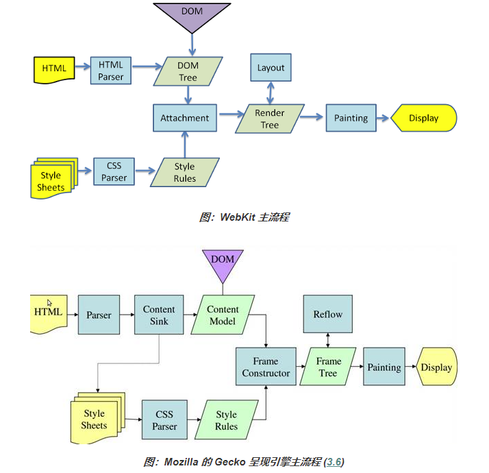

###浏览器工作原理（主流程）
- 浏览器的主要组件
1. 用户界面
包括地址栏、前进/后退按钮、书签菜单等。除了浏览器主窗口显示的您请求的页面外，其他显示的各个部分都属于用户界面
2. 浏览器引擎
在用户界面和呈现引擎之间传送指令
3. 呈现引擎
负责显示请求的内容。如果请求的内容是 HTML，它就负责解析 HTML 和 CSS 内容，并将解析后的内容显示在屏幕上
Firefox 使用的是 Gecko
Safari 和 Chrome 浏览器使用的都是 WebKit
4. 网络
用于网络调用，比如 HTTP 请求。其接口与平台无关，并为所有平台提供底层实现
5. 用户界面后端
用于绘制基本的窗口小部件，比如组合框和窗口。其公开了与平台无关的通用接口，而在底层使用操作系统的用户界面方法
6. JavaScript解析器
用于解析和执行 JavaScript 代码
7. 数据存储
这是持久层。浏览器需要在硬盘上保存各种数据，例如 Cookie。新的 HTML 规范 (HTML5) 定义了“网络数据库”，这是一个完整（但是轻便）的浏览器内数据库
* 值得注意的是，和大多数浏览器不同，Chrome 浏览器的每个标签页都分别对应一个呈现引擎实例。每个标签页都是一个独立的进程
- 主流程
呈现引擎一开始会从网络层获取请求文档的内容。
呈现引擎将开始解析HTML文档，并将各标记逐个转化成内容树上的DOM节点。
同时解析外部CSS文件以及样式元素中的样式数据。
HTML中这些带有视觉指令的样式信息将用于创建呈现树。
呈现树构建完毕之后，进入布局处理阶段，为每个节点分配一个应出现在屏幕上的确切坐标。
下一个阶段是绘制，呈现引擎会遍历呈现树，由用户界面后端层将每个节点绘制出来。
这是一个渐进的过程。为了达到更好的用户体验，呈现引擎会力求尽快将内容显示在屏幕上。
不必等到整个HTML文档解析完毕之后，就会开始构建呈现树和设置布局。在不断接收和处理来自网络的其余内容的同时，呈现引擎会将部分内容解析并显示出来。


###行内元素和块级元素
- 块级元素
1. 总是在新行上开始，占据一整行；
2. 高度，行高以及外边距和内边距都可控制；
3. 宽度始终是与浏览器宽度一样，与内容无关；
4. 它可以容纳内联元素和其他块元素
- 行内元素
1. 和其他元素都在一行上；
2. 高，行高及外边距和内边距部分可改变；
3. 宽度只与内容有关；
4. 行内元素只能容纳文本或者其他行内元素。
不可以设置宽高，其宽度随着内容增加，高度随字体大小而改变，
内联元素可以设置外边界，但是外边界不对上下起作用，只能对左右起作用，
也可以设置内边界，但是内边界在ie6中不对上下起作用，只能对左右起作用

###同源策略
- 什么是同源
所谓的同源是一种安全机制，为了预防某些恶意行为（例如 Cookie 窃取等），浏览器限制了从同一个源加载的文档或脚本如何与来自另一个源的资源进行交互。
而满足同源要具备三方面：协议相同、域名相同、端口相同
- 什么地方需要同源
    1. Ajax通信
    2. Cookie
    3. LocalStorage
    4. IndexDB
    5. DOM的操作

###跨域资源共享
1. CORS 
实现CORS需要浏览器与服务器的同时支持。  
浏览器会为请求添加Origin头，其包含页面的源信息（协议、域名和端口）  
Origin: http://domain.com  
如果服务器认为该请求可接受，就在Access-Control-Allow-Origin头部中回发相同的源信息。  
要注意的是请求和响应都不包含Cookie信息。  
现代浏览器都对 CORS 提供了原生支持（IE8、9 是利用XDomainRequest，不过已废弃），无需编写额外代码即可触发简单的跨域行为，因为浏览器会自动帮你添加一些头部信息，但是有以下限制：  
a. 不可使用setRequestHeader()设置自定义头部。  
b. 默认情况下不能请求 Cookie 等凭据，除非服务器在响应头中将Access-Control-Allow-Credentials设为true。  
c. 调用getAllResponseHeaders()会返回空字符串。  
对于非简单请求，它会在正式通信之前，增加一次http查询请求，称为"预检"请求（preflight）。  
通常是一个OPTION请求。这个请求先询问服务器，当前网页所在的域名是否在服务器的许可名单之中，以及可以使用哪http动词和头信息字段。  
只有得到肯定答复，浏览器才会发出正式的XMLHttpRequest请求，否则就报错  
2. 图像Ping  
该跨域技术主要是利用标签设置src属性（请求地址通常都带有查询字符串），然后监听该的onload或onerror事件来判断请求是否成功。响应的内容通常是一张 1 像素的图片或者204响应。  
图片 Ping 有两个缺点：  
    a. 因为是通过标签实现，所以只支持GET请求。  
    b. 无法访问服务器响应脚本，只能用于在浏览器与服务器之间进行单向通行。  
3. JSONP  
JSONP 是 JSON with padding 的简写，其主要是利用动态创建script标签向服务器发送 GET 请求，  
服务器收到请求后将数据放在一个指定名字的回调函数中并传送回来  
```javascript
//对创建标签行为进行封装
function addScriptTag(src) {
  var script = document.createElement('script')
  script.setAttribute("type","text/javascript")
  script.src = src
  document.body.appendChild(script)
}

//当浏览器加载完毕时向服务器发送请求
window.onload = function () {
  addScriptTag('http://domain.com/data?callback=getdata')
}

//服务器收到上面的请求后，将数据放在回调函数的参数（data）中返回
function getdata(data) {
  console.log(data)
}

//服务器获取参数名后，将回调函数和参数拼接为字符串返回
response.send(
  `${query.callback}({
    "name": "Hello"
  })`
)
```  
4. 其他跨域的方法  
* HTML5的postMessage
* WebSocket（当然协议就不一样了）
* document.domain（iframe）
* location.hash（iframe）
* window.name
* nginx 反向代理

###跨页面通信  todo
- 同源页面的跨页面通信  
1. BroadCast Channel  
Broadcast Channel 会创建一个所有同源页面都可以共享的（广播）频道，因此其中某一个页面发送的消息可以被其他页面监听到  
2. Service Worker  

- 非同源页面的跨页面通信  

###两种路由模式  
在单页应用中，单纯改变浏览器地址，页面不会重载。路由主要是通过监听事件，并利用JavaScript实现动态改变页面内容，有两种实现方式：  
- hash模式  
使用window.location.hash属性以及onhashchange事件，监听浏览器地址hash值变化，执行相应的js切换网页  
1. hash指的是地址中#号以及后面的字符，也称为散列值  
2. 散列值是不会随请求发送的服务器端的，所以改变hash，不会重新加载页面  
3. 监听window的hashchange事件，当散列值改变时，可以通过location.hash来获取和设置hash值  
4. location.hash值的变化会直接反应到浏览器地址栏
- history模式  
利用history API实现url地址改变，网页内容改变  
* window.history属性指向History对象，它表示当前窗口的浏览历史。当发生改变时，只会改变页面的路径，不会刷新页面。  
* History对象保存了当前窗口访问过的所有页面地址。通过history.length可以得出当前窗口一共访问过几个网址。  
* 由于安全原因，浏览器不允许脚本读取这些地址，但是允许在地址之间导航。  
* 浏览器工具的前进和后退按钮，其实就是对History对象进行操作。  
History对象的主要属性  
* lenght: 当前窗口访问过的网址数量（包括当前网页）  
* state: History堆栈最上层的状态值  
History对象的方法  
* back: 移动到上一个网址，等同于点击浏览器的后退键。对于第一个访问的网址，该方法无效果
* forward: 移动到下一个网址，等同于点击浏览器的前进键。对于最后一个访问的网址，该方法无效果
* go: 接受一个整数作为参数，以当前网址为基准，移动到参数指定的网址。如果参数超过实际存在的网址范围，该方法无效果；如果不指定参数，默认参数为0，相当于刷新当前页面
* pushState: 该方法用于在历史中添加一条记录。不会触发页面刷新，只是导致History对象发生变化，地址栏也会有变化。  
    语法: history.pushState(object, title, url)  
    object：是一个对象，通过 pushState 方法可以将该对象内容传递到新页面中。如果不需要这个对象，此处可以填 null。
    title：指标题，几乎没有浏览器支持该参数，传一个空字符串比较安全。
    url：新的网址，必须与当前页面处在同一个域。不指定的话则为当前的路径，如果设置了一个跨域网址，则会报错。
* replaceState: 该方法用来修改 History 对象的当前记录，用法与 pushState() 方法一样
- popState事件  
每当 history 对象出现变化时，就会触发 popstate 事件  
* 仅仅调用pushState()方法或replaceState()方法 ，并不会触发该事件;
* 只有用户点击浏览器倒退按钮和前进按钮，或者使用 JavaScript 调用History.back()、History.forward()、History.go()方法时才会触发。
* 另外，该事件只针对同一个文档，如果浏览历史的切换，导致加载不同的文档，该事件也不会触发。
* 页面第一次加载的时候，浏览器不会触发popstate事件。
history 致命的缺点就是当改变页面地址后，强制刷新浏览器时，（如果后端没有做准备的话）会报错，因为刷新是拿当前地址去请求服务器的，如果服务器中没有相应的响应，会出现 404 页面
- 区别  
hash会在浏览器地址后面增加#号，而history可以自定义地址

###DOM树  
- 什么是DOM  
HTML文件字节流无法被渲染引擎理解，需要将其转化为渲染引擎能够理解的结构，这个结构就是DOM（document object model，文档对象模型）  
DOM提供了对HTML文档结构化的表述，在渲染引擎中DOM有三个层面的作用：  
1. 从页面的视角来看，DOM是生成页面的基础数据结构  
2. 从JavaScript脚本角度来看，DOM提供给JavaScript脚本操作的接口，通过这套接口，JavaScript可以对DOM结构进行访问，从而改变文档的结构、内容和样式  
3. 从安全角度来看，DOM是一道安全防护线，一些不安全的内容在DOM解析阶段就被拒之门外了  
DOM是表述HTML的内部数据结构，它会将Web页面和JavaScript脚本连接起来，并过滤一些不安全的内容  
- DOM树如何生成  
1. 网络进出接收到content-type是text/html的文件，选择或者创建一个渲染进程，并建立一个共享数据的管道，讲接收到的数据不断放进管道（所以HTML解析器是随着HTML文档边加载边解析的）  
2. 通过分词器将字节流转换为Token
3. 将Token解析为DOM节点，并将DOM节点添加到DOM树中  
    * 如果压入到栈中的是StartTag Token，HTML 解析器会为该 Token 创建一个 DOM 节点，然后将该节点加入到 DOM 树中，它的父节点就是栈中相邻的那个元素生成的节点。
    * 如果分词器解析出来是文本 Token，那么会生成一个文本节点，然后将该节点加入到 DOM 树中，文本 Token 是不需要压入到栈中，它的父节点就是当前栈顶 Token 所对应的 DOM 节点。
    * 如果分词器解析出来的是EndTag 标签，比如是 EndTag div，HTML 解析器会查看 Token 栈顶的元素是否是 StarTag div，如果是，就将 StartTag div 从栈中弹出，表示该 div 元素解析完成。  
通过分词器产生的新 Token 就这样不停地压栈和出栈，整个解析过程就这样一直持续下去，直到分词器将所有字节流分词完成。  
- JavaScript如何影响DOM生成  
1. 执行到JavaScript标签的时候会暂停整个DOM的解析（因为JavaScript脚本可能会修改当前已经生成的DOM结构）  
2. 下载外部JavaScript脚本也会阻塞DOM解析（可以使用CDN、压缩文件体积、没有DOM相关操作的脚本可以设置为异步加载(async，defer)）
async: 加载完成立即执行  
defer: 在DOMContentLoaded事件之前执行  
3. 渲染引擎在遇到JavaScript脚本时，不管该脚本是否操纵了CSSOM，都会执行CSS文件下载，解析操作，再执行JavaScript脚本。JavaScript会阻塞DOM生成，而样式文件又会阻塞JavaScript的执行。

###事件模型  
浏览器的事件模型就是通过监听函数（listener）对事件做出反应。事件发生后，浏览器监听到了这个事件，就会执行对应的监听函数。这是事件驱动编程模式的主要编程方式。  
- 绑定事件的三种方式  
1. HTML的on-属性  
on-属性的值是原样传入JavaScript引擎执行。因此如果要执行函数，需要加上圆括号  
使用这个方法指定的监听代码，只会在冒泡阶段触发
2. 元素节点的事件属性  
使用这个方法指定的监听代码，只会在冒泡阶段触发
与HTML的on-属性的差异是，它的值是函数名
3. EventTarget.addEventListener()  
所有DOM节点实例都有addEventListener方法，用来为该节点定义事件的监听函数  
上面三种方法，HTML的on-属性违反了HTML与JavaScript代码相分离的原则，讲两者写在一起，不利于代码分工，不推荐使用。  
元素节点的事件属性的缺点在于，同一个事件只能定义一个监听函数，如果定义两次onclick属性，后一次会覆盖前一次，不推荐使用。 
EventTarget.addEventListener是推荐的指定监听函数的方法。它有如下优点：  
同一个事件可以添加多个监听函数。  
能够指定在哪个阶段（捕获阶段还是冒泡阶段）触发监听函数。  
除了 DOM 节点，其他对象（比如window、XMLHttpRequest等）也有这个接口，它等于是整个JavaScript统一的监听函数接口。  
